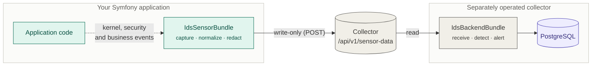

# IdsSensorBundle

[](https://github.com/projektmotor/ids-sensor-bundle/actions/workflows/ci.yml)
[](https://packagist.org/packages/projektmotor/ids-sensor-bundle)
[](#requirements)
[](LICENSE)

**Intrusion detection sensors for Symfony applications.** Captures security-relevant
events, normalizes them into a fixed wire format, and ships them over HTTPS to a
separately operated collector — without ever slowing down the application it watches.



The sensor runs *inside* the application it monitors. If that application is compromised,
so is the sensor — which is why it may only ever **write** to the broker, never read or
delete.

## What it produces

One event, exactly as the collector receives it:

```json
{
  "schema_version": 1,
  "event_id": "b3f1e6b0-6e3a-4c9a-9f2e-2a6a2f4b9c11",
  "timestamp": "2026-08-13T10:15:32.421Z",
  "layer": "kernel",
  "event_type": "kernel.exception",
  "correlation_id": "req-7f2a1c",
  "event_severity": "warning",
  "application_id": "shop-api",
  "instance_id": "web-03",
  "environment": "prod",
  "actor": {
    "user": null,
    "ip": "203.0.113.42",
    "session_id_hash": "a3f9c1d8e4b27a05",
    "client_fingerprint": "c71b04ae9f3d62"
  },
  "payload": {
    "exception_class": "Symfony\\Component\\HttpKernel\\Exception\\NotFoundHttpException",
    "exception_message": "No route found for GET /wp-admin/setup-config.php",
    "http_status": 404
  }
}
```

Nothing is normalized during the request. Capturing happens under a hard budget of
**1500 µs** (5 ms p99 ceiling for all sensors combined); normalizing, redacting and
shipping happen on `kernel.terminate`, after the response has left. See
[Request lifecycle](doc/04-request-lebenszyklus.md).

## What it detects — and what it does not

This table comes **before** the installation instructions on purpose. Anyone who installs
the bundle and overlooks the business layer believes something is monitored that is not.

| Layer | After `composer require` | Work in your application |
|---|---|---|
| Kernel | **active**, no code required | none |
| Security | **active** if SecurityBundle is present | none |
| Business | **inactive** | implement an interface, dispatch events |

Kernel and security layers reliably detect **failed** attacks — scanning, brute force,
denied authorizations, error bursts. They see failures because a failure leaves a trace in
the framework: a 403, a 404, an exception.

**Successful attacks that use the application as intended produce no signal there.** An
attacker with a valid session who sets a discount to 100 %, retrieves another customer's
order for which no voter exists, or exports data in quantities no human needs, produces
nothing but HTTP 200. No amount of tightening the kernel rules compensates for this. The
only remedy is the business layer — and that requires application code.

Details: [Observation layers](doc/02-beobachtungsebenen.md).

## Requirements

| | |
|---|---|
| PHP | ≥ 8.2 |
| Symfony | ^6.4 \| ^7.0 |
| Collector | Reachable over HTTPS from the application |
| Required extensions | `ext-json` |
| Recommended | `ext-apcu` (cross-process throttling, breaker state, token cache) |

## Installation

```bash
composer require projektmotor/ids-sensor-bundle
```

That is the whole install. Earlier versions needed a second package for the message
broker; the sensor now talks to the collector over HTTPS and brings its own client.

Symfony Flex registers the bundle automatically. Without Flex, add it to
`config/bundles.php`:

```php
return [
    // ...
    ProjektMotor\IdsSensor\IdsSensorBundle::class => ['all' => true],
];
```

### Minimal configuration

Four values are mandatory. The collector hands you the three UUIDs and the credentials
when you register:

```yaml
# config/packages/ids_sensor.yaml
ids_sensor:
    application_id: '%env(IDS_APPLICATION_ID)%'
    environment_id: '%env(IDS_ENVIRONMENT_ID)%'
    sensor_id: '%env(IDS_SENSOR_ID)%'
    session_hash:
        key: '%env(IDS_SESSION_HASH_KEY)%'
    collector:
        base_uri: '%env(IDS_COLLECTOR_URL)%'
        username: '%env(IDS_COLLECTOR_USER)%'
        password: '%env(IDS_COLLECTOR_PASSWORD)%'
```

**`sensor_id` must differ per node.** One sensor is one running installation; if replicas
share the identifier they are indistinguishable, and a silent sensor goes unnoticed. In
Kubernetes all replicas of a Deployment share a ConfigMap — take this one from a per-pod
secret or the Downward API instead.

Generate the HMAC key — a **dedicated** one, at least 32 characters, deliberately *not*
`APP_SECRET`:

```bash
php -r 'echo bin2hex(random_bytes(32)), PHP_EOL;'
```

Then verify the installation:

```bash
php bin/console ids:sensor:setup-check
```

A non-zero exit code means detection is ineffective. Run it in your deployment pipeline,
and do not defuse it with `|| true` — the whole point is that misconfiguration surfaces at
deploy time rather than during the post-mortem of an incident.

Full reference: [Configuration](doc/08-konfiguration.md).

## Capturing business events

The only layer that needs application code — and the only one that can see successful
attacks. Implement one interface:

```php
use ProjektMotor\IdsSensor\Contract\SecurityRelevantBusinessEvent;
use ProjektMotor\IdsEventData\Vocabulary\Severity;

final class OrderAmountOverridden implements SecurityRelevantBusinessEvent
{
    public function __construct(
        private readonly int $orderId,
        private readonly string $actorId,
        private readonly float $newAmount,
    ) {
    }

    public function getEventName(): string    { return 'order.amount_overridden'; }
    public function getSeverityHint(): string { return Severity::Warning->value; }
    public function getActorId(): ?string     { return $this->actorId; }

    public function getPayload(): array
    {
        return ['order_id' => $this->orderId, 'new_amount' => $this->newAmount];
    }
}
```

Then dispatch it the way you already dispatch domain events — the sensor listens on the
decorated `event_dispatcher`, and your business code contains no reference to the IDS:

```php
$this->eventDispatcher->dispatch(new OrderAmountOverridden(...));
```

Two alternatives exist for code bases that do not dispatch domain events, or deployments
that reject decorating the dispatcher: [Business layer](doc/09-business-ebene.md).

## Runtime models

The sensor ships **after** the response has been sent. Whether network access is permitted
at that point depends on the runtime:

| Runtime | Response detachable | Delivery |
|---|---|---|
| PHP-FPM, LiteSpeed, FrankenPHP, RoadRunner | yes | direct to the collector |
| **mod_php** | **no** | **local spool** |
| CLI, Messenger workers | n/a | direct to the collector |

> **Under mod_php, `ids:sensor:spool:flush` is mandatory.** It is the only delivery path
> there. Without a cron entry or systemd timer, the sensor writes, nobody collects, and the
> spool fills up and discards. The same applies to `ids:sensor:heartbeat`.

Why this is not merely conservative, and what it costs:
[Delivery path](doc/05-versandweg.md).

## Commands

| Command | Purpose |
|---|---|
| `ids:sensor:setup-check` | Operational check. Exit code ≠ 0 means detection is ineffective. |
| `ids:sensor:spool:flush` | Drains the spool towards the broker. Mandatory under mod_php. |
| `ids:sensor:heartbeat` | Sends a liveness signal. For cron or a systemd timer. |

## Documentation

The [`doc/`](doc/README.md) directory explains every core concept, one document each, with
a diagram per concept. Written in German.

| | | |
|---|---|---|
| [Overview](doc/01-ueberblick.md) | [Observation layers](doc/02-beobachtungsebenen.md) | [Event format](doc/03-ereignisformat.md) |
| [Request lifecycle](doc/04-request-lebenszyklus.md) | [Delivery path](doc/05-versandweg.md) | [Confidentiality](doc/06-vertraulichkeit.md) |
| [Operations](doc/07-betrieb.md) | [Configuration](doc/08-konfiguration.md) | [Business layer](doc/09-business-ebene.md) |

The full specification of both bundles — including the collector, its database schema and
the detection rules — is [`doc/concept/concept-v1.md`](doc/concept/concept-v1.md).

## Public API and versioning

Semantic versioning applies to:

- `ProjektMotor\IdsSensor\Contract\*` — the interfaces your application implements or injects
- the `IdsSensorBundle` class and **all** `ids_sensor` configuration keys
- the emitted JSON, versioned via `schema_version`

Everything else, **including all service IDs**, is `@internal` and may change in any
version. The rule is readable from the directory layout and enforced by
[`tests/Unit/ArchitectureTest.php`](tests/Unit/ArchitectureTest.php): whatever lives under
`Contract/` is public, every other file carries `@internal`.

The wire format itself — field names, enums, value objects, frame — lives in its own
package, [`projektmotor/ids-event-data`](https://github.com/projektmotor/ids-event-data)
(`ProjektMotor\IdsEventData\*`), and is versioned there, where semantic versioning covers
the package in full. The collector side consumes the very same package; that is why it
depends on nothing at all — not even on Symfony.

Changes are recorded in [`CHANGELOG.md`](CHANGELOG.md).

## Contributing

No local PHP installation required — everything runs through Docker:

```bash
make install     # composer install
make test        # unit + integration
make stan        # PHPStan level 8
make cs-fix      # php-cs-fixer
```

How `src/` is laid out and why — which namespace belongs to which section of the concept,
and when its code runs — is documented in [`doc/concept/structure.md`](doc/concept/structure.md). Read it
before moving anything: the layout carries five promises that
[`ArchitectureTest`](tests/Unit/ArchitectureTest.php) enforces.

If the service wiring changes, the container fingerprint is the actual review artefact —
it compares 15 configuration variants definition by definition:

```bash
docker compose run --rm -e IDS_UPDATE_FINGERPRINTS=1 php \
    vendor/bin/phpunit tests/Integration/ContainerFingerprintTest.php
```

Read the resulting diff. That, not the green test run, is the check.

## License

MIT — see [LICENSE](LICENSE).
