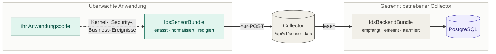
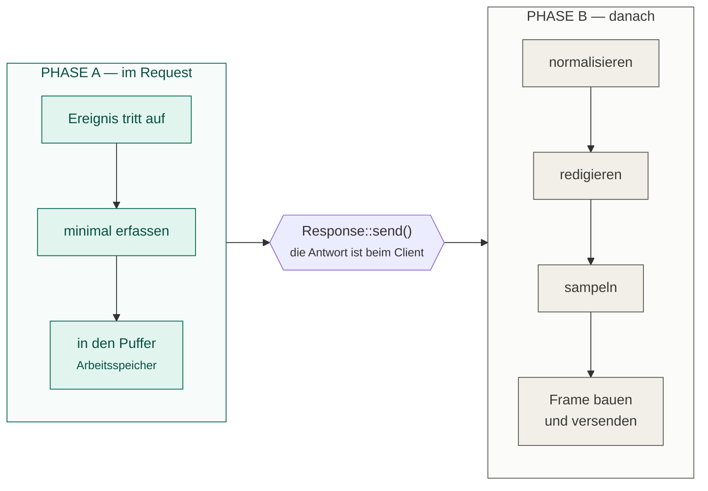

# 01 — Überblick

Das IdsSensorBundle ist die **Sensorik** eines Intrusion Detection Systems. Es läuft
*innerhalb* der überwachten Symfony-Anwendung, erfasst sicherheitsrelevante Ereignisse,
übersetzt sie in ein festes Format und schickt sie an einen getrennt betriebenen
Collector. Es entscheidet nichts, es speichert nichts, es alarmiert nicht.

## Wo das Bundle aufhört

Der Sensor darf am Collector **ausschließlich schreiben**. Ist die überwachte Anwendung
kompromittiert, ist der Sensor es auch — deshalb kann ein Angreifer über ihn weder
abgesendete Events löschen noch die Events anderer Requests mitlesen. Details in
[07 — Betrieb](07-betrieb.md#endpunkt-rechte-nur-schreiben).

Die Paketgrenze zwischen den beiden Bundles ist **nicht** eine Bibliothek, sondern das
Ereignisformat aus (*3.*). Beide Seiten kennen nur JSON voneinander. Siehe
[03 — Ereignisformat](03-ereignisformat.md).

## Die Leitidee: zwei Phasen

Alles an diesem Bundle folgt einer einzigen Entscheidung: **im Request wird gesammelt,
gearbeitet wird danach.**

Phase A läuft unter einem harten Budget: **1500 µs voreingestellt, 5 ms als Obergrenze im
99. Perzentil** für alle drei Sensoren zusammen (*2.1*). Phase B läuft auf
`kernel.terminate` — dort ist die Antwort raus, und Zeit kostet nur noch die Belegung
eines Worker-Prozesses.

Das ist keine Optimierung, sondern die Zusage, auf der alles andere aufbaut. Sie ist am
Verzeichnisbaum ablesbar (siehe [concept/structure.md](concept/structure.md)) und wird von
`ArchitectureTest::testSensorDoesNotKnowProcessing()` maschinell festgehalten: `Sensor/`
darf `Processing/` nicht einmal importieren.

Was das im Einzelnen bedeutet, steht in
[04 — Request-Lebenszyklus](04-request-lebenszyklus.md).

## Die drei Grundsatzentscheidungen

**fail-open.** Eine Störung des IDS darf die überwachte Anwendung unter keinen Umständen
beeinträchtigen (*4.*). Jeder Fehler im Sensor wird verschluckt. Der Preis: Events können
verloren gehen — deshalb wird jeder Verlust gezählt und gemeldet. Siehe
[07 — Betrieb](07-betrieb.md#fail-open-und-was-es-kostet).

Und zwar ausnahmslos: Seit der Sitzungshash ohne Schlüssel auskommt (*2.2.4*), gibt es
keinen Fall mehr, in dem eine fehlende Einstellung die Anwendung am Starten hindert. Was
weiterhin beim **Kompilieren** abbricht, sind reine Konfigurationsfehler — eine unbekannte
`raw`-Stufe, ein ungültiges `ignored_paths`-Muster. fail-open gilt für den Request-Pfad
einer laufenden Anwendung, nicht für einen Tippfehler in der YAML.

**Kein Datenbankzugriff.** Das Bundle bekommt bewusst keine Verbindung zum Beweisspeicher.
Trüge es die Zugangsdaten, hätte die überwachte Anwendung Zugriff auf ihre eigenen
Beweise, und ein Angreifer mit Codeausführung könnte seine Spuren löschen. Die
Manipulationsgrenze verläuft am Ingest-Endpunkt des Collectors (*2.*).

**Redaktion im Sensor, nicht im Collector.** Zugangsdaten werden unkenntlich gemacht,
bevor etwas den Prozess verlässt — andernfalls gingen Klartext-Passwörter über die Leitung
und landeten in Zugriffsprotokollen und Spool-Dateien (*4.5.1*). Siehe
[06 — Vertraulichkeit](06-vertraulichkeit.md).

## Was als Nächstes zu lesen ist

Wer **einschätzen** will, ob das Bundle die eigene Anwendung wirklich absichert:
[02 — Beobachtungsebenen](02-beobachtungsebenen.md). Dort steht die wichtigste Einschränkung
des ganzen Projekts.

Wer **betreiben** will: [05 — Versandweg](05-versandweg.md) und
[07 — Betrieb](07-betrieb.md). Unter mod_php gibt es eine Installationspflicht, ohne die
nichts ankommt.
