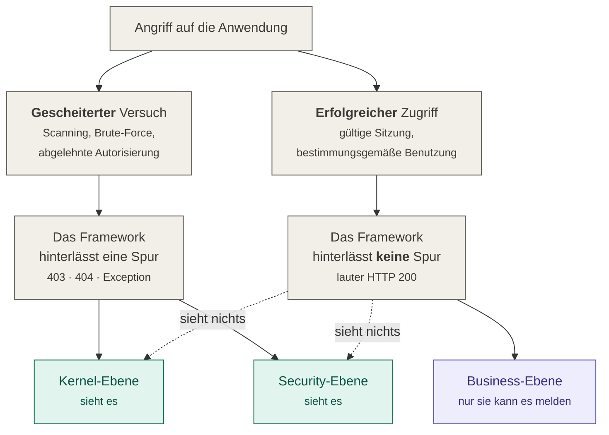

# 02 — Die drei Beobachtungsebenen

Das Bundle beobachtet an drei Stellen (*2.1*). Zwei davon arbeiten nach `composer require`
ohne eine Zeile Anwendungscode. Die dritte nicht — und **das ist die wichtigste Aussage
dieser gesamten Dokumentation.**

| Ebene | Nach `composer require` | Aufwand in der Anwendung |
|---|---|---|
| Kernel (*2.1.1*) | **aktiv**, kein Code nötig | keiner |
| Security (*2.1.2*) | **aktiv**, wenn SecurityBundle vorhanden ist | keiner |
| Business (*2.1.3*) | **inaktiv** | Interface implementieren und Events auslösen |

## Die Grenze, die keine Konfiguration verschiebt



Kernel- und Security-Ebene erkennen zuverlässig **gescheiterte** Angriffe, weil ein
Fehlschlag im Framework eine Spur hinterlässt. **Erfolgreiche Angriffe, die die Anwendung
bestimmungsgemäß benutzen, erzeugen dort kein Signal** — und nur die Business-Ebene kann
sie melden, aber die braucht Anwendungscode.

Ein Angreifer mit gültiger Sitzung, der einen Rabatt auf 100 % setzt, eine Bestellung
eines anderen Kunden abruft, für die kein Voter existiert, oder Daten in einer Menge
exportiert, die kein Mensch braucht, erzeugt lauter HTTP 200. Das sind die Szenarien S6,
S7 (ohne Voter) und S9 aus dem Konzept.

Keine Verschärfung der Kernel-Regeln kompensiert das. Wer das Bundle installiert und die
Business-Ebene übersieht, hält für überwacht, was unbeobachtet ist. Konzept 2. verlangt
deshalb ausdrücklich, dass diese Asymmetrie „in der Auslieferung nicht verschleiert" wird.

## Kernel-Ebene (*2.1.1*)

Beobachtet die HttpKernel-Events. Aktiv ohne Zutun.

| Event | Wann | Klasse |
|---|---|---|
| `kernel.request` | jeder eingehende Request | `Sensor\Kernel\RequestSensor` |
| `kernel.response` | jede erzeugte Antwort | `Sensor\Kernel\ResponseSensor` |
| `kernel.exception` | jede nicht abgefangene Ausnahme | `Sensor\Kernel\ExceptionSensor` |

`kernel.terminate` ist **kein** Sensor-Event. Es liefert keine Information über
`kernel.response` hinaus und wird ausschließlich als Versandfenster benutzt — siehe
[04 — Request-Lebenszyklus](04-request-lebenszyklus.md).

Zwei Voreinstellungen, die überraschen können und Absicht sind:

- **`layers.kernel.ignored_paths` ist leer.** Regel R2b lebt davon, Zugriffe auf
  `/_profiler` zu sehen; ein gut gemeinter Standardwert würde genau dieses Signal löschen.
  Die Einträge sind reguläre Ausdrücke **mit Trennzeichen** — `#^/health$#`, nicht
  `/health`. Ein Muster ohne Trennzeichen wurde stillschweigend nie angewandt; heute
  wird es beim Kompilieren abgelehnt.
- **Sub-Requests erzeugen nur Exception-Events** (`sub_requests: exceptions_only`). Ihr
  Pfad ist meist eine Kopie des Elternpfades, was jede Schwellwertregel doppelt zählen
  ließe. Exceptions dagegen verschluckt `ignore_errors` und wären sonst nirgends sichtbar.

### Dieselbe Ebene sieht auch die Konsole

Console-Commands, Messenger-Worker und Cronjobs erzeugen keines der drei Events oben — sie
laufen ohne HttpKernel. Ein Angreifer mit Codeausführung arbeitet genau dort.

| Event | Wann | Klasse |
|---|---|---|
| `console.command` | jeder Konsolenlauf, auch `messenger:consume` | `Sensor\Console\CommandSensor` |
| `console.error` | jeder mit einer Ausnahme gescheiterte Befehl | `Sensor\Console\CommandSensor` |

**Warum das `layer: kernel` bleibt.** `layer` ist ein geschlossenes Vokabular und bildet
collectorseitig eine ENUM-Spalte ab (*4.2.1*); ein vierter Wert wäre ein Fassungswechsel
des Ereignisformats samt Datenbankmigration. `event_type` ist offen. Die Ebene heißt
deshalb nach dem Einstiegspunkt des **Frameworks**, nicht nach HTTP.

Drei Festlegungen, die dazugehören:

- **Die Aufrufargumente reisen nicht mit.** Eine Befehlszeile führt regelmäßig genau die
  Werte, die die Denylist unkenntlich machen soll — `--password=`, ein Token als
  Stellungsargument. Übertragen wird der Befehlsname; bei `console.error` zusätzlich
  Ausnahmeklasse, redigierte Meldung und Exit-Code.
- **`console.error` ist `warning`, nicht `critical`.** Auf der Konsole gibt es kein
  Gegenstück zu 5xx/4xx: Ein vertippter Befehl und ein abgestürzter Worker enden beide mit
  einer Ausnahme. `critical` bleibt Serverfehlern vorbehalten (*2.2.1*). Der Stacktrace
  geht dabei nicht verloren — `warning` trägt `raw`.
- **`layers.kernel.console.ignored_commands` ist als einzige Ausschlussliste NICHT leer.**
  Die Vorgabe `#^ids:sensor:#` nimmt die eigenen Befehle des Bundles aus. Der minütliche
  `ids:sensor:spool:flush` erzeugte sonst ein Ereignis, das der nächste Lauf versendet, um
  dabei das nächste zu erzeugen. Wer eigene Muster ergänzt, ersetzt die Vorgabe — die
  Zeile gehört dann mit in die eigene Liste.

**Eine Grenze, die benannt gehört:** Alle Ereignisse eines Worker-Laufs teilen sich eine
Korrelationskennung, weil `console.command` je Prozess einmal feuert. Bei einem
`messenger:consume`, das stundenlang läuft, ist das eine Spur je Prozess, keine je
Nachricht.


## Security-Ebene (*2.1.2*)

Beobachtet die Security-Komponente, sofern das SecurityBundle registriert ist.

| Ereignis | `event_type` | Klasse |
|---|---|---|
| Anmeldung erfolgreich | `security.authentication.success` | `Sensor\Security\AuthenticationSensor` |
| Anmeldung gescheitert | `security.authentication.failure` | `Sensor\Security\AuthenticationSensor` |
| Autorisierungsentscheidung | `security.access_decision` | `Sensor\Security\AccessDecisionSensor` |
| Fremde Identität übernommen | `security.switch_user` | `Sensor\Security\SwitchUserSensor` |
| Übernahme beendet | `security.switch_user.exit` | `Sensor\Security\SwitchUserSensor` |

Die Spalte trägt den **übertragenen** Wert, nicht den Namen der PHP-Konstante. Diese
Zeichenketten sind Paketgrenze: der Collector wertet genau sie aus (*3.1.2*), und wer eine
Auswertung oder einen Filter auf einen anderen Wert baut, trifft nichts — lautlos.

### Rechteübernahme: zwei Ereignisse, nicht eines

`security.switch_user` allein wäre wertlos. Ohne das Ende bliebe jede spätere Handlung
unter der fremden Identität **dauerhaft** von einer echten Handlung des Übernommenen
ununterscheidbar — erst die beiden Ereignisse klammern das Zeitfenster, in dem die
Zuordnung nicht stimmt. Symfony feuert für beide Richtungen dasselbe Framework-Event;
welche vorliegt, erkennt der Sensor am Token.

`actor.user` ist der **Übernehmende**, `payload.target_user` der Übernommene. Andersherum
wäre der Vorgang von einer gewöhnlichen Handlung des Kunden nicht zu unterscheiden.
Eingestuft wird der Beginn als `warning`, das Ende als `info`.

Der Sensor hat **keinen eigenen Schalter**: Der Wechsel in eine fremde Identität ist keine
Bauart von Anmeldung, sondern die Voraussetzung dafür, dass die drei anderen Ereignisse
überhaupt der richtigen Person zugeordnet werden. Ihn abschaltbar zu machen hieße, die
Zuordnung abschaltbar zu machen. Er hängt an `layers.security.authentication`.

`AccessDecisionSensor` dekoriert den `AccessDecisionManagerInterface` und feuert damit bei
**jedem** `isGranted()`. Das ist der teuerste Sensor des Bundles. Abgesichert ist er durch
zwei Grenzen: identische Entscheidungen werden entdoppelt, und
`max_decisions_per_request` (Vorgabe 200) deckelt hart — eine Übersichtsseite mit einem
Voter pro Zeile erzeugt sonst beliebig viele.

### Die Ressourcenangabe steht in drei Feldern

| Feld | Beispiel | Wofür |
|---|---|---|
| `resource` | `Order#42` | der Beleg für einen Menschen, der einen Vorfall liest |
| `resource_type` | `order` | der Gruppierschlüssel der Erkennungsregeln |
| `resource_id` | `42` | die Kennung, die Regel B7 auf Nachbarschaft prüft |

Die beiden zerlegten Felder ersetzen `resource` nicht, sie zerlegen es (*3.1.4*). Ohne sie
wäre „numerisch benachbarte Identifier desselben Typs" nur über Zeichenkettenanalyse im
Collector zu haben, für jede Zeile erneut.

Dieselben zwei Felder stehen auch im `kernel.response` — dort abgeleitet aus Routenname und
Routenparametern. **Das Vokabular des Typs unterscheidet sich dabei bewusst:** Hier kommt
er aus der Klasse des Voter-Subjekts (`order`), dort aus dem Routennamen
(`app_order_show`). Der Collector gruppiert deshalb innerhalb einer Ebene. Ein gemeinsames
Vokabular gäbe es nur um den Preis einer geratenen Pfadgrammatik samt Singularbildung — und
ein Gruppierschlüssel, der manchmal danebenliegt, ist schlechter als einer, der ehrlich nur
innerhalb seiner Ebene gilt.

### Die Ressourcenkennung — der eine Punkt, an dem auch hier Anwendungscode hilft

(*3.1.2*) verlangt für `payload.resource` einen Identifier-String der Form `Klasse#ID` und
ausdrücklich „niemals das vollständige Objekt". Das Subjekt einer Autorisierungsprüfung ist
aber alles, was die Anwendung an `isGranted()` übergibt — eine Entity, ein Request, ein
Skalar, ein Enum oder `null`. Ohne Mitwirkung **rät** der Sensor: er versucht `getId()` und
fällt auf den Klassennamen zurück. Nachladen darf er dabei unter keinen Umständen, weil das
Latenzbudget aus (*2.1*) jede Abfrage im Request-Pfad verbietet — ein uninitialisierter
Doctrine-Proxy liefert deshalb nur seinen Klassennamen.

Wer das nicht dem Raten überlassen will, implementiert an seinen Aggregatwurzeln
`Contract\IdsResourceIdentifier`:

```php
use ProjektMotor\IdsSensor\Contract\IdsResourceIdentifier;

final class Order implements IdsResourceIdentifier
{
    public function getIdsResourceId(): ?string
    {
        return 'Order#'.$this->id;
    }
}
```

Die Methode **muss ohne Datenbankzugriff auskommen**; `null` bedeutet „keine Kennung
verfügbar", dann greift die übliche Auflösung. Mehr als Kosmetik ist das, weil die
Erkennung von Rechteausweitung daran hängt: Regel B7 sucht „numerisch benachbarte
Ressourcen-Identifier desselben Typs", P1 und P2 vergleichen sie gegen die Historie eines
Nutzers. Steht dort überall nur der Klassenname, laufen alle drei ins Leere — daran ändern
auch `resource_type` und `resource_id` nichts: Sie zerlegen, was da ist, sie erfinden keine
Kennung. (*O2*) ist geschlossen, dieser Punkt bleibt bei der Anwendung.

Das Interface liegt in `Contract/` und ist damit Teil der Semver-Fläche des Bundles; es zu
implementieren erzeugt keine Laufzeitabhängigkeit auf das Bundle über diese eine
Methode hinaus.

## Business-Ebene (*2.1.3*)

Die einzige Signalklasse für erfolgreiche Angriffe — und die einzige, die Anwendungscode
verlangt. Wie sie angebunden wird, steht in
[09 — Business-Ebene](09-business-ebene.md).

Konzept 2.1.3 nennt sechs **Vorgangsklassen**, die eine Anwendung selbst melden sollte —
bewusst keine festen Event-Namen, damit der Katalog projektunabhängig bleibt. Nummern und
Reihenfolge sind die des Konzepts; sie sind Querverweisanker, unter anderem aus (*4.3.6*).
Was fehlt, wenn eine Klasse nicht instrumentiert wird:

| | Vorgangsklasse | Beispiel | Konsequenz ohne Meldung |
|---|---|---|---|
| V1 | Änderung von Berechtigungen und Rollen | `user.roles_changed` | Rechteausweitung bleibt unbemerkt — Mass Assignment auf Rollenfelder (*Szenario S6*) erzeugt keinerlei Signal |
| V2 | Änderung sicherheitsrelevanter Kontodaten | `user.email_changed`, `user.password_changed` | Kontoübernahme wird nicht bemerkt: Session stehlen → E-Mail ändern → Passwort zurücksetzen läuft vollständig unsichtbar ab |
| V3 | Zugriff auf Daten fremder Eigentümer | `resource.accessed_cross_owner` | IDOR ohne Voter (*Szenario S7*) bleibt unentdeckt — ohne `denied`-Event ist dies die einzige verbleibende Erkennungsmöglichkeit |
| V4 | Wertverändernde Vorgänge über einer Schwelle | `order.amount_overridden`, `payment.refund_issued` | Preis- und Betragsmanipulation wird nicht erkannt; ein auf 0,01 € gesetzter Bestellbetrag ist technisch einwandfrei |
| V5 | Massenoperationen | `export.bulk_generated`, `record.bulk_deleted` | Datenabfluss über legitime Exportfunktionen bleibt unsichtbar — auf Kernel-Ebene ist ein Massenexport ein Einzelabruf |
| V6 | Administrative Funktionen | `admin.action_performed` | Missbrauch privilegierter Funktionen nach erfolgreichem Rechteerwerb wird nicht erfasst (zweiter Teil der Kette in Regel X3) |

**Der User-Switch war lange ein blinder Fleck.** Symfonys `SwitchUserListener` erzeugt
keines der Events aus (*2.1.1*) bis (*2.1.3*) — ein Administrator, der die Identität eines
Kunden übernimmt, hinterließ im IDS keine Spur, und alles, was er danach tat, sah aus wie
eine Handlung des Kunden. Seit `SwitchUserSensor` ist das geschlossen (*OB10*); der frühere
Workaround über ein Business-Event der Klasse V6 entfällt. Wer die Übernahme darüber hinaus
fachlich protokollieren will, kann V6 weiterhin benutzen — nötig ist es nicht mehr.

## Eine Ebene abschalten? Nein.

Alle drei Ebenen lassen sich über `layers.<ebene>.enabled: false` abschalten. **Das ist
fast immer der falsche Hebel**, wenn das Ziel Volumen- oder Latenzreduktion ist: es
entfernt eine Signalklasse vollständig, statt ihr Volumen zu senken.

Die richtige Reihenfolge der Stellräder steht in
[04 — Request-Lebenszyklus](04-request-lebenszyklus.md#wenn-die-latenz-drückt).
`ids:sensor:setup-check` meldet eine abgeschaltete Ebene als Befund.
