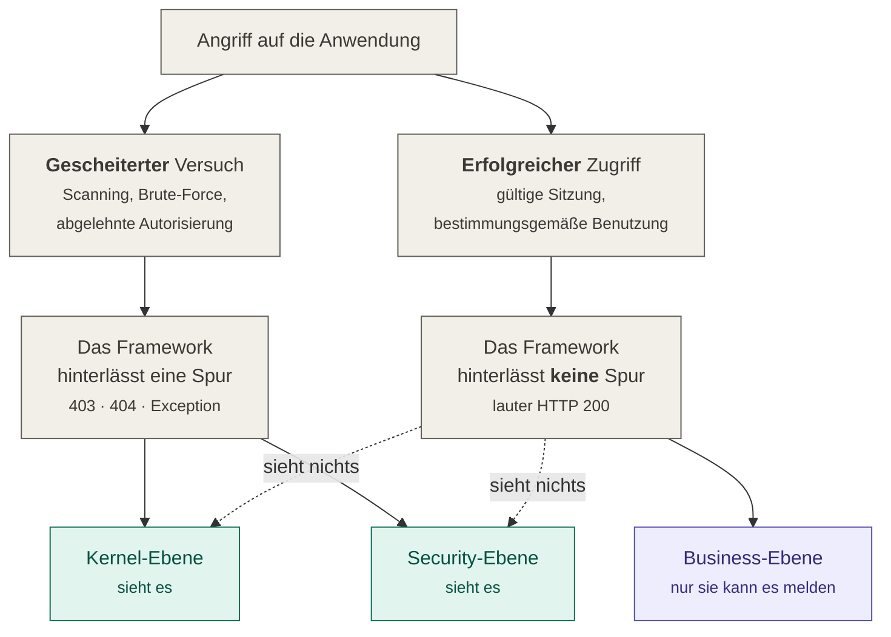

# 02 — Die drei Beobachtungsebenen

Das Bundle beobachtet an drei Stellen (*2.1*). Zwei davon arbeiten nach `composer require`
ohne eine Zeile Anwendungscode. Die dritte nicht — und **das ist die wichtigste Aussage
dieser gesamten Dokumentation.**

| Ebene | Nach `composer require` | Aufwand in der Anwendung |
|---|---|---|
| Kernel (*2.1.1*) | **aktiv**, kein Code nötig | keiner |
| Security (*2.1.2*) | **aktiv**, wenn SecurityBundle vorhanden ist | keiner |
| Business (*2.1.3*) | **inaktiv** | Interface implementieren und Events auslösen |

## Die Grenze, die keine Konfiguration verschiebt

Kernel- und Security-Ebene erkennen zuverlässig **gescheiterte** Angriffe, weil ein
Fehlschlag im Framework eine Spur hinterlässt. **Erfolgreiche Angriffe, die die Anwendung
bestimmungsgemäß benutzen, erzeugen dort kein Signal** — und nur die Business-Ebene kann
sie melden, aber die braucht Anwendungscode.

Ein Angreifer mit gültiger Sitzung, der einen Rabatt auf 100 % setzt, eine Bestellung
eines anderen Kunden abruft, für die kein Voter existiert, oder Daten in einer Menge
exportiert, die kein Mensch braucht, erzeugt lauter HTTP 200. Das sind die Szenarien S6,
S7 (ohne Voter) und S9 aus dem Konzept.

Keine Verschärfung der Kernel-Regeln kompensiert das. Wer das Bundle installiert und die
Business-Ebene übersieht, hält für überwacht, was unbeobachtet ist. Konzept 2. verlangt
deshalb ausdrücklich, dass diese Asymmetrie „in der Auslieferung nicht verschleiert" wird.

## Kernel-Ebene (*2.1.1*)

Beobachtet die HttpKernel-Events. Aktiv ohne Zutun.

| Event | Wann | Klasse |
|---|---|---|
| `kernel.request` | jeder eingehende Request | `Sensor\Kernel\RequestSensor` |
| `kernel.response` | jede erzeugte Antwort | `Sensor\Kernel\ResponseSensor` |
| `kernel.exception` | jede nicht abgefangene Ausnahme | `Sensor\Kernel\ExceptionSensor` |

`kernel.terminate` ist **kein** Sensor-Event. Es liefert keine Information über
`kernel.response` hinaus und wird ausschließlich als Versandfenster benutzt — siehe
[04 — Request-Lebenszyklus](04-request-lebenszyklus.md).

Zwei Voreinstellungen, die überraschen können und Absicht sind:

- **`layers.kernel.ignored_paths` ist leer.** Regel R2b lebt davon, Zugriffe auf
  `/_profiler` zu sehen; ein gut gemeinter Standardwert würde genau dieses Signal löschen.
- **Sub-Requests erzeugen nur Exception-Events** (`sub_requests: exceptions_only`). Ihr
  Pfad ist meist eine Kopie des Elternpfades, was jede Schwellwertregel doppelt zählen
  ließe. Exceptions dagegen verschluckt `ignore_errors` und wären sonst nirgends sichtbar.

## Security-Ebene (*2.1.2*)

Beobachtet die Security-Komponente, sofern das SecurityBundle registriert ist.

| Ereignis | Erfasst | Klasse |
|---|---|---|
| Anmeldung erfolgreich | `security.auth_success` | `Sensor\Security\AuthenticationSensor` |
| Anmeldung gescheitert | `security.auth_failure` | `Sensor\Security\AuthenticationSensor` |
| Autorisierungsentscheidung | `security.access_decision` | `Sensor\Security\AccessDecisionSensor` |

`AccessDecisionSensor` dekoriert den `AccessDecisionManagerInterface` und feuert damit bei
**jedem** `isGranted()`. Das ist der teuerste Sensor des Bundles. Abgesichert ist er durch
zwei Grenzen: identische Entscheidungen werden entdoppelt, und
`max_decisions_per_request` (Vorgabe 200) deckelt hart — eine Übersichtsseite mit einem
Voter pro Zeile erzeugt sonst beliebig viele.

## Business-Ebene (*2.1.3*)

Die einzige Signalklasse für erfolgreiche Angriffe — und die einzige, die Anwendungscode
verlangt. Wie sie angebunden wird, steht in
[09 — Business-Ebene](09-business-ebene.md).

Konzept 2.1.3 nennt sechs Vorfälle, die eine Anwendung selbst melden muss. Was fehlt, wenn
sie es nicht tut:

| | Vorfall | Konsequenz ohne Meldung |
|---|---|---|
| V1 | Manuelle Preis- oder Rabattänderung über einer Schwelle | Betrug durch berechtigte Nutzer bleibt unsichtbar |
| V2 | Massenexport von Daten | Datenabfluss über die reguläre Oberfläche ist nicht erkennbar |
| V3 | Zugriff auf fremde Ressourcen trotz Berechtigung | IDOR mit gültiger Berechtigung erzeugt kein Signal |
| V4 | Änderung von Berechtigungen und Rollen | Rechteausweitung durch einen Administrator bleibt unbemerkt |
| V5 | Stornierungen oder Rückerstattungen über einer Schwelle | Finanzieller Missbrauch ist nicht auffällig |
| V6 | Übernahme einer anderen Identität (User-Switch) | Nachvollziehbarkeit fehlt — wer hat als wen gehandelt? |

## Eine Ebene abschalten? Nein.

Alle drei Ebenen lassen sich über `layers.<ebene>.enabled: false` abschalten. **Das ist
fast immer der falsche Hebel**, wenn das Ziel Volumen- oder Latenzreduktion ist: es
entfernt eine Signalklasse vollständig, statt ihr Volumen zu senken.

Die richtige Reihenfolge der Stellräder steht in
[04 — Request-Lebenszyklus](04-request-lebenszyklus.md#wenn-die-latenz-drückt).
`ids:sensor:setup-check` meldet eine abgeschaltete Ebene als Befund.
