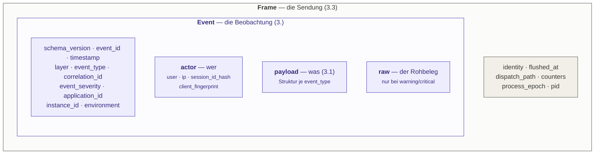

# 03 — Das Ereignisformat

Das Format ist die Paketgrenze. Sensor und Collector kennen voneinander nichts außer
diesem JSON — keine gemeinsame Bibliothek, keine PHP-Serialisierung, keine Klassennamen
auf der Leitung. Verbindlich festgelegt in (*3.*).

Im Code lebt es unter `EventFormat/`. Dieser Namensraum importiert **nichts Fremdes**,
weder aus dem Bundle noch aus Symfony, und ist darauf angelegt, als eigenes Paket
herausgelöst zu werden, das künftig auch das IdsBackendBundle konsumiert.

## Drei Ebenen der Verschachtelung



Ein Frame umhüllt die Events eines Requests; ein Event trägt seinen Payload und optional
den Rohbeleg. Der Frame ist **kein** Event und ändert das Event-Schema nicht — deshalb
liegen `dispatch_path` und die Zählerstände dort und nicht im Event: sie sind
Eigenschaften der *Sendung*, nicht einer *Beobachtung*.

Die Verzeichnisse unter `EventFormat/` spiegeln genau diese Verschachtelung:
`Frame/`, `Event/`, `Payload/` und `Vocabulary/`. Siehe
[struktur.md](struktur.md#die-beiden-öffentlichen-namespaces).

## Ein Event, wie es ankommt

```json
{
  "schema_version": 1,
  "event_id": "b3f1e6b0-6e3a-4c9a-9f2e-2a6a2f4b9c11",
  "timestamp": "2026-08-13T10:15:32.421Z",
  "layer": "kernel",
  "event_type": "kernel.exception",
  "correlation_id": "req-7f2a1c",
  "event_severity": "warning",
  "application_id": "shop-api",
  "instance_id": "web-03",
  "environment": "prod",
  "actor": {
    "user": null,
    "ip": "203.0.113.42",
    "session_id_hash": "a3f9c1d8e4b27a05",
    "client_fingerprint": "c71b04ae9f3d62"
  },
  "payload": {
    "exception_class": "Symfony\\Component\\HttpKernel\\Exception\\NotFoundHttpException",
    "exception_message": "No route found for GET /wp-admin/setup-config.php",
    "http_status": 404
  }
}
```

Die zehn Felder vor `actor` sowie die vier `actor.*`-Felder sind **Pflicht** — immer
vorhanden, unabhängig von der Ebene. Die `actor.*`-Felder sind dabei ausdrücklich
*nullable*: bei `kernel.request` liegt meist noch kein Security-Token vor, bei
zustandslosen API-Requests existiert keine Session, im CLI-Kontext kein HTTP-Kontext.

## Die geschlossenen Wertelisten

Drei Felder haben eine feste, endliche Wertemenge. Sie entsprechen exakt den
ENUM-Typen im Datenbankschema des Collectors (*4.2.1*) — **ein neuer Fall ist dort eine
Migration auf der Gegenseite**, nicht ein lokales Hinzufügen.

| Feld | Werte | Klasse |
|---|---|---|
| `layer` | `kernel` · `security` · `business` | `EventFormat\Vocabulary\Layer` |
| `event_severity` | `info` · `warning` · `critical` | `EventFormat\Vocabulary\Severity` |
| `environment` | `prod` · `staging` · `dev` | `EventFormat\Vocabulary\Environment` |

`environment` ist der Wert, den man am leichtesten falsch setzt und dessen Fehler völlig
lautlos bleibt: kommt beim Collector etwas anderes als diese drei an, scheitert das
Einfügen — stiller Totalverlust dieser Instanz, von einem stillgelegten Sensor nicht zu
unterscheiden. Deshalb gibt es `environment_map`, siehe
[08 — Konfiguration](08-konfiguration.md#herkunftskennung).

## Der Payload je Ebene (*3.1*)

Der variable Teil. Immer ein flaches oder maximal zweistufig verschachteltes Objekt.

| `layer` | Feldnamen definiert in | Beispiele |
|---|---|---|
| `kernel` | `EventFormat\Payload\KernelPayload` | `method`, `path`, `route`, `http_status`, `exception_class` |
| `security` | `EventFormat\Payload\SecurityPayload` | `firewall`, `authenticator`, `attribute`, `resource`, `decision` |
| `business` | — | frei; die Anwendung liefert ihn über `getPayload()` |

Für die Business-Ebene gibt es bewusst **keine** feste Struktur (*3.1.3*) — was ein
Vorfall bedeutet, weiß nur die Anwendung. Reservierte Schlüssel mit dem Präfix `_ids_`
werden entfernt.

Dass diese Konstanten im `EventFormat/` liegen und nicht im Normalisierer, ist kein
Zufall: die Sensoren lasen sie sonst aus Phase B, und Phase A hinge an Phase B — genau die
Richtung, die das Latenzbudget verbietet.

## Das `raw`-Feld

`raw` trägt den unverarbeiteten Rohbeleg und ist **kein Pflichtfeld**. Es wird nur für
`warning` und `critical` übertragen, weil es laut (*4.2.3*) über 95 % des Datenvolumens
ausmacht und die Masse aller Events `info` ist.

Deshalb wird es **träge** gebaut: erfasst wird im Request nur eine Closure, ausgewertet
wird sie erst in Phase B und nur dann, wenn die Severity das Feld überhaupt trägt. Wer
darüber entscheidet, ist `Support\RawPayload\Gate`; was drinsteht, legt
`Support\RawPayload\Builder` fest.

Jeder Typ trägt genau das, was die anderen nicht haben — sonst wäre `raw` bei einem
fehlgeschlagenen Request viermal fast dasselbe:

| `event_type` | Inhalt von `raw` |
|---|---|
| `kernel.response` | der gesamte Austausch: Anfrage-Header, Query, Formularfelder, Cookie-**Namen**, Antwort-Header |
| `kernel.exception` | die Aufrufkette und der Exception-Verlauf |
| `kernel.request` | **nichts** — das Event ist immer `info` und trüge `raw` nie |
| Security-Events | nichts; ihr `payload` ist vollständig |

Die Verkettung der Events eines Requests läuft über die `correlation_id` — das ist der
Zweck der Feldredundanz aus (*3.2*).

Was in `raw` unkenntlich gemacht wird und was nicht, steht in
[06 — Vertraulichkeit](06-vertraulichkeit.md).

## Was am Format verbindlich ist

`schema_version` ist **nicht konfigurierbar**. Der Sensor sendet genau eine Version. Wäre
sie einstellbar, könnte eine kompromittierte Anwendung eine alte Version behaupten und
damit collectorseitig den nachsichtigen Pfad auslösen.

Die Bump-Regeln:

- **kein** Bump bei additiven, optionalen Feldern — der Collector ignoriert Unbekanntes
- **Bump** beim Entfernen, Umbenennen oder Umtypisieren eines Pflichtfeldes, bei
  geänderter Bedeutung eines Feldes oder geändertem Hash-Verfahren

Der Zeitstempel ist auf `Y-m-d\TH:i:s.v\Z` festgelegt — UTC, Millisekunden, literales `Z`.
Das Konzept zeigt in (*3.*) nur ein Beispiel; hier ist es verbindlich gemacht, weil die
Uhrendrift-Messung des Collectors ein stabiles Format braucht.
