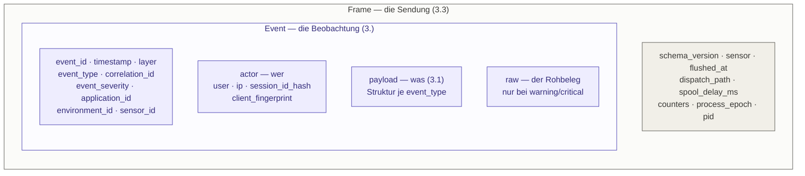

# 03 — Das Ereignisformat

Das Format ist die Paketgrenze. Sensor und Collector kennen voneinander nichts außer
diesem JSON — keine gemeinsame Bibliothek, keine PHP-Serialisierung, keine Klassennamen
auf der Leitung. Verbindlich festgelegt in (*3.*).

Im Code lebt es in einem eigenen Paket:
[`projektmotor/ids-event-data`](https://github.com/projektmotor/ids-event-data),
Namensraum `ProjektMotor\IdsEventData\`. Es importiert **nichts Fremdes**, weder aus
diesem Bundle noch aus Symfony — deshalb kann das IdsBackendBundle dasselbe Paket lesen,
ohne den Sensor mitzuziehen.

Diese Seite beschreibt das Format so, wie der Sensor es füllt. Der Formatvertrag selbst,
mit allen Feldern und Bump-Regeln, steht im README des Pakets.

## Drei Ebenen der Verschachtelung



Ein Frame umhüllt die Events eines Requests; ein Event trägt seinen Payload und optional
den Rohbeleg. Der Frame ist **kein** Event und ändert das Event-Schema nicht — deshalb
liegen `dispatch_path` und die Zählerstände dort und nicht im Event: sie sind
Eigenschaften der *Sendung*, nicht einer *Beobachtung*.

Die Verzeichnisse des Formatpakets spiegeln genau diese Verschachtelung:
`Frame/`, `Event/`, `Payload/` und `Vocabulary/`. Siehe
[concept/structure.md](concept/structure.md#das-ereignisformat-ist-ein-eigenes-paket).

## Ein Event, wie es ankommt

```json
{
  "event_id": "b3f1e6b0-6e3a-4c9a-9f2e-2a6a2f4b9c11",
  "timestamp": "2026-08-13T10:15:32.421Z",
  "layer": "kernel",
  "event_type": "kernel.exception",
  "correlation_id": "0198f2c1-4a7b-7e30-9d51-6b2f8c04a913",
  "event_severity": "warning",
  "application_id": "9b1c4f80-2a77-4d3e-9c15-7e2b6a4f0d31",
  "environment_id": "3f6d21ac-58b0-4e91-a7c4-11d9e0b8c522",
  "sensor_id": "c40a7e13-9d62-4b88-8f05-6a1e3c72b9d4",
  "actor": {
    "user": null,
    "ip": "203.0.113.42",
    "session_id_hash": "a3f9c1d8e4b27a05",
    "client_fingerprint": "c71b04ae9f3d62"
  },
  "payload": {
    "exception_class": "Symfony\\Component\\HttpKernel\\Exception\\NotFoundHttpException",
    "exception_message": "No route found for GET /wp-admin/setup-config.php",
    "http_status": 404
  }
}
```

Die neun Felder vor `actor` sowie die vier `actor.*`-Felder sind **Pflicht** — immer
vorhanden, unabhängig von der Ebene. Die `actor.*`-Felder sind dabei ausdrücklich
*nullable*: bei `kernel.request` liegt meist noch kein Security-Token vor, bei
zustandslosen API-Requests existiert keine Session, im CLI-Kontext kein HTTP-Kontext.

## Die geschlossenen Wertelisten

Drei Felder haben eine feste, endliche Wertemenge. Sie entsprechen exakt den
ENUM-Typen im Datenbankschema des Collectors (*4.2.1*) — **ein neuer Fall ist dort eine
Migration auf der Gegenseite**, nicht ein lokales Hinzufügen.

| Feld | Werte | Klasse |
|---|---|---|
| `layer` | `kernel` · `security` · `business` | `IdsEventData\Vocabulary\Layer` |
| `event_severity` | `info` · `warning` · `critical` | `IdsEventData\Vocabulary\Severity` |
| `dispatch_path` | `direct` · `deferred` · `recovered` | `IdsEventData\Frame\DispatchPath` |

`dispatch_path` steht im **Frame**, nicht im Ereignis — es beschreibt die Sendung. Es
gehört trotzdem hierher, weil es dieselbe Eigenschaft teilt: Der Collector führt es als
ENUM, und ein unbekannter Wert lässt das Einfügen scheitern.

**Die Umgebung stand hier bis Fassung 1 als vierte Zeile**, mit den festen Werten `prod`,
`staging` und `dev` und einer Klasse `Vocabulary\Environment`. Beides ist entfallen:
Umgebungen sind heute collectorseitig registrierte Gebilde mit eigener UUID und frei
wählbarem Namen, und der Sensor kennt nur die `environment_id`. Damit ist auch die
Fehlerquelle weg, um derentwillen es eine Zuordnungstabelle im Sensor gab — eine nicht
abbildbare Umgebung landete über deren Vorgabewert stillschweigend in der falschen
Auswertung. Wer den Anzeigenamen ändert, ändert nichts an der Kennung.

## Der Payload je Ebene (*3.1*)

Der variable Teil. Immer ein flaches oder maximal zweistufig verschachteltes Objekt.

| `layer` | Feldnamen definiert in | Beispiele |
|---|---|---|
| `kernel` | `IdsEventData\Payload\KernelPayload` | `method`, `path`, `route`, `http_status`, `exception_class`, `command` |
| `security` | `IdsEventData\Payload\SecurityPayload` | `firewall`, `authenticator`, `attribute`, `resource`, `decision`, `target_user` |
| beide | `IdsEventData\Payload\ResourceReference` | `resource_type`, `resource_id` |
| `business` | — | frei; die Anwendung liefert ihn über `getPayload()` |

`ResourceReference` steht quer zu den Ebenen, weil dieselbe Aussage aus zwei Quellen kommt:
auf der Security-Ebene aus dem Voter-Subjekt, auf der Kernel-Ebene aus Routenname und
Routenparametern (*3.1.4*). Das **Vokabular** des Typs unterscheidet sich dabei bewusst —
`order` dort, `app_order_show` hier —, und der Collector gruppiert deshalb innerhalb einer
Ebene.

Für die Business-Ebene gibt es bewusst **keine** feste Struktur (*3.1.3*) — was ein
Vorfall bedeutet, weiß nur die Anwendung. Reservierte Schlüssel mit dem Präfix `_ids_`
werden entfernt.

Dass diese Konstanten im Formatpaket liegen und nicht im Normalisierer, ist kein Zufall:
die Sensoren lasen sie sonst aus Phase B, und Phase A hinge an Phase B — genau die
Richtung, die das Latenzbudget verbietet.

## Das `raw`-Feld

`raw` trägt den unverarbeiteten Rohbeleg und ist **kein Pflichtfeld**. Es wird nur für
`warning` und `critical` übertragen, weil es laut (*4.2.3*) über 95 % des Datenvolumens
ausmacht und die Masse aller Events `info` ist.

Deshalb wird es **träge** gebaut: erfasst wird im Request nur eine Closure, ausgewertet
wird sie erst in Phase B und nur dann, wenn die Severity das Feld überhaupt trägt. Wer
darüber entscheidet, ist `Support\RawPayload\Gate`; was drinsteht, legt
`Support\RawPayload\Builder` fest.

Jeder Typ trägt genau das, was die anderen nicht haben — sonst wäre `raw` bei einem
fehlgeschlagenen Request viermal fast dasselbe:

| `event_type` | Inhalt von `raw` |
|---|---|
| `kernel.response` | der gesamte Austausch: Anfrage-Header, Query, Formularfelder, **JSON-Körper**, Cookie-**Namen**, Antwort-Header |
| `kernel.exception` | die Aufrufkette und der Exception-Verlauf |
| `kernel.request` | **nichts** — das Event ist immer `info` und trüge `raw` nie |
| `console.error` | die Aufrufkette und der Exception-Verlauf, wie beim `kernel.exception` |
| `console.command` | **nichts** — immer `info`, aus demselben Grund wie `kernel.request` |
| Security-Events | nichts; ihr `payload` ist vollständig |
| Business-Events | der `payload` unbereinigt und redigiert, dazu `invalid_severity_hint`, falls `getSeverityHint()` unbrauchbar war |

Die Verkettung der Events eines Requests läuft über die `correlation_id` — das ist der
Zweck der Feldredundanz aus (*3.2*).

### Der Anfragekörper

Formularkodierte Körper stehen in `request_params` — das ist, was Symfony geparst hat.
**JSON-Körper parst Symfony nicht**, sie landen nie in `$request->request`. Sie stehen
deshalb in `request_body`, gelesen vom Sensor selbst und durch dieselbe Denylist geführt.

Gelesen wird nur unter drei Bedingungen, und sie sind der Grund, warum das (*3.5*) nicht
widerspricht: nach dem Absenden der Antwort, nur bei `warning`/`critical`, und erst nachdem
`Content-Length` gegen `raw.max_request_body_bytes` geprüft wurde. Weder ist die Nutzlast
der Anwendung betroffen noch die Menge unbegrenzt.

Kommt der Körper **nicht** mit, steht der Grund in `request_body_omitted`:

| Wert | Bedeutung |
|---|---|
| `disabled` | `raw.include_request_body: false` |
| `multipart` | Datei-Upload, siehe `raw.skip_multipart` |
| `not_json` | anderer Medientyp — ohne Struktur greift die Denylist nicht |
| `unknown_length` | chunked übertragen, die Länge steht vor dem Lesen nicht fest |
| `too_large` | über `raw.max_request_body_bytes` |
| `undecodable` | als JSON deklariert, aber nicht dekodierbar |
| `unreadable` | der Körper war nicht mehr zu bekommen |

Der Vermerk ist kein Beiwerk: Ein fehlendes Feld ist von „die Anfrage hatte keinen Körper"
nicht zu unterscheiden, und bei einem Deserialisierungsversuch (*Szenario S5*) ist genau das
der Unterschied zwischen einer leeren Anfrage und einem blinden Fleck.

Was in `raw` unkenntlich gemacht wird und was nicht, steht in
[06 — Vertraulichkeit](06-vertraulichkeit.md).

## Was am Format verbindlich ist

`schema_version` ist **nicht konfigurierbar**. Der Sensor sendet genau eine Version. Wäre
sie einstellbar, könnte eine kompromittierte Anwendung eine alte Version behaupten und
damit collectorseitig den nachsichtigen Pfad auslösen.

Die Bump-Regeln:

- **kein** Bump bei additiven, optionalen Feldern — der Collector ignoriert Unbekanntes
- **Bump** beim Entfernen, Umbenennen oder Umtypisieren eines Pflichtfeldes, bei
  geänderter Bedeutung eines Feldes oder geändertem Hash-Verfahren

Der Zeitstempel ist auf `Y-m-d\TH:i:s.v\Z` festgelegt — UTC, Millisekunden, literales `Z`.
Das Konzept zeigt in (*3.*) nur ein Beispiel; hier ist es verbindlich gemacht, weil die
Uhrendrift-Messung des Collectors ein stabiles Format braucht.
