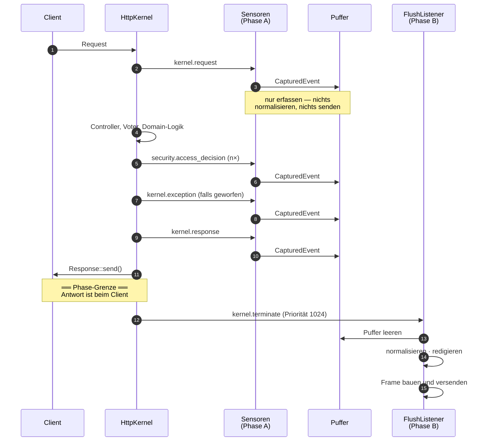

# 04 — Der Request-Lebenszyklus

Wann genau läuft welcher Code, und was kostet er? Die Antwort ist die Phasengrenze aus
[01 — Überblick](01-ueberblick.md#die-leitidee-zwei-phasen), hier im Detail.

## Der Ablauf

Alles oberhalb der Grenze kostet Antwortzeit, alles darunter nur noch die Belegung eines
Worker-Prozesses. Deshalb passiert oberhalb ausschließlich das Erfassen.

**Priorität 1024** auf `kernel.terminate` sorgt dafür, dass der Versand läuft, bevor
andere terminate-Listener der Anwendung eventuell den Prozess beenden.

### Wo sonst noch geflusht wird

`kernel.terminate` feuert nicht überall. `Delivery\Dispatch\FlushListener` hängt sich
deshalb an drei weitere Punkte — ein Messenger-Worker oder ein Import-Command würde seine
Business-Events sonst bis zum Prozessende puffern oder bei `SIGTERM` verlieren:

| Ereignis | Wann |
|---|---|
| `kernel.terminate` | HTTP-Request beendet |
| `console.terminate` | Konsolenbefehl beendet |
| `WorkerMessageHandledEvent` | Messenger-Nachricht verarbeitet |
| `WorkerMessageFailedEvent` | Messenger-Nachricht fehlgeschlagen |

## Das Erfassungsbudget

Konzept (*2.1*) nennt eine verbindliche Obergrenze von **5 ms im 99. Perzentil** für alle
drei Sensoren zusammen. `Sensor\CaptureBudget` macht daraus eine **durchgesetzte** Grenze
statt einer Absichtserklärung: es misst die eigene Laufzeit und stellt die Erfassung ein,
sobald das Budget aufgebraucht ist.

Der Standardwert ist **1500 µs** — deutlich unter den 5 ms. Die 5 ms sind die Obergrenze,
nicht das Ziel.

Betroffen sind vor allem Erfassungen, deren Anzahl pro Request nach oben offen ist:
Autorisierungsentscheidungen. Eine Übersichtsseite mit einem Voter pro Zeile erzeugt
beliebig viele — genau davor schützt das Budget. Übersprungene Erfassungen zählt
`dropped_capture_budget`.

Gemessene Werte meldet der Heartbeat. Das Versprechen ist damit im laufenden Betrieb
dauerhaft überprüfbar, nicht nur im Benchmark.

### Der Puffer

`Sensor\EventBuffer` ist eine Liste im Arbeitsspeicher des laufenden Prozesses. Kein
Cache, keine Datei, keine Queue — ein Netzwerk-Roundtrip zum Collector würde das 5-ms-Budget
allein aufbrauchen.

Eine Obergrenze, und eine Reserve dahinter:

| Grenze | Vorgabe | Wozu |
|---|---|---|
| `budget.max_events_per_request` | 64 | verhindert, dass eine Schleife mit vielen Autorisierungsprüfungen den Speicher füllt |
| `EventBuffer::MANDATORY_RESERVE` | 8 | Plätze **oberhalb** dieser Grenze, ausschließlich für Pflicht-Events |

Die Reserve ist nicht konfigurierbar und aus demselben Grund vorhanden wie ihr Gegenstück
im Erfassungsbudget: Die Zahl der Autorisierungsentscheidungen ist nach oben offen, die der
Kernel- und Anmeldeereignisse konstruktionsbedingt nicht. Ohne sie verdrängte eine
Übersichtsseite mit 64 Rechteprüfungen den `kernel.response` — und damit `http_status`, an
dem die Severity-Ableitung und die Scanning-Erkennung über gehäufte 403/404 hängen. Der
`ResponseSensor` läuft bei Priorität −2048 zuletzt und fiele als Erster heraus. Ausführlich
in [08 — Konfiguration](08-konfiguration.md#budget).

Auch die Reserve ist endlich. Ist der Puffer voll, wird verworfen und gezählt
(`dropped_buffer_full`) — niemals stillschweigend.

**Eine Grenze pro Prozess gibt es nicht.** Sie stand hier einmal als
`budget.max_events_per_process: 200` und ist entfallen, weil sie keine kohärente Bedeutung
hatte: Als Grenze für den aktuellen Inhalt wäre sie wirkungslos — der Flush leert den
Puffer, sein Inhalt liegt ohnehin immer unter 64. Als kumulative Grenze über die
Prozesslebenszeit wäre sie schädlich: ein Messenger-Worker hätte nach 200 Events dauerhaft
aufgehört zu erfassen. Der Fall, den sie abdecken sollte, tritt nicht ein — der
`FlushListener` hängt zusätzlich an `console.terminate` und den Worker-Ereignissen. Wer den
Schlüssel heute setzt, bekommt keine wirkungslose Einstellung, sondern eine Anwendung, die
nicht mehr bootet.

## Wenn die Latenz drückt

Reihenfolge der Stellräder — von oben nach unten, nicht wahllos:

1. **`layers.security.access_decision: false`** — der teuerste Sensor, er feuert bei jedem
   `isGranted()`. Kostet die Erkennung abgelehnter Autorisierungen.
2. **`layers.security.capture_granted: false`** — halbiert das Volumen, Ablehnungen
   bleiben. Kostet keine Regel des Konzepts (*4.3*), aber die Historie, auf die der offene
   Punkt E6 später zurückgreifen soll.
3. **`layers.kernel.ignored_paths`** — nimmt einzelne, nachweislich uninteressante Pfade
   heraus. Absichtlich leer vorbelegt: Regel R2b lebt davon, Zugriffe auf `/_profiler` zu
   sehen.

**Niemals eine ganze Ebene abschalten.** Das entfernt eine Signalklasse vollständig, statt
ihr Volumen zu senken. `ids:sensor:setup-check` meldet es als Befund — siehe
[02 — Beobachtungsebenen](02-beobachtungsebenen.md#eine-ebene-abschalten-nein).
