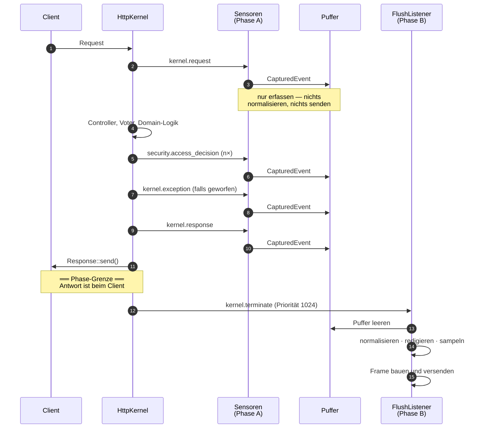
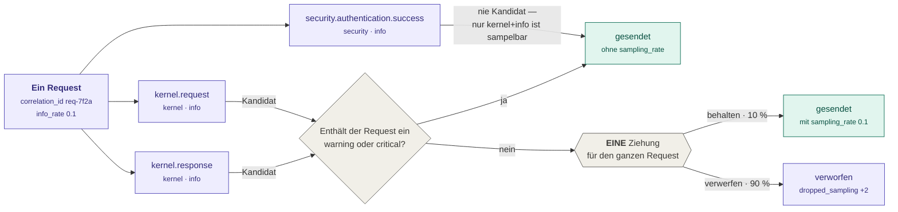

# 04 — Der Request-Lebenszyklus

Wann genau läuft welcher Code, und was kostet er? Die Antwort ist die Phasengrenze aus
[01 — Überblick](01-ueberblick.md#die-leitidee-zwei-phasen), hier im Detail.

## Der Ablauf

Alles oberhalb der Grenze kostet Antwortzeit, alles darunter nur noch die Belegung eines
Worker-Prozesses. Deshalb passiert oberhalb ausschließlich das Erfassen.

**Priorität 1024** auf `kernel.terminate` sorgt dafür, dass der Versand läuft, bevor
andere terminate-Listener der Anwendung eventuell den Prozess beenden.

### Wo sonst noch geflusht wird

`kernel.terminate` feuert nicht überall. `Delivery\Dispatch\FlushListener` hängt sich
deshalb an drei weitere Punkte — ein Messenger-Worker oder ein Import-Command würde seine
Business-Events sonst bis zum Prozessende puffern oder bei `SIGTERM` verlieren:

| Ereignis | Wann |
|---|---|
| `kernel.terminate` | HTTP-Request beendet |
| `console.terminate` | Konsolenbefehl beendet |
| `WorkerMessageHandledEvent` | Messenger-Nachricht verarbeitet |
| `WorkerMessageFailedEvent` | Messenger-Nachricht fehlgeschlagen |

## Das Erfassungsbudget

Konzept (*2.1*) nennt eine verbindliche Obergrenze von **5 ms im 99. Perzentil** für alle
drei Sensoren zusammen. `Sensor\CaptureBudget` macht daraus eine **durchgesetzte** Grenze
statt einer Absichtserklärung: es misst die eigene Laufzeit und stellt die Erfassung ein,
sobald das Budget aufgebraucht ist.

Der Standardwert ist **1500 µs** — deutlich unter den 5 ms. Die 5 ms sind die Obergrenze,
nicht das Ziel.

Betroffen sind vor allem Erfassungen, deren Anzahl pro Request nach oben offen ist:
Autorisierungsentscheidungen. Eine Übersichtsseite mit einem Voter pro Zeile erzeugt
beliebig viele — genau davor schützt das Budget. Übersprungene Erfassungen zählt
`dropped_capture_budget`.

Gemessene Werte meldet der Heartbeat. Das Versprechen ist damit im laufenden Betrieb
dauerhaft überprüfbar, nicht nur im Benchmark.

### Der Puffer

`Sensor\EventBuffer` ist eine Liste im Arbeitsspeicher des laufenden Prozesses. Kein
Cache, keine Datei, keine Queue — ein Netzwerk-Roundtrip zum Broker würde das 5-ms-Budget
allein aufbrauchen.

Eine Obergrenze, und eine Reserve dahinter:

| Grenze | Vorgabe | Wozu |
|---|---|---|
| `budget.max_events_per_request` | 64 | verhindert, dass eine Schleife mit vielen Autorisierungsprüfungen den Speicher füllt |
| `EventBuffer::MANDATORY_RESERVE` | 8 | Plätze **oberhalb** dieser Grenze, ausschließlich für Pflicht-Events |

Die Reserve ist nicht konfigurierbar und aus demselben Grund vorhanden wie ihr Gegenstück
im Erfassungsbudget: Die Zahl der Autorisierungsentscheidungen ist nach oben offen, die der
Kernel- und Anmeldeereignisse konstruktionsbedingt nicht. Ohne sie verdrängte eine
Übersichtsseite mit 64 Rechteprüfungen den `kernel.response` — und damit `http_status`, an
dem die Severity-Ableitung und die Scanning-Erkennung über gehäufte 403/404 hängen. Der
`ResponseSensor` läuft bei Priorität −2048 zuletzt und fiele als Erster heraus. Ausführlich
in [08 — Konfiguration](08-konfiguration.md#budget).

Auch die Reserve ist endlich. Ist der Puffer voll, wird verworfen und gezählt
(`dropped_buffer_full`) — niemals stillschweigend.

**Eine Grenze pro Prozess gibt es nicht.** Sie stand hier einmal als
`budget.max_events_per_process: 200` und ist entfallen, weil sie keine kohärente Bedeutung
hatte: Als Grenze für den aktuellen Inhalt wäre sie wirkungslos — der Flush leert den
Puffer, sein Inhalt liegt ohnehin immer unter 64. Als kumulative Grenze über die
Prozesslebenszeit wäre sie schädlich: ein Messenger-Worker hätte nach 200 Events dauerhaft
aufgehört zu erfassen. Der Fall, den sie abdecken sollte, tritt nicht ein — der
`FlushListener` hängt zusätzlich an `console.terminate` und den Worker-Ereignissen. Wer den
Schlüssel heute setzt, bekommt keine wirkungslose Einstellung, sondern eine Anwendung, die
nicht mehr bootet.

## Sampling: einen Teil gar nicht erst senden

Sampling heißt hier: **einen Teil der Events gar nicht erst zu senden.** Nicht kürzen,
nicht zusammenfassen, nicht später löschen — sie entstehen im Puffer und werden vor dem
Frame-Bau verworfen. Gespart werden Broker-Durchsatz, Speicher und Kosten im Collector;
verloren geht die Beobachtung, vollständig und endgültig.

Deshalb wird jeder so verworfene Event als `dropped_sampling` gezählt. Sampling ist ein
**absichtlicher** Verlust — aber deswegen kein unsichtbarer: ohne Zähler wäre eine zu
niedrig gesetzte Rate von einem Sensordefekt nicht zu unterscheiden.

Das Stellrad ist `sampling.info_rate`, und es ist die Wahrscheinlichkeit, mit der ein
Request seine sampelbaren Events **behält**:

| `sampling.info_rate` | Wirkung |
|---|---|
| `1.0` (Vorgabe) | Sampling ist aus. Es wird nicht gezogen und nichts markiert — der Schritt entfällt vollständig. |
| `0.1` | etwa jeder zehnte Request behält seine sampelbaren Events, neun von zehn verwerfen sie |
| `0.0` | alle sampelbaren Events werden verworfen |

Es ist ein Stellrad für den Notfall, kein Regelbetrieb: gedacht für Instanzen, deren
Ereignisvolumen das Budget aus (*4.2.3*) übersteigt.

### Was sampelbar ist — und was nie

| | sampelbar? | warum |
|---|---|---|
| `layer = kernel` **und** `severity = info` | **ja** | die Masse: `kernel.request` und erfolgreiche `kernel.response` gibt es pro Request garantiert, fast immer als `info` |
| `severity = warning` oder `critical` | nein | sie tragen die Erkennung — (*4.2.3*) schließt sie ausdrücklich aus |
| Security-Events, auch `info` | nein | ein erfolgreicher Login ist `info`, aber Voraussetzung für Regel B5 (Erfolg nach Fehlversuchsserie) |
| Business-Events, auch `info` | nein | laut (*2.1.3*) die einzige Signalklasse für erfolgreiche Angriffe |

Security- und Business-Events sind ohnehin selten. Sie zu sampeln spart kein Volumen und
kostet Erkennung.

Vor der Ziehung liegt noch eine Schranke: **enthält ein Request irgendein `warning` oder
`critical`, wird gar nicht erst gezogen** — auch seine `info`-Events bleiben dann
vollständig.

### Ein Request, durchgerechnet

Das Security-Event nimmt die obere Spur und umgeht die ganze Mechanik: es ist nicht
`layer = kernel` und damit nie Kandidat. Ein weggesampelter Request **verschwindet also
nicht** — es fallen nur seine sampelbaren Events weg, alles andere geht unverändert
hinaus.

Beide oberen Ausgänge führen zu „gesendet, ohne `sampling_rate`", und das ist kein
Zufall: markiert wird nur, was tatsächlich einer Ziehung ausgesetzt war.

Die Entscheidung fällt **pro Request**, nicht pro Event — das ist der Kern und der Grund
für „kohärent" im Klassennamen `Delivery\Dispatch\CoherentInfoSampler`.

**Warum das nicht anders geht:** Fiele die Entscheidung je Event, käme bei einer Rate von
0,1 regelmäßig ein `kernel.response` ohne den zugehörigen `kernel.request` an — und
umgekehrt. Für den Collector wäre das nicht von einem Verbindungsabbruch zu unterscheiden,
und jeder Self-Join über die `correlation_id` (*3.2*) liefe ins Leere. Man hätte 90 % des
Volumens gespart und dabei 100 % der Verknüpfbarkeit verloren.

**Warum ein relevanter Request seine info-Events behält:** Sonst käme bei einem 500er
gerade der `kernel.request` nicht an — also Pfad, Methode, Query und User-Agent. Die
Exception allein sagt, *dass* etwas kaputtging, nicht *worauf*. Relevante Requests sind
selten, und ihr Kontext ist der teuerste Teil eines Ausfalls. Abschaltbar über
`sampling.keep_if_request_relevant: false`.

**Warum die Ziehung zufällig ist und nicht aus der `correlation_id` abgeleitet:** Eine
Ableitung wäre reproduzierbar und billiger — aber *steuerbar*. Ist
`correlation.require_trusted_proxy` gelockert, setzt der Client die ID selbst, und ein
Angreifer könnte so lange IDs probieren, bis er eine findet, die garantiert weggesampelt
wird. Er hätte damit einen selbst gewählten blinden Fleck. Bei `random_int()` ist das
ausgeschlossen, und die Kosten sind *ein* Aufruf pro Request.

**Was der Collector davon mitbekommt:** Übersteht ein Request die Ziehung, wird seinen
sampelbaren Events die Rate als `sampling_rate` aufgeprägt — nur ihnen, nicht allen Events
des Requests. Ohne dieses Feld wäre jede Zählung im Collector um den Faktor 1/Rate zu
klein, und niemand könnte das im Nachhinein korrigieren (*4.2.3*).

Bei der Vorgabe `1.0` entfällt der Schritt vollständig: keine Ziehung, keine Markierung,
kein `sampling_rate`-Feld. Es würde jedes Event ohne Erkenntnisgewinn verbreitern.

## Wenn die Latenz drückt

Reihenfolge der Stellräder — von oben nach unten, nicht wahllos:

1. **`layers.security.access_decision: false`** — der teuerste Sensor, er feuert bei jedem
   `isGranted()`. Kostet die Erkennung abgelehnter Autorisierungen.
2. **`layers.security.capture_granted: false`** — halbiert das Volumen, Ablehnungen
   bleiben. Kostet die Positivpfad-Regeln.
3. **`sampling.info_rate: 0.1`** — dünnt `info`-Events der Kernel-Ebene aus. Ein
   fehlerhafter Request behält seinen Kontext.

**Niemals eine ganze Ebene abschalten.** Das entfernt eine Signalklasse vollständig, statt
ihr Volumen zu senken. `ids:sensor:setup-check` meldet es als Befund — siehe
[02 — Beobachtungsebenen](02-beobachtungsebenen.md#eine-ebene-abschalten-nein).
