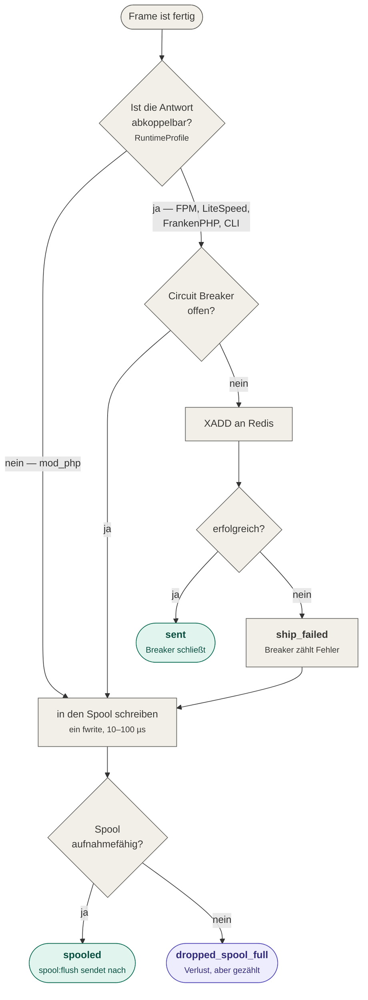
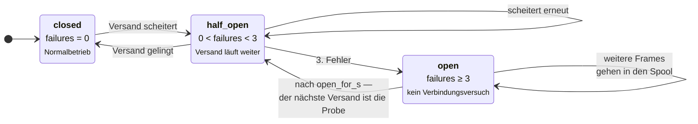

# 05 — Der Versandweg

Am Ende von Phase B steht ein fertiger Frame. Ob er zum Broker geht oder auf die Platte,
entscheidet `Delivery\Dispatch\FrameDispatcher` — an genau drei Schranken, in dieser
Reihenfolge.

## Die Weiche



Die erste Schranke ist die wichtigste: **ist die Antwort nicht abkoppelbar, findet
nachweislich kein Verbindungsversuch statt** — nicht „mit kurzem Timeout", nicht „nur wenn
Budget übrig", gar keiner.

## Schranke 1: Ist die Antwort abkoppelbar?

Phase B läuft auf `kernel.terminate`, also nach `Response::send()`. Unter PHP-FPM ruft
Symfony dort intern `fastcgi_finish_request()` auf: die Verbindung zum Client ist
geschlossen, das Skript läuft weiter. Alles danach kostet keine Antwortzeit mehr.

Unter mod_php gibt es diese Funktion **nicht**, und es existiert kein zuverlässiges
Äquivalent.

| Laufzeit | Antwort abkoppelbar | Versandweg |
|---|---|---|
| PHP-FPM (nginx, Apache-Proxy) | ja, `fastcgi_finish_request()` | direkt an Redis |
| LiteSpeed | ja | direkt an Redis |
| FrankenPHP, RoadRunner | ja | direkt an Redis |
| **mod_php** (prefork/worker/event) | **nein** | **lokaler Spool** |
| CLI, Messenger-Worker | entfällt | direkt an Redis |

**Warum das nicht „praktisch doch geht":** Man könnte argumentieren, die Antwort sei auch
ohne `fastcgi_finish_request()` beim Client — sobald `Content-Length` gesetzt und der
Puffer geleert ist, rendert der Browser. Darauf darf man sich nicht verlassen. Sobald die
Antwort **chunked** übertragen wird — kein `Content-Length`, eine `StreamedResponse`, oder
Apache schaltet per `mod_deflate` auf `Transfer-Encoding: chunked` um —, wartet der Client
auf den abschließenden Null-Chunk, und der kommt erst beim Skriptende. Jeder
Netzwerkzugriff in Phase B wäre dann **echte Antwortzeit**, und das Latenzbudget wäre
verletzt, ohne dass es jemand merkt.

`flush.policy: auto` ist die Vorgabe, weil die Laufzeitumgebung eine Eigenschaft des
**Servers** ist und nicht der Anwendung: dieselbe Anwendung läuft beim einen Kunden unter
FPM und beim anderen unter mod_php. Müsste der Wert von Hand gesetzt werden, wäre die
wahrscheinlichste Fehlkonfiguration genau die gefährliche Richtung.

Das Argument `RuntimeProfile` ist in `FrameDispatcher` bewusst **nicht** nullable: es ist
die einzige Schranke vor dem Netzwerk unter mod_php, und ein fehlendes Argument bedeutete
„sende direkt".

## Schranke 2: Der Circuit Breaker



Nach `open_for_s` (Vorgabe 30 s) meldet `isOpen()` wieder `false`, und der nächste Frame
ist die Probe: gelingt sie, wird zurückgesetzt; scheitert sie, öffnet der Breaker sofort
erneut, weil der Fehlerzähler noch über der Schwelle steht. Einen eigenen
Halb-offen-Zustand gibt es deshalb nicht — er ergibt sich.

**Dieser Baustein ist nicht optional, und der Grund ist nicht Eleganz.** Ohne Breaker
sieht ein Broker-Ausfall so aus: jeder Request läuft in den Verbindungs- oder
Lese-Timeout. Bei 20 ms Connect- und 30 ms Read-Timeout sind das bis zu **50 ms
zusätzliche Belegung pro Request**, für die Dauer des Ausfalls. Ein FPM-Pool mit 32
Kindprozessen bei 200 Requests pro Sekunde ist damit erschöpft, und die Anwendung ist
nicht mehr erreichbar.

Das Ergebnis wäre paradox: fail-open soll garantieren, dass eine IDS-Störung die Anwendung
nicht beeinträchtigt — ohne Breaker würde sie unter Last genau ins Gegenteil kippen und
*closed* failen.

Ist der Breaker offen, findet **kein** Verbindungsversuch statt: null Netzwerk-I/O, der
Frame geht direkt in den Spool. Der Zustand reist im Heartbeat mit, damit der Betreiber
sieht, ob und wie oft er gegriffen hat.

## `dispatch_path`: drei Zustände statt eines Flags

Jeder Frame trägt, auf welchem Weg er den Broker erreicht hat (*3.3.1*). Ein binäres
„late"-Flag wäre hier falsch — es würde planmäßig verzögerten Versand und Nachlauf nach
einem Ausfall in einen Topf werfen.

| Wert | Bedeutung | Für den Collector |
|---|---|---|
| `direct` | im selben Durchlauf versendet | Echtzeitregeln uneingeschränkt anwendbar |
| `deferred` | planmäßig über den Spool — mod_php | Echtzeitregeln weiter anwendbar, Verzögerung ist bekannt und begrenzt |
| `recovered` | Nachlauf nach einer Störung | Verzögerung unbekannt; Echtzeitregeln mit Vorsicht |

Der Wert ist kein Schalter, sondern ein abgeleiteter Tatsachenwert: die Anwendung kann ihn
nicht setzen.

## Der Spool

Der Spool ist **kein Übertragungsweg zum Collector**. Der Collector liest ausschließlich
aus Redis; `ids:sensor:spool:flush` läuft neben der überwachten Anwendung und benutzt
dieselben XADD-only-Rechte. Die Rechtetrennung bleibt vollständig intakt.

### Drei Folgen unter mod_php

**1. `ids:sensor:spool:flush` ist der einzige Transportweg — also Installationspflicht.**

```cron
* * * * * php /pfad/bin/console ids:sensor:spool:flush --quiet
```

Besser ein systemd-Timer mit `OnUnitActiveSec=30s`. Ohne diesen Prozess kommt **nichts**
an: der Sensor schreibt, niemand holt ab, der Spool läuft voll und verwirft.

**2. Die Erkennung verzögert sich um das Drain-Intervall.** Ein Brute-Force-Angriff wird
erkannt, aber bis zu 30 Sekunden später als unter FPM. Das ist strukturell und nicht
wegkonfigurierbar; das einzige Gegenmittel ist ein kürzeres Intervall.

**3. Das Spool-Verzeichnis muss node-lokal sein** — niemals NFS oder ein geteiltes Volume.
Sonst holt man sich genau den Netzwerkzugriff zurück, den man aus dem Request
herausgenommen hat. Für Container ist `/dev/shm/ids-spool` die Empfehlung.

> **Falle bei Containern:** Der Drain-Prozess muss dasselbe Spool-Verzeichnis sehen wie der
> Webserver. Entweder cron **im selben Container** oder ein Sidecar am selben Volume. Ein
> Kubernetes-CronJob in einem **eigenen Pod funktioniert nicht** — er sieht den Spool des
> Web-Pods nicht und versendet stillschweigend nichts. Dasselbe gilt für die `instance_id`,
> die dort ebenfalls falsch wäre.

Es gibt bewusst **keinen** `spool.enabled`-Schalter: Der Spool ist kein Merkmal, sondern
der Puffer, auf dem die fail-open-Zusage steht — und unter mod_php der einzige
Transportweg. Ein Schalter dafür hätte dort jede Erfassung lautlos verworfen. Wer den
Spool nicht selbst leeren will, stellt `spool.drain: off`.
