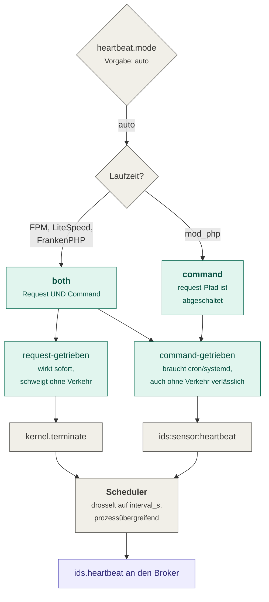

# 07 — Betrieb

Was nach der Installation dauerhaft laufen muss, was gemeldet wird und woran man erkennt,
dass etwas nicht stimmt.

## Der Heartbeat ist nicht optional

Konzept 2. nennt die **lautlose Stilllegung** des Sensors als die gefährlichste
Angriffsform: ein Angreifer, der den Sensor abschaltet, ist von einer Anwendung ohne
Verkehr nicht zu unterscheiden. Deshalb sendet der Sensor ein Lebenszeichen; bleibt es
aus, erzeugt der Collector den Alarm `ids.sensor_silent`.

Der Heartbeat ist ein **eigener Nachrichtentyp**, kein Event (*3.4*) — er hat keinen
`layer`. Ein vierter Wert dort würde collectorseitig einen Insert-Fehler auslösen.



**Unter mod_php ist der Command der einzige Weg** — der request-getriebene Pfad ist dort
abgeschaltet, weil er Netzwerkzugriff im Request bedeutete. Ohne cron meldet der Collector
dauerhaft `ids.sensor_silent`, obwohl der Sensor arbeitet.

```cron
* * * * * php /pfad/bin/console ids:sensor:heartbeat --quiet
```

Der Modus reist im Payload mit, damit der Collector die Aussagekraft eines ausbleibenden
Heartbeats kennt: bei `request` heißt Schweigen möglicherweise nur „kein Verkehr", bei
`command` heißt es „etwas ist kaputt".

### Warum die Drosselung die `instance_id` kennt

Der `Scheduler` drosselt **prozessübergreifend** — anders wäre er im request-getriebenen
Modus wirkungslos, weil unter PHP-FPM jeder Request in einem anderen Prozess laufen kann
und jeder für sich „noch nie gesendet" feststellen würde.

Prozessübergreifend heißt bei APCu aber auch: geteilt zwischen **allen** Anwendungen, die
dieses PHP-Pool benutzen. Ohne `instance_id` im Schlüssel würde die erste Instanz, die
einen Heartbeat sendet, die Heartbeats aller anderen für ein Intervall unterdrücken — der
Collector sähe eine einzige lebende Instanz und meldete für alle übrigen
`ids.sensor_silent`. Also einen Dauerfalschalarm genau für die Instanzen, die in Ordnung
sind.

Die Ablage ist zweistufig: APCu zuerst, Datei als Rückfall. Der CLI-Prozess des
Heartbeat-Commands sieht das APCu-Segment von PHP-FPM **nicht** — es sind getrennte
Shared-Memory-Segmente. Ohne die Datei wüssten Command- und Request-Pfad nichts
voneinander und würden im Modus `both` doppelt senden.

## fail-open, und was es kostet

Eine Störung des IDS darf die überwachte Anwendung **unter keinen Umständen**
beeinträchtigen (*4.*). Jeder Fehler wird verschluckt. Der Preis: **Events können verloren
gehen** — deshalb wird jeder Verlust gezählt und reist im Frame sowie im Heartbeat mit.

Die Zähler sind nach der Phase geordnet, in der der Verlust entsteht. Sie sind bewusst
feiner geschnitten, als es zum Zählen nötig wäre: Jeder Zähler steht für **eine** Ursache
und damit für ein anderes Gegenmittel — eine gemeinsame Zahl ließe nicht erkennen, welches
greift.

**Erfassung (Phase A, im Request):**

| Zähler | Bedeutung | Gegenmittel |
|---|---|---|
| `dropped_capture_budget` | Erfassungsbudget im Request erschöpft — die Zeit war alle | `budget.capture_us` erhöhen oder `access_decision` abschalten |
| `dropped_capture_error` | die Erfassung selbst hat geworfen — der Sensor ist defekt | Fehlerbericht; das Log nennt die Ausnahme |
| `dropped_decision_cap` | mehr `isGranted()` als `max_decisions_per_request` | Cap erhöhen — oder prüfen, ob die Seite wirklich so viele Voter braucht |
| `dropped_buffer_full` | mehr Events als der Puffer aufnimmt | `budget.max_events_per_request` |
| `dropped_reset` | der Puffer war beim Service-Reset noch gefüllt | ein Flush-Punkt fehlt; siehe [04](04-request-lebenszyklus.md) |

**Verarbeitung und Versand (Phase B, nach der Antwort):**

| Zähler | Bedeutung | Gegenmittel |
|---|---|---|
| `dropped_sampling` | absichtlich weggesampelt (*4.2.3*) | `sampling.info_rate` |
| `dropped_no_normalizer` | für die Ebene ist kein Normalisierer registriert | die Ebene ist abgeschaltet, das Event aber erfasst worden — `setup-check` |
| `dropped_normalize_error` | die Normalisierung ist fehlgeschlagen | Fehlerbericht; betrifft meist einen Payload der Anwendung |
| `dropped_frame_too_large` | die Sendung überschreitet `flush.max_frame_bytes` | Payload untersuchen — nicht Plattenplatz, sondern Inhalt |
| `dropped_spool_full` | Spool voll, Frame verworfen | `spool.max_bytes`, häufiger drainen |
| `dropped_spool_unreadable` | unlesbare Spool-Zeile oder dauerhaft unversendbarer Frame | ein zweiter Versuch scheitert gleich; Spool-Datei prüfen |
| `ship_failed` | Broker nicht erreichbar | Broker prüfen; der Frame ging in den Spool |
| `heartbeat_failed` | Lebenszeichen konnte nicht gesendet werden | wie `ship_failed` |

**Was nicht zählbar ist**, und das ist eine ehrliche Grenze: `SIGKILL`, der OOM-Killer,
Container-Eviction und `MAXLEN`-Trimming am Broker sind von innen nicht beobachtbar.
Stirbt der Prozess hart, sind die gepufferten Events weg — ohne Spur. `ids.event_loss`
deckt bewusste Verwerfungen und Spool-Überlauf, nicht das harte Wegsterben.

Eine weitere Grenze: entsteht keine Antwort, gibt es kein `kernel.response` — und damit
kein `raw` der Anfrageseite. Die gepufferten Events werden trotzdem versendet.

## Broker-Rechte: nur schreiben

Der Sensor läuft **in** der Anwendung, die er überwacht. Ist sie kompromittiert, ist er es
auch. Deshalb darf er ausschließlich schreiben — kein Lesen, kein Löschen (*2.*):

```text
user ids_sensor on >GEHEIM resetkeys resetchannels -@all ~ids:events:* +xadd +ping +client|setinfo
```

`+ping` braucht die Verbindungsprüfung. `+client|setinfo` braucht phpredis, weil aktuelle
Versionen beim Verbinden Bibliotheksname und -version melden — ohne dieses Recht scheitert
oder protokolliert der Verbindungsaufbau, je nach Version. Ein Detail, das genau in einer
gehärteten Umgebung auffällt und sonst nirgends.

Ausdrücklich **nicht** erteilt sind `xgroup`, `xread`, `xreadgroup`, `xrange`, `xdel` und
`del`: ein Angreifer in der Anwendung kann damit weder abgesendete Events löschen noch die
noch nicht konsumierten Events anderer Requests mitlesen.

Daraus folgt zwingend **`auto_setup: false`**. Der Standard von Symfonys Redis-Transport
sendet `XGROUP CREATE … MKSTREAM`, und das lehnen die Rechte mit `NOPERM` ab. Dieses Bundle
setzt den Wert selbst; wer ihn überschreibt, bekommt eine Anwendung, die in der Entwicklung
funktioniert und beim ersten Versand in Produktion scheitert. **Der wahrscheinlichste
Erstinstallationsfehler.** Stream und Consumer-Gruppe erzeugt der Collector.

Übertragen wird ausschließlich JSON, niemals PHP-serialisierte Daten. Das ist eine
Sicherheitsentscheidung: der Sensor braucht zwingend Schreibrecht, und ein Angreifer mit
Codeausführung könnte über `PhpSerializer` einen präparierten Payload einstellen, den der
Collector deserialisiert — Codeausführung in genau der Komponente, die die Kompromittierung
überleben soll.

### Ihre Messenger-Einrichtung bleibt unberührt

Das Bundle registriert **einen Transport** und sonst nichts: keine `buses`, kein `routing`,
keine Middleware. Der Sensor spricht diesen Transport unmittelbar an.

Das ist zugesagt und mit einem Test belegt, weil die naheliegende Alternative — ein eigener
Message-Bus — Ihre Anwendung beschädigt hätte: sobald ein Bundle einen Wert für
`framework.messenger.buses` beisteuert, greift Symfonys Vorgabe `messenger.bus.default`
nicht mehr. Eine Anwendung ohne ausdrücklich benannte Buses hätte danach nur noch den
sendenden Bus des Sensors gehabt, und jedes `$bus->dispatch()` wäre wirkungslos geworden —
ohne Fehler und ohne Warnung.

Wer den Transport lieber selbst konfiguriert: `transport.register_transport: false`, und
den Transport unter dem Namen aus `transport.name` anlegen.

## Trusted Proxies

Steht die Anwendung hinter einem Reverse Proxy und ist `framework.trusted_proxies` nicht
gesetzt, ist `actor.ip` bei **jedem** Event die Proxy-IP. Alle IP-basierten Regeln aus
(*4.3*) sind dann wirkungslos — ohne jede Fehlermeldung.

## Die drei Befehle

| Befehl | Zweck |
|---|---|
| `ids:sensor:setup-check` | Betriebsprüfung. Rückgabewert ≠ 0 heißt: die Erkennung ist wirkungslos. Für den Deploy. |
| `ids:sensor:spool:flush` | Leert den Spool in Richtung Broker. Unter mod_php Pflicht. |
| `ids:sensor:heartbeat` | Sendet ein Lebenszeichen. Für cron oder systemd-Timer. |

`ids:sensor:setup-check` bitte **nicht** mit `|| true` entschärfen. Der Sinn ist, dass eine
Fehlkonfiguration im Deploy auffällt und nicht erst bei der Nachanalyse eines Vorfalls.

Der Command unterscheidet **Befunde** (die Erkennung ist wirkungslos — Rückgabewert 1) von
**Hinweisen** (etwas ist eingeschränkt, aber möglicherweise gewollt — Rückgabewert 0).
`--strict` behandelt Hinweise wie Befunde:

```console
$ php bin/console ids:sensor:setup-check --strict
```

Das ist der Schalter für Deployments, die jede Einschränkung ausdrücklich abnicken wollen.
Er ist praktisch immer rot, und das ist Absicht: Der Hinweis auf die fehlende
Business-Instrumentierung erscheint **unabhängig** von jeder Konfiguration, weil der Sensor
nicht wissen kann, ob die Anwendung Events auslöst. Wer `--strict` grün haben will, muss
die Business-Ebene tatsächlich anbinden — siehe
[09 — Business-Ebene](09-business-ebene.md).

## Fehlersuche

| Symptom | Wahrscheinliche Ursache |
|---|---|
| `No transport supports Messenger DSN redis://…` | `symfony/redis-messenger` fehlt — es ist hier eine Entwicklungsabhängigkeit, die Anwendung muss es selbst verlangen |
| `NOPERM … XGROUP` beim ersten Prod-Versand | `auto_setup` wurde überschrieben |
| Collector meldet `ids.sensor_silent`, Sensor läuft | Heartbeat-cron fehlt (unter mod_php Pflicht) |
| Gar nichts kommt an, keine Fehlermeldung | unter mod_php: `spool:flush` läuft nicht, oder der Drain-Prozess sieht ein anderes Verzeichnis |
| Alle Events tragen dieselbe `instance_id` | zur Build-Zeit aufgelöst statt zur Laufzeit |
| Alle Events tragen die Proxy-IP | `framework.trusted_proxies` fehlt |
| Instanz taucht in keiner Auswertung auf | `environment` nicht abbildbar — der Collector verwirft |

Der erste Griff ist in allen Fällen `ids:sensor:setup-check`; er prüft genau diese Punkte.
