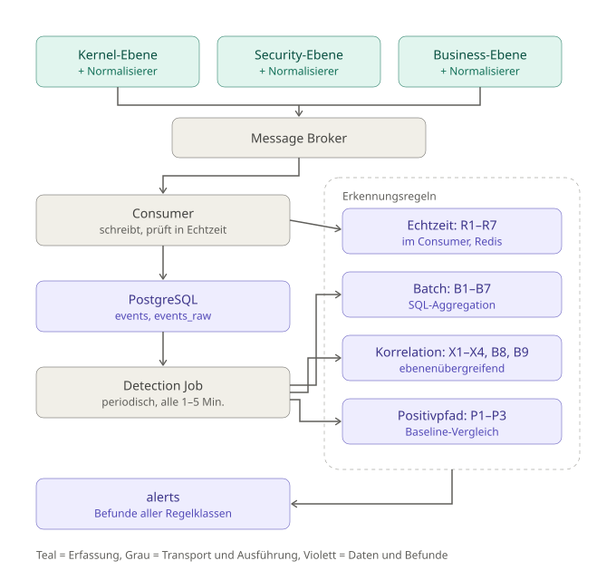

# IDS-Konzept: Generische Symfony-Anwendung (6.4 / 7.x)

**Stand:** 13.08.2026
**Status:** In Bearbeitung — Neuansatz, ersetzt vorheriges Zwei-Profil-Komplexsystem (TYPO3 + API/Symfony)
**Versionshistorie:** Version 1 gesichert am 13.08.2026 (Stand nach Restrukturierung: Abschnitte 1–4 und 6, inkl. Zwei-Bundle-Auslieferung und Erkennungsstruktur in 4.3. Die Restrukturierung führte die Erkennung aus einem eigenen Abschnitt 5 nach 4.3 zusammen; eine Ziffer 5 gibt es seitdem nicht mehr.)
· 15.08.2026: zwei Literale des Drahtformats umbenannt, damit Konzept und Code dieselben Wörter benutzen — `redaction_version` → `cleanup_version` (3.1, 3.4) und `[redacted]` → `[confidential]` (4.5.1). Die deutsche Prosa bleibt bei „Redaktion"; der Implementierung liegt sie als `Support\PayloadConfidentialityCleanup\` zugrunde. Inhaltlich ändert sich nichts.
· 16.08.2026: **inhaltliche Änderung** — Auflösung eines Widerspruchs zwischen 3.5 und Szenario S5 (4.3.6). 3.5 schloss den Zugriff auf den rohen Eingabestrom pauschal aus, S5 sagte für denselben Beleg „vollständige Verfügbarkeit" zu. Da Symfony nur formularkodierte Körper parst, war `raw` für jede JSON-API-Anfrage leer — also genau dort, wo S5 stattfindet. 3.5 erlaubt das Lesen jetzt unter drei Bedingungen (JSON, bekannte und begrenzte Länge, nach dem Absenden der Antwort) und benennt jede Ablehnung über `request_body_omitted`; S5 trägt den entsprechenden Vorbehalt. Neue Felder in 3.5: `request_body`, `request_body_omitted`. Neue Option: `raw.max_request_body_bytes`.
· 16.08.2026, zweiter Durchgang: Ergebnis eines Abgleichs von Konzept, Dokumentationsreihe `doc/01`–`doc/09` und Quellcode. **Inhaltliche Änderungen:** (a) Die `raw`-Bedingung „für alle Events, die einen Alert ausgelöst haben" ist in Abschnitt 3 und 4.2.3 **gestrichen** — sie ist vom Sensor nicht erfüllbar, weil der Alert erst im Collector entsteht; die Folge steht als offener Punkt OB11. (b) `correlation_id` ist in 2.2.4 ergänzt und für Läufe ohne Request festgelegt (neuer Unterabschnitt „Korrelation außerhalb des Requests"). (c) Die Redaktionsliste in 4.5.1 steht auf `version: 2` und führt die beiden `X-Debug-*`-Header; 3.4 zeigt entsprechend `cleanup_version: 2`. (d) Sechs Bausteine der Umsetzung sind nachgezogen: Erfassungsbudget und Circuit Breaker in 2.1, Sub-Requests, fatale Fehler und `ignored_paths` in 2.1.1, `environment_map`/`environment_fallback` in 2.2.1. (e) 3.4 zeigt die tatsächlich gesendeten Heartbeat-Felder. **Redaktionell:** Die offenen Punkte in 6.1/6.3 tragen jetzt das Präfix `OB` und kollidieren nicht mehr mit den Batch-Regeln B1–B9 aus 4.3.2/4.3.3; Verweise auf einen „Abschnitt 5" zeigen auf 4.3.6; der `alerts`-Index heißt `idx_alerts_first_seen` (eine Spalte `created_at` gibt es nicht); 2.2.1 führt `timestamp` und `correlation_id`; der doppelte Wirksamkeitshinweis in Abschnitt 2 ist entfernt.
· 29.08.2026: **inhaltliche Änderung, die größte seit Version 1** — der Transport zwischen Sensor und Collector wechselt vom Message Broker auf eine REST-Schnittstelle. Der Sensor sendet per HTTPS an `POST /api/v1/sensor/{sensor_id}`, angemeldet mit vom Collector ausgegebenen Zugangsdaten und einem daraus geholten, gecachten JWT (neuer Abschnitt 3.6). Damit fällt Redis in **beiden** Rollen weg: als Transport und als In-Memory-Zählerspeicher der Echtzeitregeln, der jetzt eine `UNLOGGED`-Tabelle in der ohnehin vorhandenen PostgreSQL-Datenbank ist (4.2.1, 4.3). **Das System besteht danach aus zwei Bausteinen statt vier:** der überwachten Anwendung und dem Collector. Betroffen sind 1, 2, 2.1, 3.3–3.6, 4, 4.1, 4.2, 4.3, 4.4, 4.5 und 6. Das Drahtformat aus Abschnitt 3 ändert sich **nicht**, deshalb kein `schema_version`-Bump. **Der Quellcode ist bewusst unverändert:** Das Bundle liefert weiterhin den Redis-Streams-Transport aus, und die Dokumentationsreihe `doc/01`–`doc/09` beschreibt diesen ausgelieferten Stand korrekt. Konzept und Auslieferung laufen bis zur Umsetzung auseinander.

---

## Inhaltsverzeichnis

- [1. Ausgangslage & Scope](#1-ausgangslage--scope)
- [2. IdsSensorBundle](#2-idssensorbundle)
  - [2.1 Sensorik](#21-sensorik)
    - [Das Erfassungsbudget — eine gemessene Grenze statt einer Absichtserklärung](#das-erfassungsbudget--eine-gemessene-grenze-statt-einer-absichtserklärung)
    - [Der Circuit Breaker — damit fail-open unter Last nicht ins Gegenteil kippt](#der-circuit-breaker--damit-fail-open-unter-last-nicht-ins-gegenteil-kippt)
    - [2.1.1 HttpKernel-Events](#211-httpkernel-events)
    - [2.1.2 Security-Component-Events](#212-security-component-events)
    - [2.1.3 Business-/Domain-Events](#213-business-domain-events)
  - [2.2 Normalisierungs-Mapping](#22-normalisierungs-mapping)
    - [2.2.1 Gemeinsame genutzte Eigenschaften (bei allen Sensoren gleich)](#221-gemeinsame-genutzte-eigenschaften-bei-allen-sensoren-gleich)
      - [Anwendungs- und Instanzkontext](#anwendungs--und-instanzkontext)
      - [Konkrete Ableitungsregeln für event_severity](#konkrete-ableitungsregeln-für-event_severity)
    - [2.2.2 Normalisierung Kernel-Ebene](#222-normalisierung-kernel-ebene)
      - [Nutzerkontext auf Kernel-Ebene](#nutzerkontext-auf-kernel-ebene)
    - [2.2.3 Normalisierung Security-Ebene](#223-normalisierung-security-ebene)
    - [2.2.4 Normalisierung Business-Ebene](#224-normalisierung-business-ebene)
      - [Korrelation außerhalb des Requests](#korrelation-außerhalb-des-requests)
      - [Bildung der Sitzungskontext-Felder](#bildung-der-sitzungskontext-felder)
- [3. Normalisierungsformat](#3-normalisierungsformat)
  - [3.1 Payload-Format pro Ebene / Events](#31-payload-format-pro-ebene--events)
    - [3.1.1 Kernel-Ebene / -Events](#311-kernel-ebene---events)
      - [`kernel.request`](#kernelrequest)
      - [`kernel.exception`](#kernelexception)
      - [`kernel.response`](#kernelresponse)
    - [3.1.2 Security-Ebene / -Events](#312-security-ebene---events)
      - [`security.authentication.success`](#securityauthenticationsuccess)
      - [`security.authentication.failure`](#securityauthenticationfailure)
      - [`security.access_decision`](#securityaccess_decision)
    - [3.1.3 Business-Ebene / -Events](#313-business-ebene---events)
      - [Generische Business-Events](#generische-business-events)
  - [3.2 Bewusste Feldredundanz zwischen Request- und Folge-Events](#32-bewusste-feldredundanz-zwischen-request--und-folge-events)
  - [3.3 Transportformat: der Frame](#33-transportformat-der-frame)
    - [3.3.1 `dispatch_path` — drei Zustände statt eines Flags](#331-dispatch_path--drei-zustände-statt-eines-flags)
  - [3.4 Heartbeat — ein eigener Nachrichtentyp, kein Event](#34-heartbeat--ein-eigener-nachrichtentyp-kein-event)
  - [3.5 Inhalt von `raw` je `event_type`](#35-inhalt-von-raw-je-event_type)
  - [3.6 Die Ingest-Schnittstelle](#36-die-ingest-schnittstelle)
    - [Endpunkt und Umschlag](#endpunkt-und-umschlag)
    - [Anmeldung](#anmeldung)
    - [Antwortcodes und was der Sensor daraus macht](#antwortcodes-und-was-der-sensor-daraus-macht)
    - [Zwei Versandmodelle](#zwei-versandmodelle)
- [4. IdsBackendBundle - Zentrale Sammelstelle](#4-idsbackendbundle---zentrale-sammelstelle)
  - [4.1 Ingest-Endpunkt und Consumer](#41-ingest-endpunkt-und-consumer)
  - [4.2 PostgreSQL-Datenbank](#42-postgresql-datenbank)
    - [4.2.1 Tabellenschema](#421-tabellenschema)
    - [4.2.2 Indizierung](#422-indizierung)
    - [4.2.3 Retention & Partitionierung](#423-retention--partitionierung)
      - [Volumenbudget und gestufte Retention](#volumenbudget-und-gestufte-retention)
      - [Partitionierung mit pg_partman](#partitionierung-mit-pg_partman)
    - [4.2.4 Auswertungstabellen](#424-auswertungstabellen)
  - [4.3 Detection](#43-detection)
    - [4.3.1 Echtzeit-Regeln (pro Event, im Consumer)](#431-echtzeit-regeln-pro-event-im-consumer)
    - [4.3.2 Periodische Regeln (Batch, alle 1–5 Minuten)](#432-periodische-regeln-batch-alle-15-minuten)
    - [4.3.3 Ebenenübergreifende Korrelation](#433-ebenenübergreifende-korrelation)
    - [4.3.4 Positivpfad-Regeln (Prüfung erfolgreicher Vorgänge)](#434-positivpfad-regeln-prüfung-erfolgreicher-vorgänge)
    - [4.3.5 Anomaliebasierte Ergänzung](#435-anomaliebasierte-ergänzung)
    - [4.3.6 Detektions-Regeln Symfony-typische Angriffsszenarien](#436-detektions-regeln-symfony-typische-angriffsszenarien)
  - [4.4 Alerting - Vorfall statt Einzelalarm](#44-alerting---vorfall-statt-einzelalarm)
  - [4.5 Absicherung der Sammelstelle und Rohdatenschutz](#45-absicherung-der-sammelstelle-und-rohdatenschutz)
    - [4.5.1 Redaktion sensibler Werte in `raw`](#451-redaktion-sensibler-werte-in-raw)
    - [4.5.2 Zugriffstrennung in der Datenbank](#452-zugriffstrennung-in-der-datenbank)
    - [4.5.3 Weitere Maßnahmen](#453-weitere-maßnahmen)
- [6. Offene Punkte — priorisierte Gesamtübersicht](#6-offene-punkte--priorisierte-gesamtübersicht)
  - [6.1 Erledigt in dieser Fassung](#61-erledigt-in-dieser-fassung)
  - [6.2 Erkennung](#62-erkennung)
  - [6.3 Betrieb, Auslieferung, Validierung](#63-betrieb-auslieferung-validierung)
  - [6.4 Empfohlene Reihenfolge](#64-empfohlene-reihenfolge)

---

## 1. Ausgangslage & Scope

**Ziel:** Intrusion Detection (Angriffserkennung) für eine **generische Symfony-Anwendung** ab Version 6.4.

> **Änderung gegenüber der ersten Fassung:** Ursprünglich lautete das Ziel „Symfony 5.4". Die Zielversion des `IdsSensorBundle` ist stattdessen PHP 8.2+ mit Symfony `^6.4|^7.0` — das löst den offenen Punkt OB5 in Richtung der aktuellen LTS. Der Grund ist nicht Modernität, sondern Eindeutigkeit: das Authenticator-System hat sich zwischen 5.4 und 6.x grundlegend geändert, und die Security-Ebene aus 2.1.2 hängt daran unmittelbar. Beide Wege parallel zu unterstützen hieße, zwei verschiedene Erfassungspfade für Anmeldeereignisse zu pflegen — von denen einer in jeder Installation ungetestet läuft. **Folge: in einer 5.4-Anwendung ist das Bundle nicht installierbar.**

**Bewusste Eingrenzung — explizit NICHT Teil dieses Konzepts (vorerst):**
- Keine Überwachung des Webservers (Apache/Nginx)
- Keine Überwachung der Datenbank
- Keine Überwachung eines Reverse-Proxy
- Keine Überwachung der Netzwerk-/Infrastruktur-Ebene
- Kein Bezug auf ein konkretes, bestehendes Projekt — es geht um Symfony 6.4/7.x als generisches Muster

Betrachtet wird ausschließlich das, was **innerhalb der Symfony-Anwendung selbst** beobachtbar ist.

**Aufbau:** Zwei Symfony-Bundles, die ausschließlich über die REST-Schnittstelle des Collectors miteinander kommunizieren (3.6).

| Paket | Läuft wo | Aufgabe |
|---|---|---|
| `IdsSensorBundle` | in der überwachten Symfony-Anwendung | Erfassung, Normalisierung, Redaktion (4.5.1), Versand an den Collector |
| `IdsBackendBundle` | läuft in eigenständiger Symfony-Anwendung (Backend / Dashboard), getrennt deployed| Ingest-Endpunkt, Ausgabe und Sperrung der Sensor-Zugangsdaten, Speicherung, sämtliche Regeln aus Abschnitt 4.3, Alerts, Applications verwalten, ... |

**Zwei Bausteine, nicht vier.** Zwischen beiden steht nichts: kein Message Broker, kein In-Memory-Store. Was der Collector intern tut — ob er die angenommene Sendung erst einreiht, ob er Zwischenspeicher benutzt — ist seine Sache und für den Sensor unsichtbar. Nach außen braucht eine vollständige Installation genau zwei Dinge, die betrieben, gehärtet und überwacht werden müssen: die überwachte Anwendung und den Collector samt seiner PostgreSQL-Datenbank.

**Die Paketgrenze ist das normalisierte Event-Format aus Abschnitt 3.** Alle zur Erkennung nötigen Daten stecken darin — deshalb liegen *alle* Regeln im Collector, auch die Symfony-spezifischen. Sie prüfen normalisierte Feldwerte (`payload.path`, `payload.exception_class`), nicht Framework-Objekte, und brauchen zur Laufzeit keine Symfony-Kenntnis.

**`schema_version` im Event:** Da beide Bundles getrennt deployed werden, laufen sie zeitweise auseinander. Das Feld erlaubt dem Collector, ältere Sensoren zu verarbeiten, statt Events zu verwerfen.

---

## 2. IdsSensorBundle

**Architekturentscheidung:** Sensor und Normalisierer bilden **einen Baustein** (nicht zwei getrennte Komponenten) — z. B. ein Symfony-Event-Subscriber, der das Rohevent abfängt und direkt in normalisierter Form weitergibt.

**Kernel- und Security-Ebene (siehe 2.1 Sensorik und 2.2 Normalisierungs-Mapping) sind nach `composer require` ohne Anwendungscode aktiv** — die Event-Subscriber registrieren sich selbst. Die Business-Ebene erfordert zwingend Arbeit in der Anwendung (Implementierung der benötigten Events). Diese Asymmetrie entspricht der Wirksamkeitsaussage aus 2.1 und wird in der Auslieferung nicht verschleiert.

Der Hinweis zur Wirksamkeit, der diese Asymmetrie ausformuliert, steht in 2.1.

**Warum das IdsSensorBundle keinen Datenbankzugriff erhalten darf**

Trüge das Sensor-Bundle die PostgreSQL-Zugangsdaten, hätte die überwachte Anwendung Zugriff auf ihren eigenen Beweisspeicher. Ein Angreifer mit Codeausführung — also genau das Szenario aus S4 und S5 — könnte seine Spuren löschen. Die Manipulationsgrenze verläuft deshalb am Ingest-Endpunkt des Collectors, mit **asymmetrischen Rechten**:

| | Anwendung (Sensor) | Collector |
|---|---|---|
| Verben | ausschließlich `POST` auf `/api/v1/sensor/{sensor_id}` und dessen Token-Endpunkt | vollständiger Zugriff auf den Beweisspeicher |
| Geltungsbereich | das Token gilt für genau die eigene `sensor_id` — der Collector gleicht dessen `sub`-Claim gegen den Pfad ab (3.6) | — |
| Lesen | kein Endpunkt gibt gespeicherte Events zurück | Lesen erfolgt im Dashboard, hinter eigener Anmeldung |
| Löschen | kein `DELETE`, kein Bearbeiten, kein Nachträgliches | Retention und Partitionierung (4.2.3) |

Damit kann ein Angreifer in der Anwendung keine bereits abgesendeten Events löschen und die noch nicht konsumierten Events anderer Requests nicht mitlesen. Gegenüber dem früher vorgesehenen Message Broker ist das die **schärfere** Grenze: Es gibt keinen gemeinsamen Stream mehr, aus dem überhaupt gelesen werden könnte, und keine Kommandosprache, deren Rechte man einzeln entziehen müsste. Der Sensor kennt genau zwei Adressen, und beide nehmen nur entgegen.

**Was dadurch nicht verhindert wird:** gefälschte Events einschleusen (der Sensor braucht Schreibrecht), den Ingest-Endpunkt fluten (Restrisiko aus Abschnitt 4), und den Sensor stilllegen.

Das Stilllegen ist lautlos und daher am gefährlichsten — deshalb sendet jeder Sensor im festen Intervall (Vorschlag: 60 s) einen **Heartbeat** mit `application_id` und `instance_id`. Bleibt er aus, erzeugt der Collector einen Alert (`rule_id = "ids.sensor_silent"`). Das macht aus dem Stilllegen ein detektierbares Ereignis.

Gegen das Fluten hat der Collector zwei Mittel, die eine Broker-ACL nicht bot: eine Ratengrenze je `sensor_id` (`429`, siehe 3.6) und das sofortige Sperren der Zugangsdaten im Anwendungsregister, ohne dass jemand Infrastruktur anfassen muss.

Aus demselben Grund liegt die **Erkennungskonfiguration collectorseitig** (Pfad-Wissensbasis, Schwellwerte, Cooldowns) und wird nicht vom Sensor mitgeliefert — andernfalls könnte eine kompromittierte Anwendung sich die unangenehmen Regeln abschalten.

### 2.1 Sensorik

3 Beobachtungsebenen:

- HttpKernel-Events
- Security-Component-Events
- Business-/Domain-Events

**Entscheidungen:** 
- Alle drei Ebenen werden von Anfang an gemeinsam betrachtet (nicht sequenziell/optional). Ziel, Auswertungen / Analysen sollen auch Kombination der drei Ebene abbilden können.
- Jede der drei Beobachtungsebenen erhält einen **eigenen Sensor**, der jeweils **fest mit einem eigenen Normalisierer gekoppelt** ist (ein Baustein). Der Normalisierer sendet die normalisierten Daten anschließend an eine **zentrale Sammelstelle**.

> **Hinweis zur Wirksamkeit:** Die drei Ebenen sind nicht gleichwertig ersetzbar. Kernel- und Security-Ebene erkennen zuverlässig *gescheiterte* Angriffe (Fehler, Denials, Fehlversuche). Erfolgreiche Angriffe, die die Anwendung bestimmungsgemäß benutzen, erzeugen dort **kein Signal** und sind ausschließlich über die Business-Ebene erkennbar (siehe 2.1.3 und 4.3.4). Wird die Business-Ebene nicht instrumentiert, bleibt das System auf die Erkennung gescheiterter Angriffe beschränkt.



*Die Grafik zeigt den Gesamtaufbau über diesen Abschnitt hinaus: Erfassung (2.1.1–2.1.3), Transport (2.1 und 3.6), Speicherung (Abschnitt 4) und die vier Regelklassen der Detection (4.3). Nicht dargestellt sind die Pfad-Wissensbasis `known_paths.yaml` (4.3.1), die als Konfiguration in den Consumer geladen wird, und die Tabelle `metric_baselines` (4.2.4), die der Detection Job für Positivpfad- und Anomalieregeln liest und schreibt.*

**Transport-Entscheidung:** Übertragung erfolgt **per HTTPS-POST an die REST-Schnittstelle des Collectors** — `POST /api/v1/sensor/{sensor_id}`, abgesetzt nach dem Absenden der Antwort. Zwischen Sensor und Collector steht keine eigene Transport-Infrastruktur. Endpunkt, Umschlag, Anmeldung und Antwortcodes sind in **3.6** festgelegt.

Der Grund ist der Betriebsweg. Ein Message Broker verlangt vom Betreiber der überwachten Anwendung einen Netzwerkpfad zu Infrastruktur, die dem Collector gehört, dazu eine Broker-ACL, die getrennt vom Anwendungsregister gepflegt wird — zwei Dinge, die in fremden Rechenzentren, hinter fremden Firewalls und bei fremden Hostern jedes Mal neu verhandelt werden müssen. Ein HTTPS-Endpunkt geht überall durch, und die Zugangsdaten entstehen dort, wo eine Application ohnehin angelegt wird (Abschnitt 1; offener Punkt OB3).

**Der Preis, offen benannt:** Der Broker war zugleich ein Puffer *außerhalb* der überwachten Anwendung. Fällt er weg, trägt der lokale Spool eine Störung allein, und `spool.max_bytes` ist die einzige Reserve. Das verschiebt Gewicht auf den Spool und auf die Verlustzähler aus 3.4 — beide waren vorher schon vorhanden, sind jetzt aber die einzige Rückfallebene.

Ob der Collector die angenommene Sendung intern einreiht, bevor er sie verarbeitet, ist seine Entscheidung und für den Sensor unsichtbar (4.1).

**Latenzbudget:**

- Verbindliche Obergrenze: Alle drei Sensoren zusammen dürfen die Request-Latenz um höchstens **5 ms im 99. Perzentil** erhöhen

Daraus folgen drei Konstruktionsvorgaben:

- Im Request-Pfad findet **keine Datenbankabfrage** statt. Erfassung, Normalisierung und Dispatch an den Transport — nichts darüber hinaus.
- Die Echtzeitregeln (4.3.1) kommen mit einem Zugriff auf **eine** indizierte Zeile aus (`realtime_counters`, 4.2.1) und aggregieren nie über die Event-Tabellen. Das ist der Grund für die Aufteilung in Echtzeit- und Batch-Schicht — nicht die Komplexität der Regeln.
- Serialisierung und Versand dürfen den Request nicht blockieren; das Fehler- und Timeout-Verhalten ist in Abschnitt 4 festgelegt.

Wird das Budget überschritten, ist Sampling der `info`-Events (siehe 4.2.3) das vorgesehene Mittel, nicht das Abschalten einer Ebene.

##### Das Erfassungsbudget — eine gemessene Grenze statt einer Absichtserklärung

Die 5 ms oben sind eine Zusage; ohne Durchsetzung bleibt sie eine Absicht. Der Sensor führt deshalb ein **Erfassungsbudget** mit: eine Mikrosekundenzahl (`budget.capture_us`, Vorgabe 1500), gegen die vor jeder Erfassung geprüft wird. Ist sie im laufenden Request aufgebraucht, wird nicht mehr erfasst, und jede übersprungene Erfassung zählt auf `dropped_capture_budget`.

Es ist der einzige Baustein, an dem die Zusage überhaupt scheitern kann, und er ist deshalb bewusst **nicht** großzügig bemessen: 1500 µs sind knapp ein Drittel der 5 ms, weil das Budget nur die *Erfassung* deckelt. Normalisierung und Versand laufen nach dem Absenden der Antwort und tragen zur Request-Latenz nichts bei; was im Request bleibt, ist die Erfassung — und die soll deutlich unter der Zusage liegen, damit ein Ausreißer sie nicht sprengt.

**Eine Reserve für Pflicht-Events.** Die Zahl der Autorisierungsentscheidungen ist nach oben offen, die der Kernel- und Anmeldeereignisse konstruktionsbedingt nicht. Ohne Unterscheidung verdrängte eine Übersichtsseite mit einem Voter pro Zeile den `kernel.response` — und damit `http_status`, an dem die Ableitungsregeln oben, die Scanning-Erkennung (B1) und Regel R2b hängen. Kernel- und Anmeldeereignisse haben deshalb ein eigenes, kleines Kontingent oberhalb der Grenze; nur die Autorisierungsentscheidungen zählen gegen das reguläre Budget. Dieselbe Zweiteilung gilt für die Puffergrenze (`budget.max_events_per_request`).

`0` hebt das Budget auf. Das ist für CLI- und Worker-Kontexte gedacht, in denen es keine Request-Latenz gibt, die zu schützen wäre.

##### Der Circuit Breaker — damit fail-open unter Last nicht ins Gegenteil kippt

Abschnitt 4 sagt zu, dass eine Störung des IDS die Anwendung nicht beeinträchtigt, und nennt dafür zwei Mittel: `try/catch` und ein hartes Timeout von 50 ms. Beide greifen **pro Sendung**. Ist der Collector dauerhaft nicht erreichbar, zahlt jeder einzelne Request die vollen 50 ms — bei 50 Requests/s sind das 2,5 Sekunden Wartezeit pro Sekunde, verteilt auf alle Nutzer. Die Zusage wäre formal eingehalten und faktisch verletzt: Die Anwendung wäre spürbar langsamer, obwohl das IDS „nur" ausgefallen ist.

Zwischen Sensor und Collector steht deshalb ein **Circuit Breaker**. Er zählt aufeinanderfolgende Fehler; ab einer Schwelle öffnet er für eine Wartezeit, und solange er offen ist, findet **kein Verbindungsversuch statt** — null Netzwerk-I/O, der Frame geht direkt in den Spool. Nach Ablauf der Wartezeit ist die nächste Sendung die Probe: gelingt sie, wird zurückgesetzt; scheitert sie, öffnet er sofort erneut, weil der Fehlerzähler noch über der Schwelle steht.

Ein eigener Zustand „halb offen" ist dafür nicht nötig — er ergibt sich aus Zähler und Wartezeit. Der Heartbeat meldet ihn trotzdem als `half_open`, weil der Collector diese Phase von einem geschlossenen Breaker unterscheiden können muss: Sie bedeutet „gerade wird geprüft, ob es wieder geht", nicht „läuft".

Der Zustand liegt **prozessübergreifend** (APCu, ersatzweise eine Datei), sonst lernte jeder PHP-FPM-Worker den Ausfall einzeln. Er reist im Heartbeat mit (3.4), damit ein dauerhaft offener Breaker von außen sichtbar ist — ein Breaker, der still schützt, sähe sonst genauso aus wie ein funktionierender Transport.

**Ein gescheiterter Anmeldeversuch zählt wie ein gescheiterter Versand.** Der Sensor holt sein Token an einem zweiten Endpunkt (3.6); ein Collector, der keine Token ausgibt, ist genauso wenig erreichbar wie einer, der keine Sendungen annimmt. Bliebe die Anmeldung außen vor, liefe jeder Request in ihr Timeout, während der Breaker geschlossen meldete — also genau der Ausfall, gegen den er gebaut ist, nur eine Schicht tiefer.

**Der Breaker verwirft nichts.** Er entscheidet nur, ob der Weg über den Collector oder über den Spool führt. Verworfen wird erst, wenn auch der Spool voll ist — das ist die Grenze aus Abschnitt 4, und sie bleibt unverändert.

#### 2.1.1 HttpKernel-Events

**Konkreter Vorschlag — drei Events:**

| Event | Warum relevant für IDS | Konkrete Felder |
|---|---|---|
| `kernel.request` | Jede eingehende Anfrage; Basis für Muster wie Scanning, ungewöhnliche Routen, Parameter-Manipulation | Zeitstempel, HTTP-Methode, Pfad/URI, Query-Parameter, Route (falls zu diesem Zeitpunkt bereits aufgelöst), Client-IP (aus Request-Objekt), Content-Length, User-Agent-Header, ausgewählte weitere Header (z. B. `Referer`), Request-ID (selbst erzeugt zur Korrelation) |
| `kernel.exception` | Exceptions sind ein klassischer Indikator für Exploit-Versuche (unerwartete Eingaben, Type-Errors, Fatal-Fehler durch manipulierte Payloads) | Zeitstempel, Exception-Klasse (FQCN), Exception-Message (ggf. gekürzt/redigiert), abgeleiteter HTTP-Statuscode, Pfad, Content-Length, Request-ID (Korrelation zu `kernel.request`) |
| `kernel.response` | Antwortverhalten (Statuscode-Verteilung, Response-Zeit) als Baseline/Anomalie-Signal | Zeitstempel, HTTP-Statuscode, Response-Zeit (Differenz zu `kernel.request`), Response-Größe, Pfad, Route, Request-ID |

`kernel.controller` und `kernel.terminate` werden bewusst nicht als eigene Sensor-Events geführt — ersteres liefert keine über `kernel.request` hinausgehende sicherheitsrelevante Information, letzteres ist redundant zu `kernel.response`. `kernel.terminate` wird stattdessen als **Versandfenster** benutzt (siehe 3.3).

**Drei Festlegungen, die an dieser Ebene hängen:**

**Sub-Requests erzeugen nur Exception-Events.** Ein Sub-Request (`render()`, ESI, Fragment) hat meist denselben Pfad wie sein Elternrequest. Würde er die volle Trias erzeugen, zählte jede Schwellwertregel aus 4.3.2 denselben Zugriff mehrfach — B1 („>20 Events über >5 Pfade") schlüge auf einer Seite mit zwanzig gerenderten Fragmenten ohne Angriff an. Exceptions dagegen sind der Fall, in dem der Sub-Request eine eigene Auskunft trägt: Symfonys `ignore_errors` verschluckt sie, und ohne dieses Event wären sie nirgends sichtbar. Konfigurierbar über `layers.kernel.sub_requests` (`exceptions_only` als Vorgabe, `all`, `none`).

**Fatale Fehler werden erfasst, obwohl `kernel.exception` dabei nicht feuert.** Ein `OutOfMemoryError`, ein Timeout der `max_execution_time` oder ein Segfault beendet den Prozess, ohne dass ein Listener läuft — der Request ist tot, der Puffer voll und nichts wurde gesendet. Das ist ausgerechnet die Klasse von Fehlern, die ein Exploit-Versuch mit übergroßer Nutzlast erzeugt (siehe S5). Der Sensor registriert deshalb einen Shutdown-Handler, der den letzten Fehler aufnimmt und den Puffer noch versendet, mit einem eigenen, engen Zeitrahmen (`budget.fatal_dispatch_ms`) — im Shutdown ist die Anwendung ohnehin verloren, aber der Beleg muss nicht mit ihr sterben. Abschaltbar über `layers.kernel.capture_fatal_errors`.

**Pfade lassen sich ausnehmen, aber ohne Vorgabe.** `layers.kernel.ignored_paths` nimmt reguläre Ausdrücke, gegen die eingehende Pfade geprüft werden; Treffer erzeugen kein Event. Gedacht ist das für Health-Checks und Monitoring-Endpunkte, die im Minutentakt abgefragt werden und nichts aussagen. **Die Liste ist per Vorgabe leer, und das ist eine Sicherheitsentscheidung:** Regel R2b lebt davon, Zugriffe auf `/_profiler` zu sehen, und ein gut gemeinter Standardwert („interne Pfade ausnehmen") würde genau dieses Signal löschen. Wer Pfade ausnimmt, nimmt sie sehenden Auges aus der Erkennung.

#### 2.1.2 Security-Component-Events

**Konkreter Vorschlag — drei Events:**

| Event | Warum relevant für IDS | Konkrete Felder |
|---|---|---|
| `security.authentication.success` | Basis für Login-Muster, Session-Beginn | Zeitstempel, Benutzerkennung, Firewall-Name, Client-IP, Request-ID |
| `security.authentication.failure` | Klassischer Indikator für Brute-Force/Credential-Stuffing | Zeitstempel, versuchte Benutzerkennung (falls vorhanden), Fehlergrund/Exception-Typ (z. B. `BadCredentialsException`), Firewall-Name, Client-IP, Request-ID |
| `security.access_decision` — Autorisierungsentscheidung (Voter-Ergebnis, z. B. via `AuthorizationCheckerInterface`/`security.access_denied_url`-Listener) | Erkennung von Rechteausweitungsversuchen (Zugriff auf fremde Ressourcen) | Zeitstempel, Benutzerkennung, angefragtes Attribut/Recht, angefragte Ressource (Identifier, kein vollständiges Objekt), Entscheidung (granted/denied), Request-ID |

#### 2.1.3 Business-/Domain-Events

**Konkreter Vorschlag:** Da Business-Events pro Projekt naturgemäß unterschiedlich sind, wird kein fester Event-Katalog definiert, sondern ein **fester Vertrag (Interface)**, den jede Anwendung selbst implementiert, um Events an den Business-Sensor anzubinden:

```php
interface SecurityRelevantBusinessEvent
{
    public function getEventName(): string;   // z. B. "order.payment_amount_overridden"
    public function getSeverityHint(): string; // "info" | "warning" | "critical"
    public function getActorId(): ?string;     // z. B. Benutzerkennung
    public function getPayload(): array;       // event-spezifische Kernfelder, projektdefiniert
}
```

Der Business-Sensor erfasst generisch alle Events, die dieses Interface implementieren, unabhängig vom konkreten Event-Inhalt. Damit bleibt Abschnitt 2.1.3 projektunabhängig, ohne auf feste Business-Events verzichten zu müssen — die Generizität liegt im Vertrag, nicht im Inhalt.

> **Korrektur gegenüber der ersten Fassung:** Ursprünglich stand hier, das Abonnement erfolge „z. B. via Symfony-EventDispatcher-Tagging". Dieser Weg existiert nicht. Symfonys `EventDispatcher` löst Listener über den **exakten Event-Namen** auf — `getListeners()` schlägt `$this->listeners[$eventName]` als String-Schlüssel nach, ohne `instanceof`-Prüfung und ohne die Klassenhierarchie zu durchlaufen. Ein Listener, der auf den Interface-Namen registriert wird, feuert deshalb **nie**, und zwar ohne Fehlermeldung: die Business-Ebene wäre scheinbar aktiv und faktisch leer — genau der „vollständige blinde Fleck", den der Hinweis zur Tragweite weiter unten beschreibt.
>
> Umgesetzt ist stattdessen einer von drei Wegen, konfigurierbar über `layers.business.capture_mode`:
>
> - **`dispatcher`** (Vorgabe): ein Decorator auf `event_dispatcher` prüft jedes dispatchte Event mit `instanceof`. Die Fachlogik bleibt frei von IDS-Referenzen, und das Bundle ist rückstandslos entfernbar. Der Preis ist der größere Schadensradius — deshalb liegt `$inner->dispatch()` niemals in einem `try`, und der Decorator läuft außerhalb des `TraceableEventDispatcher`.
> - **`recorder`**: die Anwendung übergibt das Event ausdrücklich an ein Sensor-Interface. Der dokumentierte Einstieg für Bestandscode, der noch keine Domain-Events auslöst.
> - **`configured`**: ein Compiler-Pass registriert Listener aus einer ausdrücklichen Liste von Event-Klassen. Für Deployments, die eine Dekoration von `event_dispatcher` ablehnen.

**Empfohlene Business-/Domain-Events**

Das Interface legt fest, *wie* Business-Events aussehen, aber nicht, *wofür* sie erzeugt werden. Ohne Orientierung bleibt die Business-Ebene in der Praxis leer — und damit die gesamte dritte Beobachtungsebene wirkungslos. Der folgende Katalog ist deshalb eine **Empfehlung**, welche Vorgangsklassen eine Anwendung instrumentieren sollte:

| # | Vorgangsklasse | Beispiel-Event | **Konsequenz bei Nichtimplementierung** |
|---|---|---|---|
| V1 | Änderung von Berechtigungen/Rollen | `user.roles_changed` | **Mass Assignment auf Rollenfelder (Szenario S6) bleibt vollständig unentdeckt.** Eine per Formular untergeschobene Rollenänderung ist auf Kernel-Ebene ein gültiger `200`-Request und erzeugt kein einziges Signal. |
| V2 | Änderung sicherheitsrelevanter Kontodaten | `user.email_changed`, `user.password_changed` | **Kontoübernahme wird nicht bemerkt.** Der klassische Ablauf einer Übernahme (Session stehlen → E-Mail ändern → Passwort zurücksetzen) läuft ohne dieses Event vollständig unsichtbar ab. |
| V3 | Zugriff auf Daten fremder Eigentümer | `resource.accessed_cross_owner` | **IDOR ohne Voter (Szenario S7) bleibt unentdeckt.** Fehlt der Voter, gibt es kein `denied`-Event — dieses Business-Event ist dann die einzige verbleibende Erkennungsmöglichkeit. |
| V4 | Wertverändernde Vorgänge oberhalb einer Schwelle | `order.amount_overridden`, `payment.refund_issued` | **Wirtschaftlicher Schaden durch Preis-/Betragsmanipulation wird nicht erkannt.** Ein auf 0,01 € manipulierter Bestellbetrag ist technisch ein einwandfreier Vorgang. |
| V5 | Massenoperationen | `export.bulk_generated`, `record.bulk_deleted` | **Datenabfluss über legitime Exportfunktionen bleibt unsichtbar.** Ein Massenexport unterscheidet sich auf Kernel-Ebene nicht von einem Einzelabruf. |
| V6 | Administrative Funktionen | `admin.action_performed` | **Missbrauch privilegierter Funktionen nach erfolgreichem Rechteerwerb wird nicht erfasst.** Ohne dieses Event fehlt der zweite Teil der Angriffskette (siehe Korrelationsregel X3). |

Der Katalog ist bewusst als **Vorgangsklassen** formuliert, nicht als feste Event-Namen — er bleibt damit projektunabhängig (Anforderung aus Abschnitt 1), gibt aber genug Struktur vor, dass die Business-Ebene nicht ungenutzt bleibt.

> **Wichtiger Hinweis zur Tragweite:** Jede nicht implementierte Vorgangsklasse ist kein gradueller Qualitätsverlust, sondern ein **vollständiger blinder Fleck** für die zugehörige Angriffsklasse. Die betroffenen Angriffe (S6, S7, S9) erzeugen auf Kernel- und Security-Ebene *keinerlei* Signal — sie sind aus Sicht der Anwendung fehlerfreie, autorisierte Vorgänge. Es gibt keine Ausweichmöglichkeit über verschärfte Kernel-Regeln: Wo kein Event erzeugt wird, kann keine Regel greifen. Anwendungen ohne Business-Instrumentierung erkennen zuverlässig nur *gescheiterte* Angriffe.


### 2.2 Normalisierungs-Mapping


Aufbauend auf den konkreten Events aus Abschnitt 2.1: Für jede Ebene wird festgelegt, wie die jeweiligen Rohfelder auf ein gemeinsames Set normalisierter Felder abgebildet werden. Ziel ist, dass die zentrale Sammelstelle unabhängig von der Herkunftsebene mit einer einheitlichen Struktur arbeiten kann.

#### 2.2.1 Gemeinsame genutzte Eigenschaften (bei allen Sensoren gleich)

- `schema_version` — Versionsnummer des normalisierten Event-Formats (siehe 3.)
- `event_id` — vom Normalisierer generierte UUID, eindeutig pro Event
- `timestamp` — Zeitpunkt der Beobachtung, gesetzt von der Anwendung (siehe „Zusätzlich `received_at`“ unten)
- `correlation_id` — Kennung des Durchlaufs, in dem das Event entstand; auf allen drei Ebenen Pflicht (siehe 2.2.2, 2.2.3, 2.2.4)
- `layer` — fester Wert `"kernel"` / `"security"` / `"business"`, abhängig vom Baustein
- `event_severity` — bei Kernel/Security durch feste Regeln abgeleitet (siehe „Konkrete Ableitungsregeln für event_severity“), bei Business direkt aus `getSeverityHint()` übernommen
- `application_id` — Kennung der überwachten Anwendung, aus deren Konfiguration
- `instance_id` — Kennung des ausführenden Hosts/Containers
- `environment` — `"prod"` / `"staging"` / `"dev"`

##### Anwendungs- und Instanzkontext

Ohne diese drei Felder `application_id`, `instance_id` & `environment` kann eine gemeinsame Sammelstelle die Herkunft eines Events nicht bestimmen. Das hat unmittelbare Folgen für die Erkennung:

- Eine IP, die zwei Anwendungen besucht, wird bei jeder Schwellwertregel **doppelt gezählt** — Fehlalarme entstehen ohne Angriff.
- Last- und Testverkehr aus `staging` würde die Baselines der Anomalieschicht (4.3.5) verschieben und die Produktionserkennung unbrauchbar machen.
- Bei horizontaler Skalierung ließe sich nicht feststellen, ob ein Muster von einer Instanz oder verteilt auftritt.

> **Verbindliche Aggregationsregel:** Jede Aggregation und jeder Zeitfenster-Join in Abschnitt 4.3 erfolgt zwingend **innerhalb einer Kombination aus `application_id` und `environment`**. Regeln, die über diese Grenze hinweg aggregieren, sind fehlerhaft — auch wenn sie technisch funktionieren.

**`environment` ist ein ENUM aus genau drei Werten** (`prod`, `staging`, `dev`; siehe 4.2.1). Reale Symfony-Anwendungen benutzen aber `prod_eu_west_2`, `preprod`, `test`, `local` — ein `INSERT` mit einem davon scheitert, und das Event ist verloren. Der Sensor bildet deshalb ab, statt durchzureichen:

- **`environment_map`** — eine ausdrückliche Zuordnung eigener Umgebungsnamen auf die drei erlaubten Werte (`preprod: staging`, `local: dev`).
- **`environment_fallback`** — der Wert für alles, was die Karte nicht trifft. Vorgabe `prod`, weil eine falsch als Produktion gezählte Instanz Fehlalarme erzeugt, eine falsch als `dev` gezählte dagegen stillschweigend aus der Erkennung fällt. Von den beiden Fehlern ist der laute der richtige.

**Ein nicht abgebildeter Name wird protokolliert, nicht verschwiegen** — mit `critical`, weil alle Events dieser Instanz danach falsch zugeordnet sind und die Aggregationsregel oben nicht mehr hält. Die Prüfung gehört in den Deploy (`ids:sensor:setup-check`), nicht in die Nachanalyse eines Vorfalls.

**Zusätzlich `received_at`:** `timestamp` wird von der Anwendung gesetzt und hängt damit an der Uhr des Anwendungsservers. Der Consumer setzt deshalb zusätzlich `received_at`. Die Differenz beider Werte macht Uhrendrift messbar — bei verteilten Instanzen sonst eine stille Fehlerquelle für alle Zeitfensterregeln, da ein nachlaufender Server Events in bereits ausgewertete Fenster einsortiert.

##### Konkrete Ableitungsregeln für event_severity

**Abgrenzung zur Alert-Severity:** `event_severity` ist eine **kontextfreie Vorbewertung des Einzelevents** durch den Normalisierer — sie kennt weder Häufungen noch Vorgeschichte. Die Erkennungsregeln aus Abschnitt 4.3 vergeben davon unabhängig eine eigene `alert_severity` und können dabei zu einer völlig anderen Einstufung kommen. Beispiel: Eine `kernel.response` mit Status 200 hat immer `event_severity = info`; betrifft sie den Pfad `/_profiler`, vergibt Regel R2b `alert_severity = critical`. Das ist kein Widerspruch, sondern die Trennung von Rohbewertung und Befund.

Gilt nur für Einzelevents (Bewertung ohne Kontext/Häufung — Muster über mehrere Events hinweg, z. B. wiederholte Login-Fehlversuche, sind Aufgabe der Erkennungslogik, nicht des Normalisierers).

| Event-Typ | Bedingung | `event_severity` |
|---|---|---|
| `kernel.request` | immer | `info` |
| `kernel.exception` | `http_status` 500–599 | `critical` |
| `kernel.exception` | `http_status` 400–499 | `warning` |
| `kernel.exception` | alle anderen Fälle | `info` |
| `kernel.response` | `http_status` 500–599 | `critical` |
| `kernel.response` | `http_status` ∈ {401, 403, 404, 429} | `warning` |
| `kernel.response` | übrige 4xx | `info` |
| `kernel.response` | 2xx/3xx | `info` |
| `security.authentication.success` | immer | `info` |
| `security.authentication.failure` | immer | `warning` |
| `security.access_decision` | `decision = "granted"` | `info` |
| `security.access_decision` | `decision = "denied"` | `warning` |
| Business-Event | — | direkt aus `getSeverityHint()` übernommen, keine eigene Ableitung |

`critical` wird als `event_severity` ausschließlich für Serverfehler (5xx) vergeben — alles, was auf ein tatsächliches Fehlverhalten der Anwendung hindeutet, nicht nur auf einen abgelehnten/nicht gefundenen Zugriff.

#### 2.2.2 Normalisierung Kernel-Ebene

| Normalisiertes Feld | Rohfeld (aus 2.1.1) |
|---|---|
| `timestamp` | Zeitstempel |
| `correlation_id` | Request-ID |
| `actor.ip` | Client-IP |
| `actor.user` (siehe „Nutzerkontext auf Kernel-Ebene“) | Benutzerkennung aus dem Security-Token, sofern zum Event-Zeitpunkt authentifiziert |
| `actor.session_id_hash` | Session-ID aus dem Request (gehasht, nie im Klartext) |
| `actor.client_fingerprint` | User-Agent + ausgewählte Header (gehasht) |
| `payload.*` (event-spezifisch, unverändert strukturiert übernommen) | HTTP-Methode, Pfad, Query-Parameter, Route, User-Agent, Content-Length |
| `payload.*` (bei `kernel.exception`) | Exception-Klasse, Exception-Message, Statuscode |
| `payload.*` (bei `kernel.response`) | Statuscode, Response-Zeit, Response-Größe |
| `event_type` | Event-Name (`kernel.request` / `kernel.exception` / `kernel.response`) |

##### Nutzerkontext auf Kernel-Ebene

**Entscheidung:** Der Kernel-Normalisierer setzt `actor.user` aus dem Security-Token, sofern zum Zeitpunkt des Events eine Authentifizierung vorliegt.

- Bei `kernel.request` ist der Token in der Regel **noch nicht** verfügbar (die Firewall greift erst später im Request-Lifecycle) → `actor.user` bleibt dort meist `null`.
- Bei `kernel.response` und `kernel.exception` ist der Token praktisch immer verfügbar → `actor.user` ist dort gesetzt.
- Ohne diese Zuordnung wären die nutzerbezogenen Kernel-Regeln B7, P1 und P2 nicht umsetzbar, da sie Kernel-Events pro Nutzer aggregieren. Sie stützen sich deshalb auf `kernel.response`, nicht auf `kernel.request`.

#### 2.2.3 Normalisierung Security-Ebene

| Normalisiertes Feld | Rohfeld (aus 2.1.2) |
|---|---|
| `timestamp` | Zeitstempel |
| `correlation_id` | Request-ID |
| `actor.ip` | Client-IP |
| `actor.user` | Benutzerkennung (angemeldet oder versucht) |
| `actor.session_id_hash` | Session-ID (gehasht) |
| `actor.client_fingerprint` | User-Agent + ausgewählte Header (gehasht) |
| `payload.*` | Firewall-Name, Fehlergrund, angefragtes Attribut/Ressource, Entscheidung |
| `event_type` | Event-Name |

#### 2.2.4 Normalisierung Business-Ebene

| Normalisiertes Feld | Rohfeld (aus 2.1.3, Interface) |
|---|---|
| `timestamp` | Zeitpunkt des Vorgangs |
| `correlation_id` | Request-ID des laufenden Requests; außerhalb eines Requests die Kennung des Console-Laufs (siehe „Korrelation außerhalb des Requests“) |
| `actor.user` | `getActorId()` |
| `actor.ip = null`, sofern nicht im Payload mitgeliefert | — (keine IP auf Business-Ebene garantiert) |
| `actor.session_id_hash`, `actor.client_fingerprint` (bei CLI-/Worker-Kontext `null`) | Session-Kontext aus dem laufenden Request, sofern vorhanden |
| `event_type` | `getEventName()` |
| `event_severity` | `getSeverityHint()` |
| `payload.*` (unverändert durchgereicht — Business-Sensor kennt die projektspezifische Struktur nicht) | `getPayload()` |

##### Korrelation außerhalb des Requests

`correlation_id` ist auf allen drei Ebenen Pflichtfeld (Abschnitt 3) und in 4.2.1 `TEXT NOT NULL` — auch dort, wo es keinen Request gibt. Business-Events entstehen aber regelmäßig in Console-Commands und Messenger-Workern, und dort greift die Erzeugung aus 2.2.2 nicht.

**Festlegung:** Der Sensor erzeugt zu Beginn jedes Console-Laufs (`console.command`) eine eigene Kennung derselben Form wie im Request-Pfad (UUIDv7) und führt sie über den gesamten Lauf. Ein Command, der einen anderen aufruft, behält die Kennung des äußeren — beide gehören zu demselben Durchlauf. Damit gilt für den Collector durchgängig dieselbe Regel: Events mit gleicher `correlation_id` gehören zu einem Durchlauf, und der Self-Join aus 3.2 ist auf allen drei Ebenen dieselbe Abfrage.

**Benannte Grenze:** `messenger:consume` ist ein Command. Ein Worker, der Stunden läuft, bündelt damit alle seine Events unter einer Kennung — die Kennung identifiziert dort den Prozess, nicht die einzelne Nachricht. Für die Regeln aus 4.3 ist das unschädlich, weil keine von ihnen über `correlation_id` aggregiert; sie ist Verkettungsschlüssel für die Nachanalyse, kein Aggregationsschlüssel (die Aggregationsregel aus „Anwendungs- und Instanzkontext“ nennt `application_id` und `environment`). Wer die einzelne Nachricht wiederfinden will, nimmt sie in den Payload seines Business-Events auf.

**Der Leerstring** bleibt für Prozesse, die weder Request noch Command sind — ein eingebundenes Skript, ein Testlauf. Er bedeutet ausdrücklich „kein zuordenbarer Durchlauf"; der Collector joint nicht darauf. Ein `null` ist keine Option, weil 4.2.1 die Spalte als `NOT NULL` führt.

##### Bildung der Sitzungskontext-Felder

- **`session_id_hash`** — HMAC-SHA256 der Session-ID mit einem dedizierten, nur dem IDS bekannten Schlüssel (nicht `APP_SECRET`). Die Session-ID selbst wird **niemals** gespeichert: andernfalls wäre die Event-Datenbank selbst ein Session-Hijacking-Vektor und würde die Angriffsfläche vergrößern, die sie überwachen soll. Der Hash erfüllt seinen Zweck (Verkettung von Events derselben Sitzung) vollständig, ohne die Sitzung übernehmbar zu machen.
- **`client_fingerprint`** — SHA256 über eine feste, dokumentierte Feldfolge: `User-Agent`, `Accept-Language`, `Accept-Encoding`. Bewusst eine schmale, stabile Auswahl — je mehr Header einfließen, desto häufiger ändert sich der Fingerprint aus harmlosen Gründen und desto mehr False Positives erzeugt Regel B9.
- Beide Felder sind **nullable**: Bei zustandslosen API-Requests existiert keine Session, bei CLI-/Worker-Ausführung existiert kein HTTP-Kontext.

---

## 3. Normalisierungsformat

Aus dem Normalisierungs-Mapping aus Abschnitt 2.2 ergibt sich folgendes gemeinsame Event-Schema, das alle drei Bausteine an die zentrale Sammelstelle senden. Es ist verbindlich festgelegt, nicht mehr Vorschlag.

**Entscheidung:** Ein zusätzliches `raw`-Feld mit der unverarbeiteten Original-Nutzlast wird ins Format aufgenommen. Datenschutz- und Speicherfragen werden hier bewusst nachrangig behandelt — Priorität hat die Verfügbarkeit der Rohdaten für Nachanalyse.

```json
{
  "schema_version": 1,
  "event_id": "b3f1e6b0-6e3a-4c9a-9f2e-2a6a2f4b9c11",
  "timestamp": "2026-08-13T10:15:32.421Z",
  "layer": "kernel",
  "event_type": "kernel.exception",
  "correlation_id": "req-7f2a1c",
  "event_severity": "warning",
  "application_id": "shop-api",
  "instance_id": "web-03",
  "environment": "prod",
  "actor": {
    "user": null,
    "ip": "203.0.113.42",
    "session_id_hash": "a3f9c1d8e4b27a05",
    "client_fingerprint": "c71b04ae9f3d62"
  },
  "payload": {
    "exception_class": "Symfony\\Component\\HttpKernel\\Exception\\NotFoundHttpException",
    "exception_message": "No route found for GET /wp-admin/setup-config.php",
    "http_status": 404
  },
  "raw": {
    "note": "unverarbeitete Original-Nutzlast des Rohevents, Struktur abhängig von event_type"
  }
}
```

**Pflichtfelder im übertragenen Event (immer vorhanden, unabhängig von der Ebene):**
`schema_version`, `event_id`, `timestamp`, `layer`, `event_type`, `correlation_id`, `event_severity`, `application_id`, `instance_id`, `environment`, `actor.user`, `actor.ip`, `actor.session_id_hash`, `actor.client_fingerprint`

`raw` ist **kein Pflichtfeld** mehr: Es wird ausschließlich für Events mit `event_severity` in (`warning`, `critical`) übertragen und gespeichert (Begründung: siehe „Volumenbudget und gestufte Retention“). `received_at` wird nicht vom Sensor, sondern vom Consumer gesetzt (siehe „Anwendungs- und Instanzkontext“) und ist deshalb nicht Teil des übertragenen Events.

Die vier `actor.*`-Felder sind **immer vorhanden, aber nullable** — je nach Ebene und Ausführungskontext ist nicht jeder Wert bestimmbar (siehe „Bildung der Sitzungskontext-Felder“).

**Variabler Teil:**
`payload` — Struktur abhängig von `event_type`; siehe Abschnitt 3.1. Immer ein flaches oder maximal zweistufig verschachteltes JSON-Objekt.

**Optionales Feld `sampling_rate`** (float, Vorgabe 1.0): die Rate, unter der dieses Event überlebt hat. Wird nur mitgesendet, wenn tatsächlich gesampelt wurde — bei 1.0 würde es jedes Event ohne Erkenntnisgewinn verbreitern. Abschnitt 4.2.3 verlangt die Rate im Event, damit der Consumer Aggregate hochrechnen kann; ohne dieses Feld wäre jede Zählung um den Faktor 1/Rate zu klein, und niemand könnte das nachträglich korrigieren. Gesampelt wird ausschließlich `layer = kernel` mit `event_severity = info`, und die Entscheidung fällt pro Request statt pro Event: ein `kernel.response` ohne den zugehörigen `kernel.request` wäre nicht von einem Verbindungsabbruch zu unterscheiden und machte jeden Self-Join nach Abschnitt 3.2 wertlos.

### 3.1 Payload-Format pro Ebene / Events

#### 3.1.1 Kernel-Ebene / -Events

##### `kernel.request`
```json
{
  "method": "GET",
  "path": "/api/orders/42",
  "query": { "expand": "items" },
  "route": "app_order_show",
  "user_agent": "Mozilla/5.0 ...",
  "referer": null,
  "content_length": 0
}
```
- `query`: flaches Objekt aus den Query-Parametern (keine Arrays von Arrays; verschachtelte Query-Strukturen werden auf einer Ebene abgeflacht bzw. als String belassen)
- `route`: `null`, falls zum Zeitpunkt von `kernel.request` noch nicht aufgelöst

##### `kernel.exception`
```json
{
  "exception_class": "Symfony\\Component\\HttpKernel\\Exception\\NotFoundHttpException",
  "exception_message": "No route found for GET /wp-admin/setup-config.php",
  "http_status": 404,
  "path": "/wp-admin/setup-config.php",
  "content_length": 0
}
```
- `exception_message`: auf 500 Zeichen gekürzt, um übergroße Payloads zu vermeiden
- `path` und `content_length` werden aus dem zugehörigen Request **redundant übernommen** (siehe 3.2)

##### `kernel.response`
```json
{
  "http_status": 200,
  "response_time_ms": 42,
  "response_size_bytes": 1523,
  "path": "/api/orders/42",
  "route": "app_order_show"
}
```
- `path` und `route` werden aus dem zugehörigen Request **redundant übernommen** (siehe 3.2)

#### 3.1.2 Security-Ebene / -Events

##### `security.authentication.success`
```json
{
  "firewall": "main",
  "authenticator": "form_login"
}
```
- `authenticator`: Kurzname des verwendeten Authenticators (z. B. `form_login`, `api_token`, `json_login`)

##### `security.authentication.failure`
```json
{
  "firewall": "main",
  "failure_reason": "BadCredentialsException"
}
```
- Die versuchte Benutzerkennung steht in `actor.user` (siehe 2.2.3), nicht im Payload — Vermeidung von Redundanz

##### `security.access_decision`
```json
{
  "attribute": "ROLE_ADMIN",
  "resource": "Order#42",
  "decision": "denied"
}
```
- `resource`: Identifier-String (`Klasse#ID`), niemals das vollständige Objekt
- `decision`: `"granted"` oder `"denied"`

#### 3.1.3 Business-Ebene / -Events

##### Generische Business-Events
Für Business-Events wird **keine feste Payload-Struktur** vorgegeben — `payload` entspricht 1:1 dem Rückgabewert von `getPayload()` aus dem Interface (siehe 2.1.3) und ist damit projektspezifisch. Empfehlung für Projekte, die das Interface implementieren:
- flache Struktur (keine verschachtelten Objekte/Entities)
- nur primitive Typen (string, number, bool, null) als Werte
- Feldnamen `snake_case`, konsistent zu den übrigen Ebenen

Beispiel (projektspezifisch, nicht Teil des generischen Konzepts):
```json
{
  "order_id": 42,
  "original_amount": 19.99,
  "overridden_amount": 0.01
}
```

### 3.2 Bewusste Feldredundanz zwischen Request- und Folge-Events

**Entscheidung:** `path` (und bei `kernel.response` zusätzlich `route`, bei `kernel.exception` zusätzlich `content_length`) werden aus dem ursprünglichen Request in die Folge-Events **kopiert**, obwohl sie dort fachlich bereits über die `correlation_id` auffindbar wären.

**Begründung:** Nahezu alle Batch-Regeln (B1, B7, S10-Muster) aggregieren Statuscodes *und* Pfade gemeinsam. Ohne Redundanz bräuchte jede dieser Abfragen einen Self-Join auf `kernel.request` über die `correlation_id` — bei Millionen Events pro Partition der teuerste Teil der Abfrage. Der Mehrverbrauch an Speicher (wenige hundert Byte pro Event) wird bewusst in Kauf genommen, um die Erkennungsabfragen einfach und schnell zu halten.

**Konsequenz für die Implementierung:** Der Kernel-Sensor muss den Request-Kontext über den gesamten Request-Lifecycle mitführen (z. B. in einem Request-Scoped Service), damit `kernel.response` und `kernel.exception` darauf zugreifen können.

### 3.3 Transportformat: der Frame

Ein Request erzeugt typischerweise drei bis fünf Events, bei vielen Autorisierungsprüfungen deutlich mehr. Einzeln versendet wären das N Netzwerk-Roundtrips pro Request. Übertragen wird deshalb ein **Frame**: ein Umschlag mit allen Events eines Requests, der Sensor-Kennung und den Zählerständen. Ein Request → ein Frame → **ein** `POST` (3.6).

```json
{
  "v": 1,
  "sensor": { "application_id": "shop-api", "instance_id": "web-03", "environment": "prod", "process_epoch": "01a0…", "pid": 4711 },
  "flushed_at": "2026-08-14T10:15:32.487Z",
  "dispatch_path": "direct",
  "spool_delay_ms": 0,
  "counters": { "captured": 918273, "sent": 918100, "dropped_spool_full": 33 },
  "events": [ /* die normalisierten Events dieses Requests */ ]
}
```

Der Frame ist **kein Event** und ändert das Event-Schema oben nicht — er umhüllt es. `dispatch_path`, `spool_delay_ms` und die Zählerstände liegen deshalb auf Frame-Ebene: sie sind Eigenschaften der *Sendung*, nicht einer einzelnen Beobachtung. Ein einzelnes Event weiß nicht, ob es verzögert verschickt wurde; die Sendung weiß es.

Derselbe Frame ist auch das Format im lokalen Spool — eine Zeile je Frame. Beim Nachsenden wird er unverändert weitergeschickt, also **nicht** erneut normalisiert oder redigiert; ein zweiter Redaktionsdurchlauf wäre eine zweite Gelegenheit, es falsch zu machen. Ein gebündelter Versand (3.6) packt mehrere dieser Zeilen als JSON-Liste in **einen** POST; am einzelnen Frame ändert das nichts.

#### 3.3.1 `dispatch_path` — drei Zustände statt eines Flags

Nachgesendete Events tragen alte `timestamp`-Werte und würden sonst bereits ausgewertete Zeitfenster verfälschen — dieselbe Fehlerklasse wie die Uhrendrift in „Anwendungs- und Instanzkontext".

Ein binäres Flag („zu spät: ja/nein") genügt dafür **nicht**, und das ist der entscheidende Punkt: unter mod_php gibt es kein `fastcgi_finish_request()`, weshalb dort **planmäßig jeder Frame** über den lokalen Spool läuft. Mit einem Flag wäre jeder dieser Frames als „zu spät" markiert angekommen, und der Consumer hätte eine mod_php-Installation **dauerhaft von der Echtzeit-Erkennung ausgeschlossen** — die Regeln R1–R7 aus 4.3.1 hätten dort nie gefeuert. Ein Flag kann einen planmäßigen Transportweg nicht von einer Störung unterscheiden.

| Wert | Der Sensor setzt ihn, wenn … | Verzögerung | Erwartetes Consumer-Verhalten |
|---|---|---|---|
| `direct` | der Frame unmittelbar nach dem Absenden der Antwort an den Collector ging | keine | Echtzeit-Regeln **und** Speicherung — der Normalfall unter PHP-FPM |
| `deferred` | der Frame planmäßig über den Spool lief — unter mod_php, oder weil der gebündelte Versandmodus eingestellt ist (3.6) | begrenzt: höchstens ein Drain-Intervall | Echtzeit-Regeln **weiterhin anwenden**, solange `spool_delay_ms` unter der consumerseitigen Toleranz liegt; darüber wie `recovered` behandeln |
| `recovered` | der Frame im Spool lag, weil der Collector nicht erreichbar war oder die Sendung mit `429`/`5xx` abgewiesen hatte | unbegrenzt — Minuten bis Stunden | **keine** Echtzeit-Zähler mehr hochzählen; nur Speicherung und die Batch-Regeln aus 4.3.2 ff. |

`dispatch_path` ist **kein Schalter**, sondern ein vom Sensor abgeleiteter Tatsachenwert; die Anwendung kann ihn nicht setzen. Konfigurierbar ist nur die **Toleranzschwelle auf der Consumer-Seite** — sie gehört ins IdsBackendBundle und ist dort noch zu vereinbaren (Empfehlung als Startwert: das Zweifache des im Heartbeat gemeldeten `drain_interval_s`).

### 3.4 Heartbeat — ein eigener Nachrichtentyp, kein Event

Abschnitt 2 verlangt ein Lebenszeichen im festen Intervall, damit die Stilllegung des Sensors ein detektierbares Ereignis wird. Es wird **nicht** als Event nach dem Schema oben übertragen, und das ist keine Auslegungsfrage:

- `layer` ist ein Enum aus `kernel|security|business`. Ein Heartbeat gehört zu keiner dieser Ebenen — er ist eine Aussage **über den Sensor**, nicht über die Anwendung.
- `layer`, `event_severity` und `correlation_id` sind laut Tabellenschema in 4.2.1 `NOT NULL`. Ein Heartbeat hat keines davon: er beobachtet nichts, hat keinen Schweregrad und gehört zu keinem Request.

Ersatzwerte zu erfinden, nur um das Schema zu erfüllen, würde Zeilen in die Ereignistabelle schreiben, die keine Ereignisse sind — und jede Aggregation nach `layer` oder `event_severity` wäre um sie verfälscht. Der Heartbeat ist deshalb eine eigene Nachricht mit eigenem Typ-Header — `X-Ids-Type: ids.heartbeat` gegenüber `ids.event_batch` (3.6) —, sodass der Collector sie unterscheiden kann, **ohne den Body zu parsen**.

```json
{
  "type": "ids.heartbeat",
  "schema_version": 1,
  "sent_at": "2026-08-14T10:15:32.487Z",
  "application_id": "shop-api",
  "instance_id": "web-03",
  "environment": "prod",
  "process_epoch": "01a0…", "pid": 4711,
  "heartbeat_mode": "both", "triggered_by": "request",
  "interval_s": 60, "seconds_since_last": 61,
  "runtime": { "policy": "auto", "sapi": "fpm-fcgi", "response_detachable": true, "dispatch_path": "direct", "drain_interval_s": 30 },
  "counters": { "captured": 918273, "sent": 918100, "dropped_sampling": 40, "dropped_rejected": 0, "heartbeat_failed": 0 },
  "latency": { "in_request_overhead_us": { "p50": 96, "p99": 210 }, "dispatch_ms": { "p50": 2, "p99": 9 } },
  "spool": { "bytes": 0, "spooled_frames": 0, "pending_files": 0, "oldest_pending_age_s": null,
             "discarded_full": 0, "discarded_unwritable": 0, "discarded_unencodable": 0 },
  "circuit_breaker": { "state": "closed", "failures": 0, "open_count": 0, "open_for_ms": 0 },
  "cleanup_version": 2
}
```

Zu zwei Blöcken, die feiner aufgelöst sind, als „ich lebe" verlangt:

- **`spool`** trennt drei Verwerfungsgründe (`discarded_full`, `discarded_unwritable`, `discarded_unencodable`) aus demselben Grund, aus dem die Verlustzähler getrennt sind: „die Platte ist voll" führt zu mehr Plattenplatz, „das Verzeichnis ist nicht beschreibbar" zu einer Rechtekorrektur, „der Frame ließ sich nicht kodieren" zu einer Untersuchung des Payloads. Eine gemeinsame Zahl ließe nicht erkennen, welche Maßnahme greift. `spooled_frames` ist der Gegenwert zu `sent` für den Spool-Weg.
- **`circuit_breaker.open_for_ms`** sagt, wie lange der Breaker schon offen ist. `open_count` allein unterscheidet nicht zwischen „hat heute Morgen einmal ausgelöst" und „ist seit vierzig Minuten offen" — und nur der zweite Fall ist ein laufender Ausfall.

Beides ist rein additiv und nach den Bump-Regeln aus 3 unkritisch: Ein Consumer, der die Felder nicht kennt, ignoriert sie.

Der Heartbeat trägt bewusst mehr als „ich lebe". Er ist der einzige Kanal, über den Betriebszustände **ohne Verkehr** nach draußen kommen, und beantwortet damit drei Anforderungen, die sonst unerfüllbar bleiben:

- **`ids.event_loss`** (Restrisiko in Abschnitt 4) braucht die Verlustzähler. Reisen sie nur im Frame mit, sind sie genau dann unsichtbar, wenn kein Verkehr da ist — also im Fall „Sensor läuft, aber nichts kommt an".
- **Das 5-ms-Versprechen aus 2.1** ist nur überprüfbar, wenn die gemessene Latenz im Betrieb berichtet wird und nicht nur im Benchmark.
- **Der Spool-Füllstand** entscheidet unter mod_php über Datenverlust. Läuft der Drain-Prozess nicht, wächst `oldest_pending_age_s` unbegrenzt; von außen ist das ausschließlich hier sichtbar, und zwar bevor der Spool volläuft und verwirft.

**Die Zähler sind absolut, nicht als Zuwachs.** Abschnitt 4 sichert at-least-once-Zustellung zu; bei einer erneuten Zustellung würden Deltas doppelt zählen. Übertragen werden deshalb Absolutwerte samt `process_epoch` und `pid`: der Consumer bildet Zuwächse selbst und erkennt am Wechsel der Epoche, dass ein neuer Prozess bei null angefangen hat — ohne sie wäre ein Neustart von einem Zählerrücksprung nicht zu unterscheiden.

**`heartbeat_mode` und `triggered_by` reisen mit,** weil sie bestimmen, was ein *ausbleibender* Heartbeat bedeutet. Im request-getriebenen Modus heißt Schweigen entweder „Sensor tot" oder „kein Verkehr", und der Consumer kann beides nicht unterscheiden — auf einer nachts unbenutzten Anwendung wäre `ids.sensor_silent` sonst jede Nacht ein Falschalarm. Im command-getriebenen Modus ist Schweigen immer ein Befund. Fallen die beiden Felder auseinander (`mode: both`, aber `triggered_by` dauerhaft `request`), fehlt der cron-Eintrag — erkennbar, bevor er schadet.

**Heartbeats werden nicht gespoolt.** Ein nachgesendeter Heartbeat behauptete Leben zu einem Zeitpunkt, an dem der Sensor den Collector gerade nicht erreichte, und der Consumer würde `ids.sensor_silent` nachträglich unterdrücken — für einen Sensor, der tatsächlich nichts liefern konnte. Scheitert der Versand, ist Schweigen die richtige Auskunft; gezählt wird es in `heartbeat_failed`.

### 3.5 Inhalt von `raw` je `event_type`

Das Schema oben legt für `raw` nur „unverarbeitete Original-Nutzlast, Struktur abhängig von `event_type`" fest. Ohne festgelegten Inhalt ist die Redaktion aus 4.5.1 nicht prüfbar: man kann nicht testen, dass ein Cookie-Wert nicht durchkommt, wenn nicht definiert ist, ob überhaupt Header übertragen werden. Deshalb je Typ verbindlich:

| `event_type` | Inhalt von `raw` |
|---|---|
| `kernel.response` | `request_headers`, `response_headers` (beide redigiert), `query`, `request_params` (redigiert), `request_body` (redigiert, nur JSON), `request_body_omitted` (Grund, falls nicht übertragen), `cookie_names` (**nur Namen**), `cleanup_version` |
| `kernel.exception` | `trace` (rahmenweise, nur `file`/`line`/`class`/`function`), `exception_chain` (Klasse, Datei, Zeile), `cleanup_version` |
| `kernel.request` | **nichts** — siehe unten |
| Security-Events | **nichts** — ihr `payload` ist vollständig, der Austausch steht im `kernel.response` derselben `correlation_id` |
| Business-Events | `payload` unbereinigt und redigiert, dazu `invalid_severity_hint`, falls der Hinweis der Anwendung unbrauchbar war |

**Warum die Anfrageseite am `kernel.response`-Event hängt und nicht am `kernel.request`-Event.** Das folgt zwingend aus zwei Festlegungen dieses Konzepts, die zusammen eine Falle bilden: `raw` wird nur bei `warning` und `critical` übertragen (Abschnitt 3), und `kernel.request` ist laut den Ableitungsregeln in 2.2.1 **immer** `info`. Ein `raw` am Request-Event würde deshalb ausnahmslos verworfen — die Header, die Formularfelder und die Cookie-Namen eines Angriffsversuchs erreichten den Beweisspeicher **nie**. Also genau die Daten, für die `raw` überhaupt aufgenommen wurde. Das `kernel.response`-Event ist der richtige Träger: seine Stufe spiegelt den *Ausgang* des Requests, und durch die Feldredundanz aus 3.2 ist es ohnehin das zusammenfassende Event.

**Jeder Typ trägt nur, was die anderen nicht haben.** Ein fehlgeschlagener Request erzeugt bis zu vier Events; würde jedes die Anfrage-Header mitschicken, wäre `raw` viermal fast dasselbe — bei einem Feld, das laut 4.2.3 über 95 % des Datenvolumens ausmacht. Die Verkettung über die `correlation_id` ist genau der Zweck der Redundanz aus 3.2; sie hier zu wiederholen wäre Volumen ohne Erkenntnisgewinn.

**Zwei harte Regeln, die nicht verhandelbar sind:**

- **`getTraceAsString()` wird nie benutzt.** Es bettet die Aufrufargumente ein — ein `setPassword('hunter2')` im Stack landete damit im Klartext im Beweisspeicher, und zwar an einer Stelle, die **keine Denylist erreicht**, weil dort kein Feldname steht. Der Trace wird rahmenweise aus `getTrace()` aufgebaut.
- **Von Cookies nur die Namen.** Der Name zeigt, welche Sitzungs- und Tracking-Cookies eine Anfrage mitbrachte — bei einem Angriffsversuch eine brauchbare Spur. Ein Wert wäre exakt der Session-Hijacking-Vektor, den 4.5.1 ausschließt.

**Formularparameter werden mitgenommen und redigiert, nicht ausgelassen.** 4.5.1 nennt „Login-Formulardaten" als Beispiel für das, was redigiert gehört — nicht für das, was fehlen soll. Dass eine Anfrage ein Feld `password` mitbrachte, ist bei der Auswertung eines Angriffsversuchs die entscheidende Auskunft; sein Inhalt nicht.

**Der Anfragekörper wird gelesen — unter drei Bedingungen.** Hier stand „gelesen wird ausschließlich, was das Framework bereits geparst hat; der rohe Eingabestrom wird nicht angefasst". Das war zu weit gefasst und stand im Widerspruch zu Szenario S5 in 4.3.6, das für denselben Beleg „vollständige Verfügbarkeit" zusagt: Symfony parst nur **formularkodierte** Körper, ein JSON-Körper landet nie in `$request->request` — und Deserialisierungs-Angriffe kommen über JSON-APIs. Für S5 war `raw` damit ausnahmslos leer, ohne dass es auffiel.

Der Satz schützte vor zwei Schäden, und beide hängen an Bedingungen statt am Vorgang: die Nutzlast wegzulesen, die die Anwendung noch braucht, und unbegrenzt viel zu lesen. Gelesen wird deshalb genau dann, wenn

- der Körper als JSON deklariert ist (`application/json` oder ein `+json`-Suffix),
- seine Länge über `Content-Length` bekannt ist und unter `raw.max_request_body_bytes` liegt,
- und der Beleg ohnehin gebaut wird — also **nach** dem Absenden der Antwort und nur für `warning`/`critical`.

Damit ist weder die Anwendung betroffen noch die Menge offen. Alles andere — `multipart`, unbekannte Länge, Überlänge, kein JSON, nicht dekodierbar — wird **nicht** übertragen, sondern durch einen Grund in `request_body_omitted` benannt; ein fehlendes Feld wäre von „die Anfrage hatte keinen Körper" nicht zu unterscheiden. Ein nicht dekodierbarer Körper geht ausdrücklich auch nicht als Text mit: Die Redaktion aus 4.5.1 greift über Feldnamen, und ohne Struktur gibt es keine.

### 3.6 Die Ingest-Schnittstelle

Abschnitt 3 legt fest, *was* übertragen wird. Dieser Abschnitt legt fest, *wie* — er ist der Vertrag zwischen den beiden Bundles auf der Transportebene und die Umsetzung der Transport-Entscheidung aus 2.1.

#### Endpunkt und Umschlag

```http
POST /api/v1/sensor/{sensor_id}
Authorization: Bearer <JWT>
Content-Type: application/json
X-Ids-Type: ids.event_batch
X-Ids-Schema-Version: 1

[ { …Frame… }, { …Frame… } ]
```

**Der Körper ist immer eine JSON-Liste von Sendungen desselben Typs.** Der Direktversand schickt eine Liste mit genau einem Element. Das kostet ein Klammernpaar und erspart beiden Seiten zwei Körperformate — der Collector hat einen Codepfad, nicht zwei, und dieser Abschnitt beschreibt eine Form, nicht zwei. Heartbeats werden nie gebündelt (3.4); ihre Liste enthält immer genau ein Element.

`X-Ids-Type` trägt `ids.event_batch` oder `ids.heartbeat`. Der Header hält die Zusage aus 3.4 aufrecht: Der Collector unterscheidet die beiden Nachrichtenarten, **ohne den Körper zu parsen**. `X-Ids-Schema-Version` wiederholt die `schema_version` aus Abschnitt 3 an derselben Stelle und aus demselben Grund — beide Bundles werden getrennt deployed und laufen zeitweise auseinander.

**Die `sensor_id` steht im Pfad und nicht nur im Token**, damit der Collector weiterleiten, protokollieren und Raten begrenzen kann, bevor er Kryptografie anfasst.

Frame (3.3) und Heartbeat (3.4) ändern sich durch diesen Abschnitt **nicht**. Das Drahtformat ist vom Transportweg unabhängig; deshalb ist die Umstellung vom Broker auf REST kein `schema_version`-Bump.

**Größengrenze.** Eine einzelne Sendung ist durch `flush.max_frame_bytes` begrenzt. Maßgeblich dafür ist jetzt, was der Collector und der davorstehende Reverse Proxy annehmen — `client_max_body_size` beziehungsweise `post_max_size` —, nicht mehr eine Broker-Eigenschaft. Im gebündelten Modus tritt eine Grenze für die **Sendung** daneben: Der Drainer füllt einen POST bis zu ihr und teilt danach auf.

#### Anmeldung

Der Collector gibt beim Anlegen einer Application drei Werte aus: `sensor_id`, Benutzername und Passwort. Sie gehören zusammen und werden zusammen gesperrt (offener Punkt OB3).

1. Der Sensor holt ein Token: `POST /api/v1/sensor/{sensor_id}/token` mit Benutzername und Passwort, Antwort `{ "token": "<JWT>", "expires_at": "…" }`.
2. Er legt Token und Ablaufzeitpunkt **prozessübergreifend** ab — denselben Weg, den der Circuit Breaker für seinen Zustand schon geht (APCu, ersatzweise eine Datei). Ohne das holte sich jeder PHP-FPM-Worker sein eigenes Token, und aus einer Anmeldung je Stunde würden Tausende.
3. Erneuert wird **vorausschauend**, mit einem Vorlauf vor dem Ablauf — nicht erst, wenn eine Sendung mit `401` zurückkommt. Eine Erneuerung im Fehlerfall wäre ein zweiter Netzwerk-Roundtrip innerhalb des 50-ms-Versandbudgets aus Abschnitt 4, also genau das, was das Budget verhindern soll.
4. Kommt trotzdem ein `401`, meldet der Sensor sich **einmal** neu an und wiederholt die Sendung **einmal**. Ein zweites `401` ist ein Fehlschlag wie jeder andere.
5. Die Anmeldung zählt in Versandbudget und Circuit Breaker mit (2.1).

**Inhalt des Tokens.** Ein JWT trägt signierte Aussagen, sogenannte Claims. Verbindlich sind drei, alle aus RFC 7519 und damit von jeder Bibliothek verstanden:

| Claim | Bedeutung | Wert |
|---|---|---|
| `sub` | *subject* — für wen das Token ausgestellt wurde | die `sensor_id` |
| `iat` | *issued at* — Ausstellungszeitpunkt | Unix-Zeit |
| `exp` | *expiration* — Ablaufzeitpunkt | Unix-Zeit |

**Der Collector muss bei jeder Sendung prüfen, dass `sub` mit der `sensor_id` im Pfad übereinstimmt.** Eine gültige Signatur allein genügt nicht: Ohne diesen Abgleich könnte ein Sensor mit seinem eigenen, völlig legitimen Token an den Pfad eines fremden Sensors senden und Ereignisse unter dessen Kennung einschleusen. Diese Prüfung ist die Manipulationsgrenze aus Abschnitt 2 in einer Zeile Code; fehlt sie, ist die Grenze nicht vorhanden.

**Zur Gültigkeitsdauer** ist eine Stunde der Vorschlag, und sie ist ein Kompromiss: kurz genug, dass ein entwendetes Token von selbst wertlos wird, lang genug, dass die Erneuerung einmal je Stunde und Host anfällt statt spürbar oft. Wer sie kürzer setzt, kauft schnelleres Verfallen mit mehr Anmelde-Roundtrips im Versandbudget.

Das Passwort liegt in der überwachten Anwendung, also in einem Prozess, der im Bedrohungsmodell als kompromittierbar gilt (Abschnitt 2). Das ist **keine Verschlechterung** gegenüber dem Broker, dessen Zugangsdaten dort ebenso lagen — wohl aber der Grund, warum das Token kurz lebt und die Zugangsdaten sperrbar sein müssen.

#### Antwortcodes und was der Sensor daraus macht

Diese Tabelle ist normativ. Der Sensor muss „geht nie" von „später erneut" unterscheiden können, sonst hält eine einzelne dauerhaft abgelehnte Sendung den ganzen Spool fest.

| Antwort | Bedeutung | Der Sensor |
|---|---|---|
| `202 Accepted` | dauerhaft entgegengenommen | zählt `sent`; der Breaker schließt |
| `400`, `413`, `422` | die Sendung ist aus sich heraus nicht annehmbar | **verwirft** sie, zählt `dropped_rejected`; **nicht** spoolen, Breaker unberührt |
| `401` | Token abgelaufen oder ungültig | meldet sich einmal neu an und wiederholt einmal |
| `403` | Token passt nicht zur `sensor_id`, oder die Zugangsdaten sind gesperrt | **verwirft**, zählt `dropped_rejected` und protokolliert als Fehler; Breaker unberührt. Ein Konfigurationsfehler heilt nicht durch Warten, und Spoolen füllte den Puffer mit Sendungen, die nie angenommen werden |
| `429` | Ratengrenze erreicht | **spoolt**, beachtet `Retry-After`; der Breaker zählt einen Fehler |
| `5xx`, Timeout, Verbindungsfehler | der Collector ist gestört | **spoolt**; der Breaker zählt einen Fehler |

**`202` und nicht `200`, und es bedeutet „dauerhaft abgelegt", nicht „verarbeitet".** Der Sensor löscht die Spool-Zeile auf Grundlage dieser Antwort. Gäbe der Collector sie, bevor die Sendung einen Absturz überlebt, wäre die at-least-once-Zusage aus Abschnitt 4 gebrochen — und zwar unbemerkt, weil der Sensor korrekt gehandelt hätte.

`dropped_rejected` ist ein neuer Verlustzähler neben denen aus 3.4. Er ist von `ship_failed` zu trennen, weil beide zu **entgegengesetzten** Maßnahmen führen: `ship_failed` heißt „der Collector prüfen", `dropped_rejected` heißt „den Payload prüfen". Eine gemeinsame Zahl ließe nicht erkennen, welche greift. Wie alle Zähler reist er im Heartbeat mit und speist `ids.event_loss` (Abschnitt 4).

#### Zwei Versandmodelle

Beide sind zulässig, und die Wahl trifft der Betreiber der überwachten Anwendung über `flush.policy` — eine neue Einstellung braucht es dafür nicht.

| Modell | `flush.policy` | Weg |
|---|---|---|
| direkt | `auto` (Vorgabe) | ein Request → ein Frame → ein POST, abgesetzt nach dem Absenden der Antwort. Unter mod_php weiterhin über den Spool, weil die Antwort dort nicht abkoppelbar ist |
| gebündelt | `spool` | jeder Frame geht auf die Platte, der Drain-Lauf packt mehrere Frames in einen POST |

(`flush.policy: direct` erzwingt den Direktversand auch dort, wo die Antwort nicht abkoppelbar ist. Das ist kein drittes Modell, sondern die Aufhebung der Erkennung aus 3.3.1, und unter mod_php verletzt es das Latenzbudget aus 2.1.)

Zwei Folgen, die zum Modell gehören und nicht verschwiegen werden:

- **Im gebündelten Modus trägt jeder Frame `dispatch_path: deferred`** — nicht mehr nur unter mod_php. Damit entscheidet die consumerseitige Toleranzschwelle aus 3.3.1 (offener Punkt OB9) darüber, ob die Echtzeitregeln überhaupt noch greifen. Wer bündelt, muss sie gesetzt haben.
- **Der TLS-Handshake ist der Grund, warum es diesen Modus gibt.** Unter PHP-FPM ist jeder Request ein eigener Prozesskontext; eine Verbindung lässt sich zwischen Requests nicht wiederverwenden, also fällt je Sendung ein vollständiger Handshake an. Er liegt hinter dem Absenden der Antwort und kostet damit keine Antwortzeit — er belegt aber das FPM-Kind. Bei hohem Aufkommen ist Bündelung die Antwort: ein Handshake für viele Frames. Unter FrankenPHP und RoadRunner entfällt das Problem, weil dauerhafte Worker die Verbindung halten. Ein Message Broker hatte diese Kosten nicht; sie sind der Preis dafür, dass der Weg durch jede Firewall geht.

---

## 4. IdsBackendBundle - Zentrale Sammelstelle

Ist der entscheidende Teil einer späteren Backend-Anwendung. Diese Anwendung wird außerdem ein Dashboard mit allen Alerts, aufgetretenen Anomalien, sowie einen Einblick in die Live-Daten enthalten. Sie wird dem Nutzer Einsicht in den Status seiner Systeme geben können und weitere Funktionen bieten, wie das Einrichten neuer Applications (Symfony-Projekte inkl. IdsSensorBundle). Die genaue Funktion und Umsetzung wird später in einem anderen Konzept definiert.

**Entscheidung:** PostgreSQL als Datenhaltung. Feste Felder des normalisierten Schemas (Abschnitt 3) werden als eigene, indexierbare Spalten geführt; `payload` und `raw` bleiben als JSONB, da sie strukturell variabel sind.

**Der Collector nutzt DBAL direkt, kein Doctrine ORM.** Partitionierte Tabellen, eine `UNION ALL`-View als Leseziel, JSONB, Upserts mit `ON CONFLICT` und `pg_partman` sind mit ORM-Entities nicht sinnvoll abbildbar. Migrationen als reines SQL.

**Grundsatzentscheidung: fail-open.** Eine Störung des IDS darf die überwachte Anwendung unter keinen Umständen beeinträchtigen. Ein IDS, das bei eigenem Ausfall Requests blockiert, wird nach dem ersten Vorfall abgeschaltet — und ist damit dauerhaft wirkungslos.

Konkret im Sensor:

- Der Dispatch an den Transport läuft in `try/catch`; Fehler werden **nie** an die Anwendung propagiert.
- Hartes Timeout von 50 ms; danach Abbruch des Versands, der Request läuft normal weiter. Die Anmeldung am Collector (3.6) zählt dagegen.
- Bei nicht erreichbarem Collector: lokaler Datei-Spool als Puffer, begrenzt auf eine feste Maximalgröße. Ist der Puffer voll, werden weitere Events **verworfen** statt gepuffert — unbegrenztes Puffern würde den Plattenplatz der Anwendung erschöpfen und aus einer IDS-Störung einen Anwendungsausfall machen.
- Bei einer **abgelehnten** Sendung (`4xx` außer `401`, siehe 3.6) wird verworfen und gezählt, nicht gepuffert. Der Spool ist der Puffer für Störungen, nicht für Sendungen, die auch beim zehnten Versuch abgelehnt werden.
- Bei **dauerhaft** nicht erreichbarem Collector greift der Circuit Breaker (siehe „Der Circuit Breaker" in 2.1): Ohne ihn zahlte jeder einzelne Request das Timeout, und die Zusage wäre formal eingehalten und faktisch verletzt.

**Zustellgarantie: at-least-once.** Duplikate sind damit möglich und werden im Consumer abgefangen:

```sql
INSERT INTO events (...) VALUES (...)
ON CONFLICT (event_id, "timestamp") DO NOTHING;
```

**Duplikate sind über HTTP wahrscheinlicher als über einen Broker, und das ist eingeplant.** Läuft eine Sendung in den Timeout, weiß der Sensor nicht, ob sie angekommen ist: Sie kann vollständig entgegengenommen und abgelegt worden sein, während nur die Antwort verloren ging. Der Sensor spoolt dann und sendet später erneut — richtig, denn die Gegenannahme („war bestimmt angekommen") verlöre Events. Die Deduplizierung oben deckt genau diesen Fall ab. **Ein Idempotency-Key ist deshalb ausdrücklich nicht vorgesehen:** Er löste ein Problem, das `event_id` bereits löst, und verlangte dem Collector einen zweiten Zustand ab, der selbst wieder eine Haltbarkeit und eine Aufräumregel brauchte.

**Der Consumer schreibt in einer Transaktion** in `events` und — sofern zutreffend (siehe „Volumenbudget und gestufte Retention“) — `events_raw`. Ein teilweise geschriebenes Event darf nicht entstehen.

> **Restrisiko, das aus fail-open folgt:** Ein Angreifer kann die Erkennung abschalten, indem er den Ingest-Endpunkt oder den Consumer überlastet, und den eigentlichen Angriff anschließend unbeobachtet ausführen. Denial of Service gegen das IDS wird damit zu einem sinnvollen Vorbereitungsschritt. Die Gegenmaßnahme ist keine technische Härtung des Transports, sondern **Sichtbarkeit**: Jeder verworfene oder verlorene Event wird gezählt und löst ab einem Schwellwert einen eigenen Alert aus (`rule_id = "ids.event_loss"`, siehe 4.2.4). Ein stiller Ausfall ist gefährlicher als ein sichtbarer, weil er Schutz suggeriert, den es nicht gibt.

> **Was sich durch REST an diesem Risiko verschiebt:** Der Ingest-Endpunkt ist öffentlich erreichbar, ein Broker im eigenen Netz war es nicht. Wer die Zugangsdaten eines Sensors erbeutet, kann von überall fluten — nicht nur aus der kompromittierten Anwendung heraus. Dem stehen zwei Mittel gegenüber, die es vorher nicht gab: eine Ratengrenze je `sensor_id` mit `429` (3.6, offener Punkt OB12) und das sofortige Sperren der Zugangsdaten im Anwendungsregister, ohne Infrastruktur anzufassen. Die Angriffsfläche wächst, die Reaktionsfähigkeit ebenso.

### 4.1 Ingest-Endpunkt und Consumer

Die Sammelstelle nimmt in zwei Schritten entgegen, und die Trennung ist beabsichtigt:

**Der Ingest-Endpunkt** (`POST /api/v1/sensor/{sensor_id}`, siehe 3.6) authentifiziert die Sendung, gleicht den `sub`-Claim gegen den Pfad ab, prüft den Umschlag auf Typ und Schemaversion, legt ihn **dauerhaft** ab und antwortet `202`. Er wertet nichts aus.

**Der Consumer** liest die abgelegten Sendungen, packt sie aus und schreibt die Events unverändert in die Datenbank; keine weitere Transformation, reines Mapping der bereits normalisierten Top-Level-Felder auf Spalten. Er entscheidet anhand von `event_severity`, in welche Event-Tabelle geschrieben wird, setzt `received_at` und führt die Echtzeitregeln aus (4.3.1).

**Warum der Endpunkt nicht selbst in PostgreSQL schreibt:** Er antwortet synchron, und an dieser Antwort hängt die at-least-once-Zusage. Ein Endpunkt, der Ereignisspeicherung, Ableitung und Regelauswertung erledigt, bevor er `202` sendet, verschiebt die gesamte Verarbeitungszeit in ein Wartefenster des Sensors — und ein langsamer Consumer würde als Timeout bei der überwachten Anwendung ankommen. Wie der Collector die Sendungen zwischen Endpunkt und Consumer ablegt, ist seine interne Entscheidung; nach außen sichtbar ist nur, dass `202` „dauerhaft abgelegt" bedeutet.

### 4.2 PostgreSQL-Datenbank

die Event-Tabellen `events_relevant` und `events_info` (strukturgleich, getrennt wegen gestufter Retention, gemeinsam abfragbar über die View `events`), die Rohdatentabelle `events_raw` (nur selektiv gefüllt), die Auswertungstabellen `alerts` und `metric_baselines` (siehe 4.5) sowie die Zählertabelle `realtime_counters` der Echtzeitschicht

#### 4.2.1 Tabellenschema

```sql
CREATE TYPE layer_type AS ENUM ('kernel', 'security', 'business');
CREATE TYPE severity_level AS ENUM ('info', 'warning', 'critical');

CREATE TYPE env_type AS ENUM ('prod', 'staging', 'dev');

CREATE TABLE events_relevant (
    schema_version      SMALLINT NOT NULL,
    event_id            UUID NOT NULL,
    "timestamp"         TIMESTAMPTZ NOT NULL,
    received_at         TIMESTAMPTZ NOT NULL DEFAULT now(),
    layer               layer_type NOT NULL,
    event_type          TEXT NOT NULL,
    correlation_id      TEXT NOT NULL,
    event_severity      severity_level NOT NULL,
    application_id      TEXT NOT NULL,
    instance_id         TEXT NOT NULL,
    environment         env_type NOT NULL,
    actor_user          TEXT,
    actor_ip            INET,
    actor_session_hash  TEXT,
    actor_fingerprint   TEXT,
    payload             JSONB NOT NULL,
    PRIMARY KEY (event_id, "timestamp")
) PARTITION BY RANGE ("timestamp");

CREATE TABLE events_info (LIKE events_relevant INCLUDING ALL)
    PARTITION BY RANGE ("timestamp");

CREATE VIEW events AS
    SELECT * FROM events_relevant
    UNION ALL
    SELECT * FROM events_info;

CREATE TABLE events_raw (
    event_id        UUID NOT NULL,
    "timestamp"     TIMESTAMPTZ NOT NULL,
    raw             JSONB NOT NULL,
    PRIMARY KEY (event_id, "timestamp")
) PARTITION BY RANGE ("timestamp");
```

**Aufteilung in zwei Tabellen:** `raw` ist mit Abstand am datenintensivsten, aber am schnellsten irrelevant (nur für kurzfristige forensische Nachanalyse). Die Trennung von `events` (kompakt, normalisiert) und `events_raw` (groß, kurzlebig) ermöglicht unterschiedliche Retention-Zeiträume je Tabelle (siehe 4.2.3). Der Consumer schreibt beim Einfügen eines Events in beide Tabellen (gleiche `event_id`/`timestamp`, eine Transaktion).

- `PRIMARY KEY (event_id, "timestamp")` statt nur `event_id` — bei partitionierten Tabellen muss der Partitionierungsschlüssel (`timestamp`) Teil jedes Unique/Primary-Key-Constraints sein
- `actor_ip` als `INET` statt `TEXT` — ermöglicht später IP-Bereichsabfragen (z. B. Subnetz-Filter) direkt in SQL
- `actor_session_hash` / `actor_fingerprint` als Top-Level-Spalten (nicht im `payload`) — sie werden von den Regeln B8/B9 über Event-Typen hinweg verglichen und müssen dafür indizierbar sein; ein JSONB-Zugriff wäre hier deutlich teurer
- `application_id`, `instance_id`, `environment` als `NOT NULL` — die Aggregationsregel aus „Anwendungs- und Instanzkontext“ setzt voraus, dass jedes Event zugeordnet ist; ein `NULL` würde stillschweigend über Anwendungsgrenzen hinweg aggregieren
- `received_at` mit `DEFAULT now()` — wird beim Schreiben vom Consumer gesetzt, nicht vom Sensor übertragen (Uhrendrift-Erkennung, siehe „Anwendungs- und Instanzkontext“)

**Aufteilung in `events_relevant` und `events_info`:** Beide Tabellen sind strukturgleich; die Trennung dient allein der gestuften Retention (siehe „Volumenbudget und gestufte Retention“). Der Consumer entscheidet beim Schreiben anhand von `event_severity`, in welche Tabelle das Event geht. Die View `events` fasst beide zusammen — alle Regelabfragen aus Abschnitt 4.3 arbeiten gegen die View und müssen die Aufteilung nicht kennen. Für Regeln, die ausschließlich relevante Events betrachten (die meisten), ist die direkte Abfrage von `events_relevant` die schnellere Variante.
- `layer` und `event_severity` als ENUM statt freiem Text — verhindert Tippfehler/Inkonsistenzen bei festen Wertebereichen
- `event_type` bleibt `TEXT` (nicht ENUM), da Business-Ebene beliebige, projektdefinierte Event-Namen liefert

**Die Zählertabelle der Echtzeitschicht.** Die Regeln R2b, R3 und R4 (4.3.1) und die Cooldowns aus 4.4 brauchen alle dasselbe: einen kleinen Wert unter einem Schlüssel, der nach einer Frist von selbst verfällt.

```sql
CREATE UNLOGGED TABLE realtime_counters (
    key        TEXT PRIMARY KEY,
    value      BIGINT      NOT NULL DEFAULT 0,
    expires_at TIMESTAMPTZ NOT NULL
);

CREATE INDEX idx_realtime_counters_expires_at ON realtime_counters (expires_at);
```

Hochgezählt wird mit einer einzigen Anweisung, die den neuen Stand direkt zurückgibt:

```sql
INSERT INTO realtime_counters (key, value, expires_at)
VALUES (:key, 1, now() + :ttl)
ON CONFLICT (key) DO UPDATE SET
    value      = CASE WHEN realtime_counters.expires_at < now()
                      THEN 1 ELSE realtime_counters.value + 1 END,
    expires_at = CASE WHEN realtime_counters.expires_at < now()
                      THEN now() + :ttl ELSE realtime_counters.expires_at END
RETURNING value;
```

- **`UNLOGGED` ist Absicht und die Entsprechung zu „In-Memory".** Kein WAL, kein Überleben eines Absturzes, dafür ein Bruchteil der Schreiblast. Genau die Haltbarkeit, die diese Zähler brauchen: Sie sind kein Beweismittel — der Beweisspeicher sind die Event-Tabellen. Geht der Inhalt bei einem Neustart verloren, beginnt das Zeitfenster neu, und das ist hinnehmbar.
- **Ein abgelaufenes Fenster wird beim Zugriff überschrieben, nicht gelöscht.** Die `CASE`-Ausdrücke oben setzen den Zähler zurück, sobald `expires_at` in der Vergangenheit liegt. Damit ist Aufräumen für die *Richtigkeit* der Regeln nicht nötig; das Löschen ist reine Platzpflege und läuft als `DELETE FROM realtime_counters WHERE expires_at < now()` im ohnehin vorhandenen Detection Job (4.3.2). Ohne diese Trennung hinge die Erkennungsqualität an einem Cron-Eintrag.
- **Der Upsert läuft auf derselben Verbindung und in derselben Transaktion wie der Event-Insert.** Kein zweites Netzwerkziel, kein zusätzlicher Verbindungsaufbau. Rollt die Transaktion zurück, wird auch der Zähler nicht erhöht — richtig, denn dann ist das Event nicht gespeichert.
- **Keine Partitionierung, keine Retention aus 4.2.3.** Die Tabelle räumt sich über `expires_at` selbst ab und bleibt dauerhaft klein; ihre Zeilenzahl richtet sich nach der Zahl aktiver Schlüssel, nicht nach dem Ereignisaufkommen.

#### 4.2.2 Indizierung

Die Indizes werden auf **beiden** Event-Tabellen angelegt (hier am Beispiel `events_relevant`; für `events_info` identisch, da über `LIKE ... INCLUDING ALL` übernommen):

```sql
CREATE INDEX idx_evr_timestamp ON events_relevant ("timestamp");
CREATE INDEX idx_evr_correlation_id ON events_relevant (correlation_id);
CREATE INDEX idx_evr_layer_event_type ON events_relevant (layer, event_type);
CREATE INDEX idx_evr_actor_ip ON events_relevant (actor_ip);
CREATE INDEX idx_evr_scope ON events_relevant (application_id, environment, "timestamp");
CREATE INDEX idx_evr_actor_user_ts ON events_relevant (actor_user, "timestamp");
CREATE INDEX idx_evr_session_hash ON events_relevant (actor_session_hash);
CREATE INDEX idx_evr_payload_gin ON events_relevant USING GIN (payload);
```

- `idx_evr_correlation_id`: ermöglicht das Zusammenführen aller Events einer einzelnen Anfrage über alle drei Ebenen hinweg (z. B. `kernel.request` + `security.authentication.failure` + `kernel.response` mit derselben `correlation_id`)
- `idx_evr_scope`: Grundlage der verbindlichen Aggregationsregel aus „Anwendungs- und Instanzkontext“ — jede Regelabfrage filtert zuerst auf Anwendung und Umgebung
- `idx_evr_actor_user_ts`: zusammengesetzter Index für die nutzerbezogenen Zeitfenster-Regeln (B4, B7, X2, X3, P1–P3), die durchgängig nach `actor_user` innerhalb eines Zeitraums filtern
- `idx_evr_session_hash`: Grundlage für die sitzungsbezogenen Regeln B8/B9 (Kontextwechsel innerhalb einer Sitzung)
- GIN-Index auf `payload`: erlaubt spätere Abfragen auf einzelne Payload-Felder (z. B. `payload->>'http_status'`), ohne dass jedes mögliche Feld vorab bekannt sein muss
- `events_raw` erhält keine eigenen Indizes über `event_id`/`timestamp` hinaus — die Tabelle wird ausschließlich für gezielte Einzelabfragen per `event_id` genutzt, nicht für Analysen

#### 4.2.3 Retention & Partitionierung

##### Volumenbudget und gestufte Retention

Die Retention muss aus dem tatsächlichen Datenvolumen abgeleitet werden, nicht umgekehrt. Rechnung für eine Anwendung mit **50 Requests/s** (≈ 4,3 Mio. Requests/Tag, ~3 Events pro Request, also ~13 Mio. Events/Tag):

| Tabelle | Größe je Zeile | pro Tag | bei ungestufter Retention |
|---|---|---|---|
| `events` | ~600 B | ~7,8 GB | **~2,8 TB** bei 12 Monaten |
| `events_raw` | ~3 KB | ~39 GB | **~1,2 TB** bei 30 Tagen |

**Befund:** Eine pauschale Aufbewahrung ist bei mittlerem Traffic nicht tragfähig. Drei Korrekturen, die das Volumen um mehr als eine Größenordnung senken, ohne Erkennungsfähigkeit zu verlieren:

**1. `raw` nur selektiv erfassen.** Rohdaten werden ausschließlich für Events mit `event_severity` in (`warning`, `critical`) übertragen. Das entfernt über 95 % des `raw`-Volumens und trifft genau die Events, die forensisch überhaupt in Frage kommen. Keine Regel aus Abschnitt 4.3 liest `raw` — es dient allein der manuellen Nachanalyse (siehe auch 4.5).

> **Warum nicht zusätzlich „alle Events, die einen Alert ausgelöst haben".** Diese zweite Bedingung stand hier und in Abschnitt 3, und sie ist vom Sensor **nicht erfüllbar**. Der Alert entsteht im Collector, nach Empfang (4.3.1); zum Sendezeitpunkt existiert er nicht. Ein Nachreichen sieht das Frame-Format aus 3.3 nicht vor, und zu dem Zeitpunkt, zu dem eine Antwort einträfe, ist der Frame abgesendet und im Sensor nicht mehr vorhanden — die Events liegen weder gepuffert noch anderweitig vor, weil genau das das Latenzbudget aus 2.1 verbieten würde. Die Bedingung ist deshalb gestrichen statt umformuliert — eine Zusage, die niemand einlösen kann, ist schlechter als keine.
>
> **Ein Teil dieser Begründung ist mit der Umstellung auf REST weggefallen.** Hier stand zusätzlich, die Rechtetrennung aus Abschnitt 2 (Sensor: nur `XADD`, kein `read`) schließe aus, dass der Sensor die Antwort überhaupt erführe. Über HTTP erfährt er sie (3.6) — der Weg zurück ist offen, was fehlt, sind die Daten. Was daraus folgt, ist als offener Punkt OB11 geführt und hier bewusst nicht entschieden.
>
> **Was daraus für den Collector folgt, ist ein offener Punkt (OB11 in 6.3).** Ein Alert auf einem `info`-Event — etwa R2b, „Pfadlisten-Treffer mit Status 200" — hat keinen Beleg in `events_raw` und kann auch keinen bekommen: Der Frame ist zu diesem Zeitpunkt verarbeitet, sein `raw` wurde nie übertragen. Wer das ändern will, muss an der Erfassung ansetzen (etwa: `raw` auch für Pfadlisten-Kandidaten mitschicken), nicht an der Speicherung.

**2. Gestufte Retention nach `event_severity`.** `info`-Events tragen die Masse des Volumens, aber kaum Erkenntniswert über Wochen hinaus:

| Kategorie | Retention |
|---|---|
| `events` mit `event_severity = info` | 30 Tage |
| `events` mit `warning` / `critical` | 12 Monate |
| `events_raw` (nur selektiv erfasst) | 30 Tage |

Umsetzung: `info`-Events und relevante Events werden in getrennte, jeweils monatlich partitionierte Tabellen geschrieben (`events_info`, `events_relevant`), über eine gemeinsame View `events` abfragbar. Sub-Partitionierung nach ENUM-Wert innerhalb einer Zeitpartition wäre die Alternative, ist in `pg_partman` aber deutlich aufwändiger zu verwalten.

**3. Baselines aus Aggregaten statt aus Rohevents.** Die Anomalieschicht (4.3.5) braucht Stundenzähler, keine Einzelevents über zwölf Monate. Ein täglicher Aggregationslauf schreibt die Kennzahlen nach `metric_baselines`; die Langzeithaltung von `info`-Events wird dadurch überflüssig — genau deshalb sind 30 Tage dort ausreichend.

**Sampling als Reservemaßnahme:** Reicht das nicht (Anwendungen deutlich über 50 Req/s), werden `info`-Events auf Sensorebene gesampelt, z. B. jedes n-te `kernel.request`. `warning`/`critical`-Events und alle Security- und Business-Events werden **nie** gesampelt. Sampling verfälscht Baselines und muss daher als Sampling-Rate im Event mitgeführt werden, damit Aggregate hochgerechnet werden können.

##### Partitionierung mit pg_partman

**Entscheidung:** Alle drei Event-Tabellen werden über die Erweiterung **`pg_partman`** monatlich partitioniert und automatisiert bereinigt, mit den in „Volumenbudget und gestufte Retention“ abgeleiteten Aufbewahrungsdauern:

| Tabelle | Retention | Begründung |
|---|---|---|
| `events_info` | 30 Tage | Massenvolumen, Erkenntniswert nur kurzfristig; Langzeitauswertung läuft über `metric_baselines` |
| `events_relevant` | 12 Monate | `warning`/`critical` — kompakt, Basis für Langzeitauswertung und Korrelation |
| `events_raw` | 30 Tage | groß, nur selektiv erfasst, ausschließlich für forensische Nachanalyse |

**Einrichtung:**

```sql
CREATE EXTENSION IF NOT EXISTS pg_partman;

SELECT partman.create_parent(
    p_parent_table := 'public.events_info',
    p_control       := 'timestamp',
    p_type          := 'range',
    p_interval      := '1 month',
    p_premake       := 3
);
UPDATE partman.part_config
SET retention = '30 days', retention_keep_table = false
WHERE parent_table = 'public.events_info';

SELECT partman.create_parent(
    p_parent_table := 'public.events_relevant',
    p_control       := 'timestamp',
    p_type          := 'range',
    p_interval      := '1 month',
    p_premake       := 3
);
UPDATE partman.part_config
SET retention = '12 months', retention_keep_table = false
WHERE parent_table = 'public.events_relevant';

SELECT partman.create_parent(
    p_parent_table := 'public.events_raw',
    p_control       := 'timestamp',
    p_type          := 'range',
    p_interval      := '1 month',
    p_premake       := 3
);
UPDATE partman.part_config
SET retention = '30 days', retention_keep_table = false
WHERE parent_table = 'public.events_raw';
```

- `retention_keep_table = false`: abgelaufene Partitionen werden per `DROP TABLE` entfernt (nicht nur geleert) — kein Bloat, kein `VACUUM`-Bedarf
- `p_premake := 3`: `pg_partman` legt automatisch die nächsten drei Monatspartitionen im Voraus an
- **Wichtig:** `pg_partman` benötigt einen regelmäßig laufenden Wartungsjob (`partman.run_maintenance_proc()`), der die eigentliche Erstellung/Bereinigung der Partitionen auslöst — üblich über die Erweiterung `pg_cron`, alternativ ein externer Scheduler, der die Prozedur periodisch aufruft (z. B. stündlich)

#### 4.2.4 Auswertungstabellen

Neben den Event-Tabellen hält die Sammelstelle zwei Tabellen für die Ergebnisse der Detection (4.3). Sie stehen hier, damit alle Datenbankobjekte an einer Stelle definiert sind.

```sql
CREATE TYPE alert_source AS ENUM ('realtime', 'batch', 'positive_path', 'anomaly');

CREATE TABLE alerts (
    alert_id            UUID PRIMARY KEY,
    dedup_key           TEXT NOT NULL,
    first_seen          TIMESTAMPTZ NOT NULL DEFAULT now(),
    last_seen           TIMESTAMPTZ NOT NULL DEFAULT now(),
    occurrence_count    INTEGER NOT NULL DEFAULT 1,
    rule_id             TEXT NOT NULL,        -- z. B. "R3", "B1", "X2", "anomaly:login_failure_rate"
    alert_severity      severity_level NOT NULL,
    source              alert_source NOT NULL,
    application_id      TEXT NOT NULL,
    environment         env_type NOT NULL,
    knowledge_version   TEXT,                 -- Stand der Pfad-Wissensbasis (4.3.1), bei R2/R2b/X4
    correlation_ids     TEXT[],               -- betroffene correlation_id(s), falls vorhanden
    actor_user          TEXT,
    actor_ip            INET,
    actor_session_hash  TEXT,
    description         TEXT NOT NULL,
    details             JSONB                 -- regel-spezifische Zusatzinfos (Zählerstand, Baseline-Wert)
);

CREATE UNIQUE INDEX idx_alerts_dedup ON alerts (dedup_key);

CREATE TABLE metric_baselines (
    metric_name     TEXT NOT NULL,
    bucket          SMALLINT NOT NULL,        -- z. B. Stunde des Tages (0–23)
    mean            DOUBLE PRECISION NOT NULL,
    stddev          DOUBLE PRECISION NOT NULL,
    sample_count    INTEGER NOT NULL,
    computed_at     TIMESTAMPTZ NOT NULL DEFAULT now(),
    PRIMARY KEY (metric_name, bucket)
);

CREATE INDEX idx_alerts_first_seen ON alerts (first_seen);
CREATE INDEX idx_alerts_rule_id ON alerts (rule_id);
CREATE INDEX idx_alerts_actor_ip ON alerts (actor_ip);
```

**Hinweise:**

- `alert_source` ist ein ENUM über alle **vier** Schichten aus 4.3 — `positive_path` war in einer früheren Fassung nicht enthalten.
- Die Tabelle nimmt auch **Befunde über das IDS selbst** auf, etwa `rule_id = "ids.event_loss"` bei verworfenen Events (Abschnitt 4). Das ist bewusst dieselbe Tabelle: Ein Erkennungsausfall ist ein sicherheitsrelevanter Befund und darf nicht in einem separaten Betriebskanal untergehen.
- `knowledge_version` erfüllt die Zusage aus 4.3.1, den Stand der Pfad-Wissensbasis im Alert mitzuführen; bei Regeln ohne Bezug zur Wissensbasis bleibt das Feld `null`.
- `actor_session_hash` ist ergänzt, damit sitzungsbezogene Alerts (B8/B9) ohne Rückgriff auf `details` auswertbar sind.
- Alerts referenzieren die auslösenden Events **nicht** per Fremdschlüssel auf `event_id` (ein Alert kann auf mehreren/aggregierten Events beruhen), sondern lose über `correlation_ids`/`actor_ip`/`actor_user`/`actor_session_hash`, die bei Bedarf gegen `events` nachgeschlagen werden können.

### 4.3 Detection

Vier Schichten:

| Schicht | Wann | Datenquelle | Zweck |
|---|---|---|---|
| **Echtzeit-Regeln** | pro Event, sofort | die Zählertabelle `realtime_counters` (4.2.1) + das Event selbst | Einfache, günstige Prüfungen ohne Aggregation — sofortige Reaktion |
| **Periodische Regeln** | alle 1–5 Min. (Batch) | SQL-Aggregation auf `events` | Aufwändigere/aggregierte Muster, auch ebenenübergreifend über `correlation_id` |
| **Positivpfad-Regeln** | periodisch | `events` + Nutzer-Baseline | Prüfung *erfolgreicher* Vorgänge auf Plausibilität (siehe 4.3.4) |
| **Anomalie-Ergänzung** | periodisch (z. B. täglich Baseline, dann laufender Vergleich) | historische `events`-Daten | Erkennung unbekannter Abweichungen ohne feste Regel |

**Die Echtzeitschicht braucht keine neue Komponente.** Ihre Zähler liegen in `realtime_counters` (4.2.1) — einer `UNLOGGED`-Tabelle in derselben PostgreSQL-Datenbank, die 4.2 ohnehin verlangt. Hier stand ein In-Memory-Store als eigenes Betriebsmittel; er ist entfallen, weil eine `UNLOGGED`-Tabelle dieselbe Haltbarkeit und dieselbe Zugriffsform bietet, ohne dass ein weiterer Dienst betrieben, gehärtet und überwacht werden muss. Das ist die Fortsetzung derselben Entscheidung, die in 2.1 den Message Broker abgeschafft hat.

Neue Komponente: **Detection Job** (periodisch, z. B. Symfony-Console-Command per Cron/systemd-Timer) für die periodischen, positivpfad- und anomaliebasierten Regeln — getrennt vom Consumer, da andere Ausführungsfrequenz und andere Datenquelle: Der Detection Job aggregiert über die Event-Tabellen, der Consumer sieht nur die gerade eingetroffene Sendung.

Neue Komponente: **Pfad-Wissensbasis** (`known_paths.yaml`, siehe 4.3.1) — die konfigurierbare Liste Symfony-spezifischer Pfade, gegen die der Consumer im Echtzeitpfad prüft.

Ergebnis aller Schichten: Einträge in der Tabelle `alerts` (Schema siehe 4.2.4).

#### 4.3.1 Echtzeit-Regeln (pro Event, im Consumer)

| Regel | Ebene | Bedingung | Auslöser |
|---|---|---|---|
| R1 | Kernel | `kernel.exception` mit `event_severity = critical` (5xx), **sofern keine spezifischere Regel (R6, R7) gegriffen hat** | jede einzelne Instanz — kein Schwellwert nötig, Serverfehler ist immer relevant |
| R2 | Kernel | `kernel.request.path` matcht einen Eintrag der Pfad-Wissensbasis (siehe unten) | signaturbasierte Erkennung von Scan-/Sondierungsversuchen; `alert_severity` aus der Kategorie |
| R2b | Kernel | Pfad-Wissensbasis-Treffer **und** zugehörige `kernel.response` mit `http_status = 200` | **bestätigte Exposition** — `alert_severity` aus `severity_if_status_200` der Kategorie, in der Regel `critical` |
| R3 | Security | `security.authentication.failure`-Zähler pro `actor_ip` in `realtime_counters` (Schlüssel `authfail:{actor_ip}`, Frist 60 s) übersteigt 5 | Brute-Force-Verdacht |
| R4 | Security | Autorisierung `denied`-Zähler pro `actor_user` in `realtime_counters` (Schlüssel `denied:{actor_user}`, Frist 60 s) übersteigt 5 | Rechteausweitungsversuch |
| R5 | Business | jedes Event mit `event_severity = critical` (aus `getSeverityHint()`) | sofort — Business-Ebene bewertet ihre Kritikalität selbst, wird vertraut |
| R6 | Kernel | `kernel.exception` mit `exception_class` beginnend `Twig\` | Template-Injection-Verdacht (S4) — eine Twig-Syntaxfehler zur Laufzeit bedeutet praktisch immer, dass Nutzereingabe in einen Template-Kontext gelangt ist |
| R7 | Kernel | `kernel.exception` mit `exception_class` im Namensraum `Symfony\Component\Serializer\Exception\` | Deserialisierungs-Verdacht (S5); `critical` statt `warning`, wenn zusätzlich `payload.content_length` einen Schwellwert überschreitet |

R3/R4 sind bewusst noch "Echtzeit", weil sie ausschließlich einen Upsert auf **eine** Zeile brauchen (4.2.1) und nie über die Event-Tabellen aggregieren — das hält die Latenz im Consumer niedrig. Der entscheidende Unterschied zur Batch-Schicht ist nicht Datenbank gegen Nicht-Datenbank, sondern ein einzelner Indexzugriff gegen eine Aggregation über Millionen Zeilen.

**Vorrangregel (Vermeidung von Doppelalarmen):** R1 ist eine **Auffangregel**. Ein Twig-Fehler mit Status 500 erfüllt gleichzeitig R1 und R6, ein Serializer-Fehler gleichzeitig R1 und R7 — ohne Vorrang entstünden pro Event zwei Alerts mit unterschiedlicher Aussagekraft. Deshalb gilt: Pro Event wird **genau ein** Alert erzeugt, und zwar von der spezifischsten zutreffenden Regel. Auswertungsreihenfolge: R6/R7 (spezifische Exception-Klassen) vor R1 (generisches 5xx). R2/R2b und R3–R5 betreffen andere Event-Typen und kollidieren nicht.

**Warum R7 eng gefasst ist:** Ursprünglich war R7 auch auf `TypeError`/`Error` vorgesehen. Diese Klassen treten in jeder realen Anwendung durch gewöhnliche Programmierfehler auf — die Regel hätte dauerhaft Fehlalarme erzeugt und wäre nach kurzer Zeit ignoriert worden. R7 beschränkt sich deshalb auf den Serializer-Namensraum, der außerhalb von Deserialisierungskontexten praktisch nicht auftritt.

**Umsetzungshinweis zu R2b:** `kernel.request` und `kernel.response` sind zwei getrennte Events. Der Consumer hält den Pfadlisten-Treffer daher kurzzeitig in `realtime_counters` vor — Schlüssel `pathhit:{correlation_id}`, Frist ~30 s — und wertet ihn aus, sobald das zugehörige `kernel.response`-Event eintrifft.

**Pfad-Wissensbasis (`known_paths.yaml`)**

Die Pfadliste ist der Ort, an dem Symfony-spezifisches Framework-Wissen ins System einfließt. Sie wird deshalb **nicht hartkodiert**, sondern als deklarative, versionierte Konfigurationsdatei außerhalb des Codes geführt und zur Laufzeit geladen:

```yaml
# config/ids/known_paths.yaml
version: "2026-08-13"
categories:
  framework_internals:
    description: "Symfony-interne Endpunkte, in Produktion nie legitim erreichbar"
    default_severity: warning
    severity_if_status_200: critical
    patterns:
      - { match: prefix, value: "/_profiler" }
      - { match: prefix, value: "/_wdt" }
      - { match: exact,  value: "/_fragment" }
      - { match: exact,  value: "/app_dev.php" }
      - { match: exact,  value: "/config.php" }

  exposed_configuration:
    description: "Konfigurations-/Metadateien, die bei falschem Document Root erreichbar werden"
    default_severity: warning
    severity_if_status_200: critical
    patterns:
      - { match: exact,  value: "/.env" }
      - { match: prefix, value: "/.env." }
      - { match: exact,  value: "/composer.json" }
      - { match: exact,  value: "/composer.lock" }
      - { match: prefix, value: "/.git/" }
      - { match: prefix, value: "/config/" }
      - { match: prefix, value: "/var/log/" }

  foreign_stack_probes:
    description: "Pfade fremder Technologien — in einer Symfony-App immer Scanning"
    default_severity: info
    severity_if_status_200: critical
    patterns:
      - { match: prefix, value: "/wp-admin" }
      - { match: prefix, value: "/wp-content" }
      - { match: exact,  value: "/xmlrpc.php" }
      - { match: prefix, value: "/typo3" }
```

**Designentscheidungen:**

- **Kategorien statt flacher Liste.** Ein `/wp-admin`-Treffer in einer Symfony-App ist Rauschen (Massenscanner, permanent, überall) — ein `/_profiler`-Treffer ist ein gezielter, informierter Zugriff. Beides gleich zu behandeln würde die Alerts mit Rauschen fluten und das eigentliche Signal begraben. Die Kategorie trägt deshalb die Severity, nicht der einzelne Pfad.
- **`severity_if_status_200` pro Kategorie.** Ein erfolgreicher Zugriff ist ein qualitativ anderer Befund als ein abgewiesener. Die Unterscheidung ist damit Teil der Konfiguration statt Sonderlogik im Code.
- **Explizite `match`-Strategie statt Regex.** `prefix`/`exact` sind ohne Regex-Engine auswertbar, damit ohne ReDoS-Risiko und deutlich schneller — relevant, weil diese Prüfung für *jeden* Request im Echtzeitpfad läuft. Ein `regex`-Typ kann später ergänzt werden, sollte dann aber auf die Batch-Ebene beschränkt bleiben.
- **`version`-Feld.** Wird im Alert mitgeführt, damit nachvollziehbar bleibt, gegen welchen Stand der Wissensbasis erkannt wurde.

**Betrieb:** Die Datei ist bewusst so gestaltet, dass sie ohne Codeänderung und ohne Deployment aktualisiert werden kann (Reload beim Start des Consumers bzw. per Signal). Ihre Pflege ist ein eigener, wiederkehrender Vorgang — analog zur Signaturpflege klassischer IDS —, kein Nebenprodukt der Anwendungsentwicklung.

#### 4.3.2 Periodische Regeln (Batch, alle 1–5 Minuten)

| Regel | Ebene | Bedingung (Beispiel-SQL-Logik) | Auslöser |
|---|---|---|---|
| B1 | Kernel | `actor_ip` mit >20 Events mit `http_status` 403/404 in 5 Min. über >5 unterschiedliche Pfade | Scanning-Verhalten |
| B2 | Kernel | `actor_ip` mit Gesamt-Requestrate >X/Min. (Schwellwert konfigurierbar) | mögliches DoS/Scraping |
| B3 | Security | dieselbe `actor_ip` mit Fehlversuchen gegen >5 unterschiedliche `actor_user` in 5 Min. | Credential Stuffing |
| B4 | Security | derselbe `actor_user` mit Fehlversuchen von >5 unterschiedlichen `actor_ip` in 5 Min. | Distributed Brute-Force |
| B5 | Security | `security.authentication.success` für `actor_ip`, die innerhalb der vorherigen 5 Min. ≥5 Fehlversuche hatte | erfolgreicher Login nach Brute-Force-Serie |
| B6 | Business | >3 Business-Events mit `event_severity = critical` desselben `event_type` von demselben `actor_user` in 10 Min. | Häufung kritischer Geschäftsvorgänge |
| B7 | Kernel | derselbe `actor_user` greift in 5 Min. auf >N numerisch benachbarte Ressourcen-Identifier desselben Typs zu — **unabhängig vom Statuscode** | IDOR-Enumeration (S7), auch bei erfolgreichen Zugriffen und damit auch bei fehlendem Voter |

**Beispielhafte SQL-Struktur für B1:**
```sql
SELECT actor_ip, count(*) AS hits, count(DISTINCT payload->>'path') AS distinct_paths
FROM events
WHERE application_id = :app
  AND environment = :env
  AND layer = 'kernel'
  AND event_type = 'kernel.response'
  AND (payload->>'http_status')::int IN (403, 404)
  AND "timestamp" > now() - interval '5 minutes'
GROUP BY actor_ip
HAVING count(*) > 20 AND count(DISTINCT payload->>'path') > 5;
```

Die Filterung auf `application_id` und `environment` ist keine Option, sondern Pflicht für jede Regelabfrage (siehe Aggregationsregel in „Anwendungs- und Instanzkontext“). Da `kernel.response` mit Status 403/404 die `event_severity` `warning` erhält (siehe „Konkrete Ableitungsregeln für event_severity“), könnte diese Abfrage auch direkt gegen `events_relevant` statt gegen die View laufen — schneller, weil die `info`-Partitionen dann gar nicht berührt werden.

#### 4.3.3 Ebenenübergreifende Korrelation

Regeln, die Events **verschiedener Ebenen oder verschiedener Anfragen** zusammenführen. Der verbindende Schlüssel ist je nach Regel unterschiedlich: `correlation_id` (eine Anfrage), `actor_user`, `actor_ip` oder `actor_session_hash`.

| Regel | Verknüpft über | Bedingung | Auslöser |
|---|---|---|---|
| X1 | `correlation_id` | `kernel.exception` und `security.authentication.failure` mit derselben `correlation_id` | Angriff, der gezielt den Login-Mechanismus selbst zum Fehlerverhalten bringt (z. B. Injection im Login-Formular) |
| X2 | `actor_user` | `security.access_decision` mit `denied` für ein `actor_user`/Ressourcen-Paar, gefolgt von erneutem Zugriffsversuch auf dieselbe Ressource innerhalb 2 Min. | Persistenzversuch trotz Ablehnung |
| X3 | `actor_user` | `security.authentication.success`, gefolgt von kritischem Business-Event desselben `actor_user` innerhalb 1 Min. | Login unmittelbar gefolgt von kritischer Aktion — potenzielles Konto-Übernahme-Muster |
| X4 | `actor_ip` | Treffer aus der Pfad-Wissensbasis (Kategorie `framework_internals` oder `exposed_configuration`), gefolgt von `/_fragment`-Zugriffen innerhalb 24 Std. | Fragment-Handler-Missbrauch mit geleaktem `APP_SECRET` (S3, Variante b) — der Einzelzugriff auf `/_fragment` ist bei gültiger Signatur unauffällig, erst die Vorgeschichte macht ihn verdächtig |
| B8 | `actor_session_hash` | Wechsel der `actor_ip` bei gleichem `actor_session_hash` ohne dazwischenliegendes `security.authentication.success` | Session-Übernahme (S9) |
| B9 | `actor_session_hash` | Wechsel des `actor_fingerprint` bei gleichem `actor_session_hash` | Session-Übernahme (S9) — präziser als B8, da ein Client-Wechsel mitten in der Sitzung deutlich seltener legitim ist als ein Netzwechsel |

Technisch: X1 lässt sich direkt per `correlation_id`-Self-Join auf `events` umsetzen. X2/X3 brauchen einen Zeitfenster-Join auf `actor_user`, X4 auf `actor_ip`, B8/B9 auf `actor_session_hash` — eine einzelne `correlation_id` deckt nur eine Anfrage ab und reicht dafür nicht.

**Zu B8/B9 — bekannte False-Positive-Quelle:** Ein IP-Wechsel innerhalb einer Sitzung ist bei mobilen Nutzern (Mobilfunk↔WLAN, Carrier-NAT) durchaus normal. B8 wird deshalb voraussichtlich deutlich mehr Fehlalarme erzeugen als B9 und ist ein vorrangiger Kandidat für die Kalibrierung (offener Punkt O3 in 6.2). B9 ist das belastbarere Signal, weil sich der `client_fingerprint` (User-Agent, Sprach- und Encoding-Header) während einer laufenden Sitzung praktisch nie ändert.

Die Regeln B8/B9 behalten ihre B-Nummerierung, weil sie wie die übrigen Batch-Regeln im periodischen Detection Job laufen; sie stehen hier, weil sie ebenenübergreifend korrelieren.

#### 4.3.4 Positivpfad-Regeln (Prüfung erfolgreicher Vorgänge)

**Ausgangspunkt:** Die Regeln R1–R7, B1–B7 und X1–X4 hängen nahezu durchgängig an Fehlerzuständen — Exceptions, Denials, Fehlversuche, abgewiesene Statuscodes. Daraus folgt ein struktureller Blindfleck: Angriffe, die die Anwendung *bestimmungsgemäß* benutzen und nur semantisch falsch sind (S6 Mass Assignment, S7 IDOR ohne Voter, S9 Session-Übernahme), erzeugen keinen einzigen Fehlerzustand. Sie sind aus Sicht der Anwendung fehlerfreie, autorisierte Vorgänge.

Diese Regelklasse prüft deshalb nicht, ob etwas fehlgeschlagen ist, sondern ob das *Gelungene* plausibel ist:

| Regel | Prüft | Erkennt |
|---|---|---|
| P1 | Anzahl erfolgreicher Zugriffe (`200`) desselben `actor_user` auf denselben Ressourcentyp pro Zeitfenster gegen dessen **eigene** Baseline | IDOR-Enumeration mit Erfolg (S7 ohne Voter) |
| P2 | Erfolgreiche Zugriffe auf Ressourcen-Identifier außerhalb der für diesen Nutzer historisch üblichen Wertemenge | Zugriff auf fremde Objekte |
| P3 | Kritisches Business-Event von einem `actor_user`, der diese Vorgangsklasse noch nie ausgelöst hat | erstmalige Rechteausübung nach Rechteausweitung (S6) |

**Einordnung:** P1–P3 sind durchgängig baseline-abhängig (Historie pro Nutzer statt fester Schwellwert) und laufen daher gemeinsam mit der anomaliebasierten Schicht (4.3.5).

**Abgegrenzt gegen B9:** Eine ursprünglich vorgesehene vierte Regel („erfolgreicher Vorgang bei gewechseltem `actor_fingerprint` innerhalb derselben Sitzung") wurde gestrichen — sie wäre eine echte Teilmenge von B9 (4.3.3) gewesen und hätte für dasselbe Ereignis einen zweiten Alert erzeugt. S9 wird vollständig durch B8/B9 abgedeckt.

**Warum feste Schwellwerte hier prinzipiell versagen:** Bei Fehlerzuständen (Brute-Force, Scanning) funktionieren feste Schwellwerte gut, weil ein Fehler an sich schon ungewöhnlich ist. Bei erfolgreichen, technisch legitimen Vorgängen gibt es keinen Schwellwert für "das war zwar erlaubt, passt aber nicht zu diesem Nutzer" — die Bewertung ist nur relativ zum bisherigen Verhalten möglich. Das ist die inhaltliche Rechtfertigung des anomaliebasierten Teils des Hybridansatzes.

**Ehrliche Einordnung der Grenzen:** Diese Regelklasse erzeugt naturgemäß mehr False Positives als signaturbasierte Regeln, weil "ungewöhnlich" nicht "bösartig" bedeutet. Das ist kein behebbarer Mangel des Ansatzes, sondern eine Eigenschaft des Problems: Angriffe, die die Anwendung bestimmungsgemäß benutzen, sind nur über Kontext und Erwartung erkennbar, nie über eine Signatur. P1–P3 setzen zudem voraus, dass überhaupt genug Historie pro Nutzer vorliegt — bei Neunutzern und selten aktiven Konten sind sie wirkungslos.

> **Abhängigkeit von der Business-Instrumentierung:** P3 setzt voraus, dass die Anwendung die Vorgangsklassen aus 2.1.3 tatsächlich instrumentiert. Ohne diese Events existiert für P3 keine Datengrundlage — die Regel läuft dann wirkungslos ins Leere, ohne dass dies im Betrieb auffällt. Gleiches gilt für S6 und für S7 bei fehlendem Voter: Die Positivpfad-Regeln schließen die Lücke nur so weit, wie die Anwendung überhaupt Signale liefert.

#### 4.3.5 Anomaliebasierte Ergänzung

Bewusst **keine ML-Infrastruktur** in diesem Konzept — statt eines trainierten Modells eine einfache statistische Baseline:

1. **Baseline-Job** (täglich): berechnet für definierte Metriken (z. B. Requestrate pro Route und Stunde, Fehlerquote 4xx/5xx pro Stunde, Login-Fehlversuchsquote pro Stunde) Mittelwert und Standardabweichung über ein rollierendes 30-Tage-Fenster, geschrieben in eine Tabelle `metric_baselines` (`metric_name`, `bucket` [z. B. Stunde des Tages], `mean`, `stddev`).
2. **Vergleich** (im selben periodischen Detection Job wie 4.3.2/4.3.4): aktueller Wert der Metrik im laufenden Zeitfenster wird gegen `mean ± 3·stddev` der passenden Baseline verglichen; Überschreitung → Alert `"Anomalie: <Metrik> weicht von Baseline ab"`.
3. **Bewusste Grenze:** Dieser Ansatz erkennt nur Abweichungen bei Metriken, die explizit als beobachtet definiert wurden — kein unüberwachtes Lernen unbekannter Muster. Ausbau zu echten ML-Verfahren (z. B. Isolation Forest, saisonale Zeitreihenmodelle) ist eine spätere, bewusst offen gelassene Erweiterung.

#### 4.3.6 Detektions-Regeln Symfony-typische Angriffsszenarien

Die folgenden Szenarien sind spezifisch für Symfony-Anwendungen (bzw. deren typische Fehlkonfigurationen und Komponenten) — im Unterschied zu generischen Webangriffen. Für jedes Szenario ist beschrieben, wie es sich im normalisierten Event-Strom (Abschnitt 3) niederschlägt und welche Regeln greifen.

| Szenario | Abgedeckt durch | Status |
|---|---|---|
| S1 | R2, R2b | abgedeckt |
| S2 | R2, R2b, B1 | abgedeckt |
| S3 | R2 (Variante a), X4 (Variante b) | abgedeckt |
| S4 | R1, R6, Baseline | abgedeckt |
| S5 | R1, R7 | abgedeckt |
| S6 | R5, X3, P3 | **nur bei implementierter Business-Instrumentierung** (V1, V4 — siehe 2.1.3) |
| S7 | R4 (mit Voter), B7, P1, P2 | abgedeckt; ohne Voter zusätzlich auf V3 angewiesen |
| S8 | R3, B3, B4, B5 | abgedeckt |
| S9 | B8, B9 | abgedeckt, setzt Sitzungskontext (siehe „Bildung der Sitzungskontext-Felder“) voraus |
| S10 | B1, Baseline | abgedeckt |

---

**S1 — Profiler/Web-Debug-Toolbar in Produktion erreichbar**

**Angriff:** Der Symfony Profiler (`/_profiler`, `/_wdt/*`) ist eine der ergiebigsten Informationsquellen überhaupt: Konfiguration, Umgebungsvariablen, DB-Queries, Session-Inhalte, teils Klartext-Secrets. Angreifer prüfen diese Pfade routinemäßig. Verwandt: der Legacy-Front-Controller `/app_dev.php` aus Symfony-2/3-Zeiten, der bei migrierten Projekten übrig geblieben sein kann.

**Signatur im Event-Strom:**
- `kernel.request` mit `payload.path` beginnend mit `/_profiler`, `/_wdt`, oder `/app_dev.php`
- Bei korrekt konfigurierter Prod-Umgebung folgt `kernel.response` mit `http_status = 404`
- **Kritischer Fall:** Antwort ist `200` → der Profiler ist tatsächlich exponiert

**Detektion:**
- **R2** (Echtzeit-Pfadliste) — diese Pfade sind in der Kategorie `framework_internals` der Wissensbasis (4.3.1) enthalten
- **R2b** (4.3.1) — greift mit `severity = critical`, wenn einer dieser Pfade mit `http_status = 200` beantwortet wird. Das ist kein Angriffsversuch mehr, sondern eine bestätigte Exposition — der Unterschied zwischen "jemand hat geklopft" und "die Tür stand offen" muss sich in der Severity abbilden.

---

**S2 — Konfigurationsdatei-Zugriff (`.env`, `composer.json`, `/.git`)**

**Angriff:** Symfony legt Umgebungskonfiguration konventionell in `.env` im Projektwurzelverzeichnis ab. Ist der Document Root falsch gesetzt (auf das Projektwurzelverzeichnis statt auf `public/`), sind `.env` (mit `DATABASE_URL`, `APP_SECRET`), `composer.json`/`composer.lock` (exakte Paketversionen → gezielte CVE-Auswahl) und `.git/` direkt abrufbar.

**Signatur:** `kernel.request` auf `/.env`, `/composer.json`, `/composer.lock`, `/.git/config`, `/config/packages/*`, `/var/log/*`

**Detektion:**
- **R2** — abgedeckt über die Kategorie `exposed_configuration` (4.3.1)
- **R2b** (siehe S1) greift auch hier: `200` auf diese Pfade = bestätigte Exposition, nicht nur Versuch
- **B1** — bei systematischem Durchprobieren mehrerer solcher Pfade zusätzlich als Scanning-Muster

---

**S3 — Fragment-Handler-Missbrauch (`/_fragment`)**

**Angriff:** Symfonys Fragment-Handler rendert Controller-Fragmente über `/_fragment` mit einer per `APP_SECRET` signierten URI. Zwei Angriffsvarianten: (a) Aufruf mit ungültiger/fehlender Signatur, um das Verhalten zu sondieren; (b) bei geleaktem `APP_SECRET` (z. B. aus S1/S2) die Erzeugung *gültiger* Signaturen und damit Aufruf beliebiger Controller mit kontrollierten Parametern.

**Signatur:**
- Variante (a): `kernel.request` auf `/_fragment` → `kernel.exception` mit `http_status = 403` (ungültige Signatur)
- Variante (b): `kernel.request` auf `/_fragment` mit `http_status = 200` — äußerlich unauffällig, da die Signatur gültig ist

**Detektion:**
- Variante (a): **R2** (`/_fragment` in Kategorie `framework_internals`, 4.3.1) + **B1** bei Wiederholung
- Variante (b) ist mit Pfad-Signaturen allein **nicht** erkennbar. Hier greift die Korrelation: Zugriffe auf `/_fragment` von einer `actor_ip`, die zuvor `.env` oder `/_profiler` abgerufen hat, sind hochverdächtig.
- **X4** (4.3.3) — `actor_ip` mit einem Treffer aus der Pfad-Wissensbasis, gefolgt von `/_fragment`-Zugriffen innerhalb von 24 Stunden → `critical`. Das ist der Fall, in dem die ebenenübergreifende Korrelation echten Mehrwert gegenüber Einzelregeln liefert.

---

**S4 — Template-Injection in Twig (SSTI)**

**Angriff:** Wird Nutzereingabe als Template-String (statt als Template-Variable) verarbeitet, kann über Twig-Syntax Code ausgeführt werden. Typischer Einstiegspunkt sind Funktionen, die Benutzertext dynamisch rendern (z. B. konfigurierbare E-Mail-Vorlagen, CMS-artige Inhaltsfelder).

**Signatur:** Sondierungsversuche erzeugen meist Twig-Exceptions, bevor ein funktionierender Payload gefunden wird:
- `kernel.exception` mit `exception_class` aus dem Twig-Namensraum (`Twig\Error\SyntaxError`, `Twig\Error\RuntimeError`)
- Häufig `http_status = 500` → damit `event_severity = critical`

**Detektion:**
- **R1** (jede 5xx-Exception in Echtzeit) greift bereits
- **R6** (4.3.1) — Regel auf `exception_class LIKE 'Twig\\%'` — eine Twig-Syntax-Exception zur Laufzeit ist in einer produktiven Anwendung praktisch immer ein Anzeichen dafür, dass Nutzereingabe in einen Template-Kontext gelangt. Diese Regel ist Symfony-spezifisch und wertvoller als die generische 5xx-Regel, weil sie den Verdacht sofort einordnet.
- **Baseline (4.3.5):** ein Anstieg der Twig-Exception-Rate über die Baseline hinaus deutet auf systematisches Ausprobieren hin

---

**S5 — Deserialisierungs-Angriffe (Symfony Serializer / PHP `unserialize`)**

**Angriff:** Nimmt die Anwendung serialisierte Daten von außen entgegen (API-Payloads, Cookies, Cache-Schlüssel) und deserialisiert diese, können präparierte Objektgraphen ("Gadget Chains") beim Deserialisieren Code auslösen. Symfony-Projekte sind hier durch die große Zahl mitgelieferter Klassen im Autoloader potenziell exponiert.

**Signatur:**
- `kernel.exception` mit `exception_class` aus `Symfony\Component\Serializer\Exception\*` (z. B. `NotEncodableValueException`, `UnexpectedValueException`); fehlgeschlagene Gadget-Versuche äußern sich zusätzlich als `TypeError`/`Error`, die aber bewusst **nicht** in R7 aufgenommen wurden (siehe 4.3.1)
- Oft ungewöhnlich große `payload.content_length` bei `kernel.request`

**Detektion:**
- **R1** bei 5xx
- **R7** (4.3.1) — `exception_class` im Serializer-Namensraum → `warning`, kombiniert mit `content_length` oberhalb eines Schwellwerts → `critical`
- Das `raw`-Feld (Abschnitt 3) zeigt hier seinen Wert: Kam der Payload als JSON und hält er die Größengrenze aus 3.5 ein, steht er redigiert in `raw.request_body` und ist für die forensische Nachanalyse innerhalb der 30-Tage-Retention verfügbar. Andernfalls nennt `raw.request_body_omitted` den Grund. Die **Signatur** bleibt in beiden Fällen erhalten — die auffällige Größe steht als `payload.content_length` im Event, unabhängig davon, ob der Inhalt mitkam

---

**S6 — Mass Assignment über Symfony Forms**

**Angriff:** Ein Formular, das Extra-Felder toleriert oder direkt auf eine Entity gemappt ist, kann Felder setzen, die im UI nicht vorgesehen sind (z. B. `roles`, `isVerified`, `balance`). Der Angriff ist unauffällig: die Anfrage ist syntaktisch gültig, die Antwort ist `200`.

**Signatur:** Auf Kernel-Ebene **nicht erkennbar** — ein erfolgreicher Mass-Assignment-Request unterscheidet sich technisch nicht von einem legitimen Formular-Submit.

**Detektion:**
- Ausschließlich über die **Business-Ebene** (2.1.3): Die Anwendung muss selbst ein Event auslösen, wenn ein sicherheitsrelevantes Feld verändert wird (z. B. `user.roles_changed` mit `getSeverityHint() = 'critical'`).
- Dann greift **R5** (kritisches Business-Event in Echtzeit) und **X3** (Login gefolgt von kritischer Aktion).
- **Dies ist das wichtigste Argument für die Business-Ebene überhaupt:** Angriffe, die die Anwendung *bestimmungsgemäß* benutzen und nur semantisch falsch sind, sind auf Infrastruktur- und Kernel-Ebene grundsätzlich unsichtbar. Ohne Business-Events hat das IDS hier einen blinden Fleck, den keine Verschärfung der Kernel-Regeln schließen kann.

---

**S7 — Insecure Direct Object Reference (IDOR)**

**Angriff:** Zugriff auf fremde Ressourcen durch Manipulation von Identifiern in der URL (`/orders/42` → `/orders/43`). Bei korrekt implementierten Symfony-Votern wird der Zugriff abgelehnt; fehlt der Voter, gelingt er.

**Signatur:**
- Mit Voter: Serie von Autorisierungs-Events mit `decision = "denied"`, gleiche `actor_user`, aufeinanderfolgende `payload.resource`-Identifier
- Ohne Voter: `200`-Antworten — auf Security-Ebene unsichtbar

**Detektion:**
- **R4** (5 Denials/60s pro Nutzer) und **B-Regeln** greifen im Voter-Fall
- **B7** (4.3.2) — Erkennung *sequenzieller* Ressourcen-Identifier — mehr als N Zugriffe desselben `actor_user` auf denselben Ressourcentyp mit numerisch benachbarten IDs in kurzer Zeit. Das erkennt IDOR-Enumeration **auch dann, wenn die Zugriffe erfolgreich sind** (`decision = "granted"`), und schließt damit teilweise die Lücke des fehlenden Voters.

---

**S8 — Brute-Force und Credential Stuffing gegen die Symfony-Firewall**

**Angriff:** Automatisierte Login-Versuche gegen den `form_login`- oder `json_login`-Authenticator, entweder gegen ein Konto mit vielen Passwörtern (Brute-Force) oder mit geleakten Zugangsdaten gegen viele Konten (Credential Stuffing).

**Signatur:** Serien von `security.authentication.failure` mit `payload.failure_reason = "BadCredentialsException"`

**Detektion:** Vollständig durch die bestehenden Regeln abgedeckt:
- **R3** — >5 Fehlversuche pro IP in 60s (Echtzeit)
- **B3** — eine IP gegen >5 verschiedene Nutzer (Credential Stuffing)
- **B4** — ein Nutzer von >5 verschiedenen IPs (verteilter Angriff)
- **B5** — erfolgreicher Login nach Fehlversuchsserie → der eigentlich kritische Fall, weil er die *erfolgreiche* Kontoübernahme markiert

---

**S9 — Session-Fixation und Remember-Me-Token-Missbrauch**

**Angriff:** Übernahme einer Sitzung durch untergeschobene Session-ID oder gestohlenes `REMEMBER_ME`-Cookie. Ein erfolgreicher Angriff erzeugt legitime, authentifizierte Requests.

**Signatur:** Keine Fehler-Events — der Angreifer ist aus Sicht der Anwendung ein gültiger Nutzer. Auffällig ist nur der **Kontextwechsel**: derselbe `actor_user` erscheint plötzlich von einer anderen `actor_ip` bzw. mit anderem `payload.user_agent`.

**Detektion:**
- **B8** (4.3.3) — Wechsel der `actor_ip` für denselben `actor_user` innerhalb eines kurzen Zeitfensters (z. B. <10 Min.), ohne dazwischenliegendes `security.authentication.success` → `warning`. Ein Nutzer wechselt selten mitten in der Sitzung das Netz; passiert es doch (Mobilfunk/WLAN-Wechsel), ist das ein bekannter False-Positive-Kandidat, der bei der Kalibrierung (offener Punkt O3 in 6.2) zu berücksichtigen ist.
- **B9** (4.3.3) — analog für Wechsel des `actor_fingerprint` bei gleichem `actor_session_hash` — deutlich seltener legitim als ein IP-Wechsel und damit das präzisere Signal.

---

**S10 — Enumeration bekannter Symfony-Bundle-Routen**

**Angriff:** Bevor eine bekannte Schwachstelle in einem Bundle ausgenutzt wird, prüft der Angreifer, ob das Bundle überhaupt installiert ist — durch Abruf charakteristischer Routen (Admin-Bundles, API-Dokumentations-Endpunkte, Upload-Handler). Die Statuscode-Verteilung verrät dabei die installierte Bundle-Landschaft, selbst wenn die Endpunkte geschützt sind: `403` bedeutet "vorhanden, aber geschützt", `404` bedeutet "nicht installiert".

**Signatur:** Viele `kernel.response` mit `403`/`404` von derselben `actor_ip` über eine breite Streuung unterschiedlicher `payload.path`-Werte, meist in schneller Folge

**Detektion:**
- **B1** ist genau dafür gebaut (>20 Treffer über >5 unterschiedliche Pfade in 5 Min.)
- **Baseline (4.3.5):** Ein Anstieg der 404-Quote über die Norm hinaus erkennt auch langsame, über Stunden verteilte Enumeration, die unterhalb der B1-Schwelle bleibt — genau die Lücke, für die der anomaliebasierte Teil vorgesehen ist

---

### 4.4 Alerting - Vorfall statt Einzelalarm

**Problem:** Ohne Deduplizierung feuert R3, sobald der Zähler die Schwelle überschreitet — also bei *jedem weiteren* Fehlversuch. Ein Brute-Force-Angriff mit 500 Versuchen erzeugt rund 495 Alerts für **einen** Vorfall. Das macht die Alert-Tabelle unbrauchbar und trainiert jeden Betrachter darauf, sie zu ignorieren.

**Lösung:** `alerts` ist keine Ereignis-, sondern eine **Vorfallstabelle**. Ein Vorfall wird einmal angelegt und danach fortgeschrieben.

**Bildung des `dedup_key`** — zusammengesetzt aus:
- `rule_id`
- dem für die Regel maßgeblichen Akteur: `actor_ip` (R2, R3, B1, B2, X4), `actor_user` (R4, B4, B6, B7, X2, X3, P1–P3) oder `actor_session_hash` (B8, B9)
- `application_id` und `environment` (Konsequenz der Aggregationsregel aus „Anwendungs- und Instanzkontext“)
- einem Fensterkennzeichen (siehe unten)

**Schreibvorgang** — Upsert statt Insert:

```sql
INSERT INTO alerts (alert_id, dedup_key, rule_id, alert_severity, source,
                    application_id, environment, description, details)
VALUES (...)
ON CONFLICT (dedup_key) DO UPDATE
SET last_seen = now(),
    occurrence_count = alerts.occurrence_count + 1,
    details = EXCLUDED.details;
```

**Vorfallsende:** Ein Vorfall gilt als abgeschlossen, wenn er länger als das Cooldown-Fenster seiner Regel nicht mehr aufgetreten ist (Vorschlag: 30 Minuten). Das Fensterkennzeichen im `dedup_key` sorgt dafür, dass ein erneutes Auftreten danach einen **neuen** Vorfall erzeugt statt einen Monate alten Eintrag wiederzubeleben.

**Cooldown im Echtzeitpfad:** Damit R1–R7 nicht pro Event einen Upsert auf `alerts` auslösen, hält der Consumer je `dedup_key` eine Zeile in `realtime_counters` (4.2.1) — Schlüssel `cooldown:{dedup_key}`, `expires_at` auf die Cooldown-Dauer gesetzt. Innerhalb dieses Fensters wird nur diese eine Zeile erhöht; der Upsert auf `alerts` erfolgt gebündelt. Das ist zugleich Voraussetzung für das Latenzbudget aus 2.1.

**Nebeneffekt, der eigene Aussagekraft hat:** `occurrence_count` ist selbst ein Signal. 500 Fehlversuche statt 6 unterscheiden einen automatisierten Angriff von einem vergesslichen Nutzer — ohne dass es dafür eine eigene Regel braucht. Für Priorisierung und Eskalation ist der Zählerstand oft aussagekräftiger als die `alert_severity`.

**Retention:** `alerts` wird bewusst **nicht** partitioniert und **nicht** automatisch bereinigt. Das Volumen liegt um Größenordnungen unter dem der `events`-Tabelle, und Alerts sind der eigentliche Auswertungsgegenstand — eine langfristige Historie ist hier erwünscht, nicht lästig. Sollte das Volumen unerwartet wachsen (etwa durch unkalibrierte Schwellwerte), ist eine Partitionierung nach `first_seen` analog zu 4.2.3 jederzeit nachrüstbar — die Tabelle hat kein `created_at`, ihr Anlagezeitpunkt ist `first_seen`. `metric_baselines` wird bei jedem Baseline-Lauf überschrieben und wächst nicht.

---

### 4.5 Absicherung der Sammelstelle und Rohdatenschutz

Die Sammelstelle ist das wertvollste Einzelziel der gesamten Architektur: Sie enthält, was ein Angreifer in der überwachten Anwendung erst mühsam einsammeln müsste — und das für alle Nutzer gleichzeitig.

#### 4.5.1 Redaktion sensibler Werte in `raw`

**Auflösung eines Widerspruchs:** In „Bildung der Sitzungskontext-Felder“ wird das Hashen der Session-ID damit begründet, dass die Event-Datenbank sonst selbst zum Session-Hijacking-Vektor würde. Über ein unredigiertes `raw`-Feld wäre sie das trotzdem — dort lägen Cookies, `Authorization`-Header und Login-Formulardaten im Klartext. Die Begründung wird deshalb konsequent durchgezogen statt zurückgenommen.

**Ausführungsort: der Sensor, nicht der Consumer.** Andernfalls gingen Klartext-Zugangsdaten über die Leitung und landeten unterwegs in den Zugriffsprotokollen jedes Reverse Proxy, in denen des Collectors und in den Spool-Dateien der Anwendung. Über HTTP wiegt dieses Argument **schwerer** als zuvor: Ein Broker sprach niemand mit, ein HTTP-Endpunkt steht typischerweise hinter mindestens einer protokollierenden Zwischenstation.

Redaktionsliste — Werte werden durch `[confidential]` ersetzt, Feldnamen bleiben erhalten:

| Kategorie | Einträge |
|---|---|
| Header | `Cookie`, `Set-Cookie`, `Authorization`, `Proxy-Authorization`, `X-API-Key`, `X-Auth-Token`, `X-CSRF-Token`, `X-Debug-Exception`, `X-Debug-Exception-File` |
| Parameter (Namensmuster) | `password`, `passwd`, `pwd`, `secret`, `token`, `_token`, `api_key`, `apikey`, `private_key`, `credit_card`, `cvv`, `iban` |

**Stand der Liste: `version: 2`.** Der Wert reist als `cleanup_version` in jedem `raw`-Feld und im Heartbeat mit (3.4). Ohne ihn wäre nach einer Erweiterung nicht mehr feststellbar, ob ein fehlender Wert redigiert oder nie vorhanden war.

Die beiden `X-Debug-*`-Header kamen mit Version 2 hinzu: Symfonys `ErrorListener` legt im Debug-Modus die Exception-**Meldung** in die Antwort, URL-kodiert und ungefiltert. `raw.response_headers` kopierte sie damit im Klartext, obwohl dieselbe Meldung in `payload.exception_message` durch die Denylist läuft — ein `?password=` im angefragten Pfad stand im Payload redigiert und im `raw`-Feld lesbar. Forensisch ist der Header wertlos, weil die Meldung bereits im Payload steht.

Die Liste wird wie die Pfad-Wissensbasis (4.3.1) als versionierte Konfiguration geführt, nicht hartkodiert. Ergänzungen sind additiv: Eine spätere Version darf Einträge hinzufügen, ohne dass ältere Events unlesbar werden — das ist der Zweck von `cleanup_version`.

> **Ehrliche Einordnung:** Dies ist eine Denylist und teilt deren grundsätzliche Schwäche — unbekannte Feldnamen werden nicht erfasst. Auch vollständig redigiert bleibt `raw` sensibel, weil es Geschäftsdaten und personenbezogene Formularinhalte enthält. Die Redaktion senkt das Schadensmaß bei einer Kompromittierung, sie beseitigt es nicht.

#### 4.5.2 Zugriffstrennung in der Datenbank

Drei getrennte Rollen statt eines gemeinsamen Zugangs:

| Rolle | Rechte | Verwendet von |
|---|---|---|
| `ids_writer` | nur `INSERT` auf `events_relevant`, `events_info`, `events_raw`; `INSERT`/`UPDATE` auf `realtime_counters` | Consumer |
| `ids_analyst` | nur `SELECT` auf die Event-Tabellen und `metric_baselines`, `INSERT`/`UPDATE` auf `alerts`, `DELETE` auf `realtime_counters` — **kein Zugriff auf `events_raw`** | Detection Job |
| `ids_forensics` | `SELECT` auf `events_raw`, personengebunden, Zugriffe protokolliert | manuelle Nachanalyse |

**`realtime_counters` schwächt diese Trennung nicht.** Die Tabelle enthält keine Beweismittel, sondern Zählerstände, die von selbst verfallen (4.2.1); wer sie manipuliert, kann eine Echtzeitregel um ihr Zeitfenster betrügen, aber kein gespeichertes Ereignis verändern oder lesen. Deshalb darf der Consumer dort schreiben und der Detection Job löschen, ohne dass eine der beiden Rollen dem Beweisspeicher näher käme.

Der Ausschluss von `events_raw` für `ids_analyst` ist möglich, weil **keine einzige Regel aus Abschnitt 4.3 auf `raw` zugreift**. Damit ist der sensibelste Datenbestand kein Bestandteil des laufenden Betriebs, sondern nur bei begründetem Anlass erreichbar — die Standardkompromittierung eines Dienstkontos erreicht ihn nicht.

#### 4.5.3 Weitere Maßnahmen

- **Transport:** ausschließlich TLS 1.2 oder neuer, mit verpflichtender Zertifikatsprüfung. Ein Schalter, der die Prüfung abstellt, darf in Produktion nicht greifen — er verwandelt eine authentifizierte Verbindung in eine, die jeder auf dem Weg übernehmen kann, und das fällt im Betrieb nicht auf. Der Ingest-Endpunkt (3.6) samt Token-Endpunkt ist die **einzige** öffentlich erreichbare Fläche des Collectors; Dashboard, Datenbank und Detection Job bleiben intern. Je `sensor_id` gilt eine Ratengrenze, und die Zugangsdaten sind im Anwendungsregister sperr- und rotierbar (OB3).
- **Log-Injection:** `path`, `user_agent` und `payload` sind angreiferkontrolliert. Sie werden ausschließlich als JSONB-Werte gespeichert, nie in Textlogzeilen interpoliert, und müssen in jeder späteren Auswertungsoberfläche als Daten behandelt werden, nicht als Markup.
- **Datenschutz:** Die Entscheidung, Datenschutzaspekte bei `raw` nachrangig zu behandeln, ist bewusst getroffen worden (Priorität auf forensische Vollständigkeit). Sie ist vor einem produktiven Einsatz mit echten Nutzerdaten erneut zu prüfen — betroffen sind Rechtsgrundlage, Aufbewahrungsfristen und Auskunftsfähigkeit. Als offener Punkt geführt (6.3, OB8).

---

## 6. Offene Punkte — priorisierte Gesamtübersicht

Stand nach Einarbeitung der fünf kritischen Punkte (K1–K5). Priorität: **H** = hoch, **M** = mittel. Die Spalte „Blockiert" nennt Punkte, die ohne diesen nicht bearbeitbar sind.

> **Zur Nummerierung:** Die Betriebs- und Auslieferungspunkte tragen das Präfix `OB` (`OB1`, `OB2`, …). Sie hießen bis dahin `B1`–`B10` und kollidierten damit mit den Batch-Regeln aus 4.3.2/4.3.3, die dieselben Kennungen tragen. Die Kollision war nicht theoretisch: 6.2 nannte für O3 in der Spalte „Blockiert" den Wert `B1` — gemeint war die Teststrategie, gelesen wurde die Scanning-Regel. Umbenannt wurden die offenen Punkte, weil die Regel-IDs die schützenswerteren sind: Sie landen in `alerts.rule_id` (4.2.4) und stehen damit in gespeicherten Daten.

### 6.1 Erledigt in dieser Fassung

| ID | Thema | Umgesetzt in |
|---|---|---|
| K1 | Rohdatenschutz, Zugriffstrennung, Absicherung der Sammelstelle | 4.5 |
| K2 | Ausfall- und Überlastverhalten (fail-open, at-least-once, Spool) | Abschnitt 4 |
| K3 | Latenz- und Volumenbudget, gestufte Retention | 2.1, 4.2.3 |
| K4 | Anwendungs- und Instanzkontext, Uhrendrift | 2.2.1, 3, 4.2.1, 4.2.3 |
| K5 | Vorfallsbegriff, Deduplizierung, Cooldown | 4.4 |
| OB2 | Auslieferungsform: zwei Bundles, Paketgrenze, Endpunkt-Rechte, Heartbeat | 1, 2 |
| OB5 | Symfony-Versionsbindung: `^6.4\|^7.0`, PHP 8.2+ | 1, 6.3 |
| OB6 | `correlation_id`-Erzeugung samt Umgang mit eingehenden Request-IDs | 2.2.1, 6.3 |
| K6 | Transportformat (Frame), `dispatch_path`, Heartbeat als eigener Nachrichtentyp, `raw` je `event_type`, `sampling_rate` | 3, 3.3–3.5 |
| K7 | Transportweg: REST am Collector statt Message Broker — Endpunkt, Anmeldung, Antwortcodes, zwei Versandmodelle; Echtzeitzähler in PostgreSQL statt In-Memory-Store | 1, 2, 2.1, 3.6, 4.1, 4.2.1, 4.3, 4.5 |

### 6.2 Erkennung

| ID | Thema | Prio | Blockiert |
|---|---|---|---|
| O1 | **Befundklasse `exposures`** — ein `404` auf `/_profiler` ist ein Befund über den Angreifer, ein `200` einer über die eigene Anwendung: anderer Adressat (Betrieb statt Sicherheitsüberwachung), anderer Lebenszyklus. R2b erzeugt derzeit einen Vorfall; eine bestätigte Fehlkonfiguration ist aber ein Zustand, der bis zur Behebung offen bleibt. Zu klären: Abgrenzung zu `alerts`, Lebenszyklus (offen/behoben/erneut aufgetreten), aktive vs. passive Prüfung. | H | — |
| O2 | **`resource_type` / `resource_id` ableiten** — B7, P1 und P2 vergleichen „benachbarte IDs desselben Ressourcentyps", der `kernel.response`-Payload enthält aber nur `path` und `route`. Ohne Extraktion aus Route und Routenparametern sind die drei Regeln nur über String-Analyse umsetzbar. | H | B7, P1, P2 |
| E1 | **CLI- und Worker-Kontext** — Console-Commands, Messenger-Worker und Cronjobs erzeugen keine HttpKernel-Events. Ein Angreifer mit Codeausführung arbeitet genau dort. Symfony bietet `console.command` und `console.error`; im Konzept bisher nicht vorgesehen. | H | — |
| E4 | **Metrikkatalog der Anomalieschicht** — 4.3.5 nennt Beispiele, aber keinen verbindlichen Satz. `metric_baselines` existiert damit ohne definierten Inhalt. Nach 4.2.3 ist die Aggregation zugleich Voraussetzung für die kurze `info`-Retention. | H | 4.2.3 (3), P1–P3 |
| O4 | **Baseline-Verfahren für P1–P3** — Mindesthistorie pro Nutzer, Verhalten bei Neunutzern, Umgang mit selten aktiven Konten. | H | P1–P3 |
| E2 | **Baseline-Poisoning** — wer langsam anfängt, trainiert die 30-Tage-Baseline auf sein eigenes Verhalten. Klassische Schwäche anomaliebasierter Verfahren, in 4.3.5 nicht adressiert. | M | — |
| E3 | **„Low and slow"** — wer die Schwellwerte kennt, bleibt darunter. Abgedeckt nur über die Baseline, die laut 4.3.4 bei Neunutzern wirkungslos ist. | M | E2, O4 |
| O3 | **Schwellwert-Kalibrierung** an echtem Traffic; vorrangiger Kandidat ist B8 (IP-Wechsel bei Mobilnutzern). Startwerte stehen, Validierung fehlt. | M | OB1 |
| E5 | **Reaktionsverhalten** — das System ist rein passiv. Ob das Absicht ist (Detection ohne Prevention), sollte als Scope-Entscheidung in Abschnitt 1 festgehalten werden. | M | — |

### 6.3 Betrieb, Auslieferung, Validierung

| ID | Thema | Prio | Blockiert |
|---|---|---|---|
| OB1 | **Teststrategie** — es gibt kein Verfahren, um zu prüfen, ob eine Regel tatsächlich anschlägt. Ohne simulierte Angriffe ist weder die Inbetriebnahme verifizierbar noch O3 durchführbar. | H | O3 |
| OB4 | **Selbstüberwachung** — Annahmerate am Ingest-Endpunkt, Ablehnungsquote je Statuscode, Verarbeitungsrückstand im Collector, Spool-Füllstand, Trefferquote je Regel. Direkte Voraussetzung des Restrisikos aus Abschnitt 4: fail-open ist nur vertretbar, wenn Verluste sichtbar werden. | H | — |
| OB3 | **Konfigurierbarkeit pro Anwendung** — die Grundstruktur steht in Abschnitt 1 (IdsBackendBundle: Applications verwalten); offen sind das collectorseitige Anwendungsregister (`application_id`, Technologieprofil, erwartetes Heartbeat-Intervall, regelspezifische Schwellwerte) und die Sampling-Rate aus 4.2.3. **Neu hinzugekommen:** Dasselbe Register gibt die Sensor-Zugangsdaten aus und nimmt sie zurück — `sensor_id`, Benutzername, Passwort, Gültigkeitsdauer des Tokens und der Weg, sie zu rotieren oder zu sperren (3.6). Ohne diesen Teil ist der Transport nicht in Betrieb zu nehmen; die Priorität steigt entsprechend. | H | — |
| OB6 | ~~**`correlation_id`-Erzeugung**~~ — **erledigt** durch die Umsetzung: der Sensor erzeugt sie beim ersten `kernel.request` als UUIDv7. Eine eingehende Request-ID wird nur übernommen, wenn `correlation.require_trusted_proxy` erfüllt ist — sonst wäre sie reine Client-Eingabe, und ein Angreifer könnte die Spur eines Opfers übernehmen. | — | — |
| OB5 | ~~**Symfony-Versionsbindung**~~ — **entschieden**: Zielversion des `IdsSensorBundle` ist PHP 8.2+ mit Symfony `^6.4\|^7.0`. Damit entfällt der Legacy-Doppelpfad für das alte Authenticator-System vollständig. Titel und Scope in Abschnitt 1 sind noch nachzuziehen. In einer 5.4-Anwendung ist das Bundle **nicht installierbar**. | — | — |
| OB9 | **Toleranzschwelle für `dispatch_path: deferred`** (3.3.1) — der Consumer muss entscheiden, bis zu welchem `spool_delay_ms` er Echtzeit-Regeln auf einen nachgesendeten Frame anwendet. Empfehlung als Startwert: das Zweifache des im Heartbeat gemeldeten `drain_interval_s`. Ohne diese Festlegung ist unter mod_php **entweder** die Echtzeit-Erkennung dauerhaft aus, **oder** ein Ausfall-Nachlauf verfälscht bereits ausgewertete Zeitfenster. **Seit der Umstellung auf REST betrifft das nicht mehr nur mod_php:** Der gebündelte Versandmodus aus 3.6 ist auch unter PHP-FPM wählbar und markiert dort jeden Frame als `deferred`. Wer bündelt, ohne dass die Schwelle gesetzt ist, schaltet die Echtzeit-Erkennung ab, ohne es zu merken. | H | — |
| OB10 | **Rechteübernahme per User-Switch ist ein blinder Fleck** — Symfonys `SwitchUserListener`/`SwitchUserEvent` erzeugt **keines** der Events aus 2.1.1 bis 2.1.3. Ein Administrator, der die Identität eines Kunden übernimmt, hinterlässt im IDS keine Spur. Bis zur Klärung ist das über ein Business-Event (V6 in 2.1.3) abzudecken; sauberer wäre ein zehnter Event-Typ in `schema_version` 2. | M | — |
| OB8 | **Datenschutz-Entscheidung** — bewusst nachrangig behandelt (Abschnitt 3 und 4.5.1), vor produktivem Einsatz mit echten Nutzerdaten erneut zu prüfen: Rechtsgrundlage, Aufbewahrungsfristen, Auskunftsfähigkeit. | M | — |
| OB11 | **Kein `raw` für Alerts auf `info`-Events** — die Übertragung hängt allein an `event_severity` (Abschnitt 3, 4.2.3); der Alert entsteht erst im Collector und kann nicht zurückwirken. Ein Befund wie R2b („Pfadlisten-Treffer mit Status 200") steht damit ohne forensischen Beleg da. Zu entscheiden: sensorseitig zusätzliche Kandidaten mit `raw` versehen, oder die Lücke annehmen und in 4.5.2 benennen. **Ein Gegenargument ist mit der Umstellung auf REST weggefallen:** Bislang schloss die Rechtetrennung (Sensor: nur `XADD`, kein `read`) aus, dass der Sensor überhaupt eine Antwort erfährt. Über HTTP erfährt er sie (3.6), ein Rückkanal existiert also. Was fehlt, sind die Daten — der Frame ist zum Zeitpunkt der Antwort abgesendet und nicht mehr vorhanden. Ein dritter Weg wäre damit denkbar (der Collector fordert `raw` nach, der Sensor hält Kandidaten kurz vor), kostet aber Speicher im Request-Pfad und ist gegen das Latenzbudget aus 2.1 zu prüfen. | M | — |
| OB12 | **Rückstau am Ingest-Endpunkt** — 3.6 legt fest, wie der Sensor auf `429` reagiert (spoolen, `Retry-After` beachten, der Breaker zählt einen Fehler). Offen ist die Gegenseite: ab welcher Rate je `sensor_id` der Collector ablehnt, mit welchem `Retry-After`, und wie er einen lauten, aber gesunden Sensor von einem flutenden Angreifer mit erbeuteten Zugangsdaten unterscheidet. Ohne Festlegung ist die Ratengrenze entweder wirkungslos oder sie verwirft im Normalbetrieb. | M | — |
| O5 | **Alert-Weiterverarbeitung** (Benachrichtigung, Dashboard, Eskalation) — bewusst außerhalb des Scopes, hier nur zur Vollständigkeit. | — | — |

### 6.4 Empfohlene Reihenfolge

Aus den Abhängigkeiten ergibt sich eine natürliche Folge: **OB1** (Teststrategie) und **OB4** (Selbstüberwachung) zuerst, weil ohne sie keine Regel validierbar und kein Ausfall bemerkbar ist. Dann **O2** und **E4**, die konkrete Regeln beziehungsweise die Retention-Entscheidung blockieren. **O3** zuletzt, weil Kalibrierung ohne Messverfahren nicht möglich ist.
